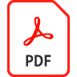

# Personnalisez et créez une marque pour un mannequin 3D avec [!DNL Dimension] et l’Adobe [!DNL Stock]

Personnalisez et créez une marque de modèle 3D dans [!DNL Dimension] en utilisant les matériaux, les propriétés environnementales, l’éclairage et la photographie, pour créer des images photoréalistes pour tout projet de conception.

>[!VIDEO](https://video.tv.adobe.com/v/331005?hidetitle=true)

Cliquez sur l’icône du fichier de PDF pour télécharger le Guide de référence rapide de ce tutoriel.

