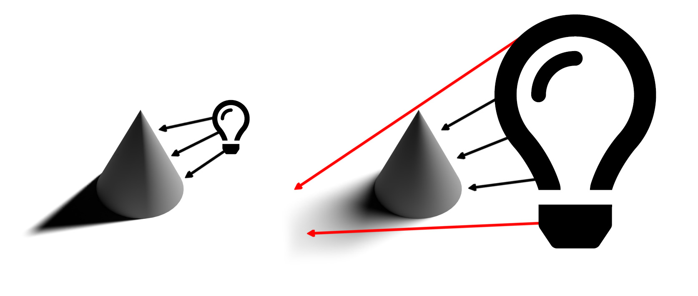

# Conseils et techniques pour la maîtrise de l’éclairage 3D dans CGI

Découvrez l’éclairage 3D et comment créer des conditions d’éclairage différentes qui peuvent modifier complètement une scène générée par ordinateur et la façon dont les objets y sont présentés.

Nous percevons le monde qui nous entoure en utilisant nos sens : on entend, on sent, on sent, on sent, on voit. Nous pouvons le voir parce que nos yeux récupèrent des informations qui nous sont apportées par des particules élémentaires appelées photons. Ces informations sont traitées par notre cerveau pour produire une image. Ce que nous interprétons comme une couleur d’objet, une brillance, une translucidité ou des qualités métalliques sont tous les produits de l’interaction entre les photons et la surface de l’objet.

La mécanique de la lumière dans une scène 3D générée par ordinateur suit le même principe naturel de diffusion de photon, à travers un processus appelé [lancer de rayon](https://en.wikipedia.org/wiki/Ray_tracing_(graphics)). Les rayons rebondissent sur les formes et interagissent avec leurs matières, définissant efficacement la façon dont les objets apparaissent dans l’image finale. Les lumières exposent la dimension de tout ce qui existe dans une scène 3D.

Certaines matières sont plus sensibles aux conditions d’éclairage que d’autres. Prenez les métaux par exemple : un objet chrome est essentiellement le reflet de tout ce qui l&#39;entoure. Si une lumière est déplacée, devient plus claire ou plus grande, toutes ces informations sont visibles directement sur la surface chromée dans des détails presque miroirs, de sorte qu’elles peuvent apparaître complètement différentes d’une condition de lumière à l’autre.

## Utilisation de lumières 3D pour créer des rendus 3D efficaces

Le processus de création d’un rendu 3D n’est jamais tout à fait le même, mais il s’agit des étapes les plus courantes :

1. Création ou acquisition d’objets
1. Assemblage de scène
1. Cadrage de la scène
1. **Eclairage**
1. Création ou affectation de matières
1. Rendu

Lorsque vous arrivez à la phase d&#39;éclairage, il est idéal de configurer vos lumières avant de travailler sur les matériaux. Pour ce faire, vous pouvez affecter une matière grise neutre et cache à l’ensemble de la scène. De cette façon, vous pourrez voir et comprendre plus clairement comment les lumières affectent les silhouettes d’objet de la scène. Une fois les matériaux terminés, l&#39;éclairage pourrait nécessiter d&#39;autres améliorations.

Il est préférable de travailler sur les lumières un par un. La lumière active doit être la seule visible dans la scène, tandis que toutes les autres lumières doivent être temporairement éteintes. De cette façon, vous pouvez voir comment une lumière spécifique influence la scène, et la modifier en travaillant sur ses propriétés, telles que la position, la direction, l’intensité, etc.

Autre astuce utile : créer une sphère avec un matériau métallique brillant (chrome ou miroir). Cette &quot;boule de miroirs&quot; reflétera efficacement l’ensemble de la scène qui l’entoure, ce qui vous permet de déterminer facilement la position, la direction ou la taille de la lumière. Dans le cas des lumières de l’environnement, vous pourrez voir son reflet dans la boule de miroir, ce qui aidera à définir son orientation dans l’espace.

## Types d’éclairage dans l’Adobe [!DNL Dimension]

### Lumières de l’environnement

Les lumières d’environnement sont des images équirectangulaires (sphériques), qui sont enveloppées dans toute la scène. Comme son nom l&#39;indique, ces lumières servent à imiter l&#39;ensemble de l&#39;environnement, y compris les sources lumineuses, qui y sont stockées.

Lorsque vous créez une scène dans [[!DNL Dimension]](https://www.adobe.com/products/dimension.html), une lumière d’environnement par défaut est créée pour vous. C&#39;est pourquoi vous pouvez immédiatement voir quoi que ce soit dans la scène. Les ressources de démarrage [!DNL Dimension] de l&#39;Adobe comprennent un certain nombre de lumières d&#39;environnement que vous pouvez essayer immédiatement. De plus, [Adobe [!DNL Stock]](https://stock.adobe.com/search?filters[content_type:3d]=1&amp;filters[3d_type_id][0]=2&amp;load_type=3d+lp) offre une vaste sélection de lumières d&#39;environnement.

Les lumières de l’environnement produisent des résultats très réalistes et peuvent vous faire gagner beaucoup de temps. Pour obtenir quelque chose de similaire manuellement, vous devriez en fait créer l&#39;ensemble de l&#39;environnement en 3D (y compris diverses sources lumineuses), ce qui représente un travail considérable.

Il existe de nombreuses façons de créer des lumières d’environnement, y compris la capture à partir d’une scène 3D, d’une photo et l’utilisation de systèmes paramétriques. Si la lumière de l’environnement est faite à partir d’une scène 3D, le processus est simple. L’image de sortie doit être de 32 bits, ce qui capturera les informations de lumière de toutes les lumières de la scène. La caméra 3D doit utiliser la projection équirectangulaire (pour générer une image sphérique).

Vous pouvez également créer des lumières d’environnement en capturant des photos du monde réel. Pour ce workflow, une caméra 360 est nécessaire (par exemple, [Ricoh Theta Z1](https://theta360.com/en/about/theta/z1.html)). La caméra est ensuite utilisée pour les expositions différentes ou pour prendre plusieurs photos du même environnement, prises avec une plage de valeurs d’exposition différentes (de la sous-exposition à la surexposition). Ces plans sont ensuite utilisés pour construire des images 32 bits, souvent appelées HDR (abréviation de High Dynamic Range). L&#39;une des méthodes pour assembler une telle image est la fonction Fusion HDR de Photoshop. La plage d’exposition incorporée devient la propriété d’intensité.

Dans les deux cas, les sources lumineuses (et leur intensité) sont &quot;cuites&quot; dans ces images et émettront la lumière une fois qu&#39;elles seront utilisées dans [!DNL Dimension].

Dans ces méthodes, vous avez capturé tous les éclairages, reflets et détails dont vous avez besoin, mais les applications 3D vous permettent de continuer à les modifier dans l’espace 3D, ce qui vous permet d’ajuster la rotation de l’éclairage ainsi que de modifier l’intensité et la couleur globales.

### Lumières directionnelles

En plus des lumières de l&#39;environnement, qui émettent de la lumière à 360 degrés, il y a aussi des lumières directionnelles, qui émettent de la lumière à partir d&#39;une seule direction. Ils sont utilisés pour imiter les lampes de poche et d&#39;autres types de lumières provenant d&#39;un émetteur bien défini, et ils peuvent être en forme de cercle ou de carré.

L’utilisation d’éclairages directionnels offre un contrôle total de la configuration de l’éclairage. L’éclairage de la scène à l’aide de ces lumières est effectué de la même manière que dans la photographie traditionnelle, où chaque lumière peut être contrôlée indépendamment, ce qui vous permet de créer votre propre éclairage photographique virtuel. L’une des configurations d’éclairage les plus couramment utilisées est le système d’éclairage à 3 points.

[!DNL Dimension] dispose d’une action pratique, Cibler la lumière au point, qui vous permet de contrôler la rotation et la hauteur en cliquant et en faisant glisser le pointeur sur un objet 3D. De cette façon, vous pouvez diriger dynamiquement les rayons lumineux. Ces paramètres peuvent également être ajustés manuellement.

Vous pouvez modifier la couleur et l’intensité des lumières directionnelles, mais aussi ajuster la forme de la source de lumière - la rendre circulaire ou rectangulaire, l’étirer ou la rendre plus grande. Enfin, vous pouvez adoucir les contours de la source de lumière.

![Modification de la forme d’une lumière directionnelle dans l’Adobe  [!DNL Dimension]](assets/Mastering3dlighting_12.gif)

Si vous réduisez la source lumineuse par rapport à l’objet, les ombres seront plus nettes, avec un contour plus net, car les rayons ne peuvent pas dépasser l’objet illuminé. Les sources lumineuses plus grandes produisent des ombres plus douces, car dans ce cas, les rayons proviennent de tous les côtés de l’objet (marqués en rouge dans l’illustration ci-dessous), créant ainsi un tableau d’ombres. Ces ombres sont adoucies par les rayons venant de la direction opposée.

### Soleil et ciel

La lumière du soleil est un type spécial de lumière directionnelle. Le processus de configuration est très similaire à une lumière directionnelle normale, mais cette lumière modifie automatiquement la couleur avec la hauteur ; lorsqu’il est proche de l’horizon (valeurs d’angle de hauteur faible), il devient progressivement plus chaud pour simuler le coucher de soleil. Vous pouvez également modifier la couleur à l’aide des paramètres prédéfinis. Pendant ce temps, la nudité affectera la douceur de l’ombre.

![Manipulation des propriétés d’éclairage pour l’éclairage de la lumière du soleil sur un modèle de voiture 3D dans l’Adobe  [!DNL Dimension]](assets/Mastering3dlighting_15.gif)

Nous sommes capables d&#39;imiter le ciel à l&#39;aide de lumières d&#39;environnement, et toute lumière d&#39;environnement représentant le ciel peut être utilisée. Nous devons maintenant aligner la lumière du soleil (produite en [!DNL Dimension]) avec celle du soleil, capturée dans la lumière de l&#39;environnement. Pour ce faire, il faut rapidement créer une sphère et lui assigner un matériau métallique. cela nous donnera des reflets en temps réel de l&#39;environnement, de sorte que nous pouvons utiliser la lumière de l&#39;objectif à point pour aligner la lumière du soleil avec celle du soleil.

Si la lumière de l’environnement présente un ciel couvert, la propriété de nuance peut être utilisée pour mieux correspondre à ces conditions.

![Manipulation des propriétés de nudité pour l’éclairage de l’environnement du ciel sur un modèle de voiture 3D dans l’Adobe  [!DNL Dimension]](assets/Mastering3dlighting_17.gif)

Une fois que la lumière du soleil et la lumière de l’environnement du ciel sont associées, vous pouvez les faire pivoter ensemble à l’aide de la propriété Rotation globale.

### Lumières basées sur l’objet

Les objets peuvent être transformés en sources lumineuses, en activant la propriété Lueur diffuse pour leurs matières. De cette façon, il est possible de créer des objets comme des ampoules, des néons, des softboxes, et toutes sortes d&#39;écrans et d&#39;écrans.

Le principal avantage de ce type d&#39;éclairage est le retrait d&#39;intensité, qui produit des résultats très naturels. Cela est très utile pour la visualisation de produits ou d’autres scènes studio.

Vous pouvez contrôler la douceur des ombres en redimensionnant l’objet lumineux vers le haut ou le bas, à l’aide de l’outil de transformation. L&#39;agrandir augmente également l&#39;intensité lumineuse.

Contrairement aux types d’éclairage précédents, ces éclairages peuvent également utiliser des textures, en plus des couleurs simples. Les textures peuvent être attachées à la couleur de base de leurs matières, et l’intensité de la lumière est contrôlée via un curseur de lueur.

## Exemples d’éclairage 3D efficace

### Eclairage de produit

Il existe de nombreuses techniques photographiques pour configurer la lumière d&#39;un plan de produit. Nous utiliserons l&#39;une des configurations les plus couramment utilisées, qui est le système d&#39;éclairage à 3 points.

Cette configuration se compose de trois éclairages :

1. **Lumière-clé :** utilisée comme source principale, cette lumière ressort approximativement du sens de la caméra.

   

1. **Lumière de rebord :** orientée du côté opposé de la touche, elle est utilisée pour exposer la silhouette du sujet.

   

1. **Lumière de remplissage :** moins intense et moins intense pour remplir les zones plus foncées, cette option est utilisée pour les zones que les deux feux précédents n’atteignent pas.

   

Il existe deux manières de créer l’éclairage à 3 points dans [!DNL Dimension] : à l’aide des lumières directionnelles (en les ajoutant individuellement à la scène ou à l’aide d’une lumière prédéfinie à 3 points) ou via des objets lumineux.

### Éclairage créatif

L’éclairage créatif est utilisé lorsque la précision physique n’est pas l’objectif principal. Cela inclut des scènes abstraites et surréalistes de toutes sortes, donc il n&#39;y a pas de frontières réelles où nos imaginations peuvent nous emmener.

Dans l&#39;exemple ci-dessus, l&#39;idée était de dépeindre un environnement de rêve : bonbons, couleurs pastel et surfaces lisses. Le système d&#39;éclairage est composé de trois plaques lumineuses (deux sur le côté et la principale qui brille du bas). Toutes les plaques lumineuses sont de taille irréaliste, ce qui crée des ombres et des tons clairs très lisses. Les sources lumineuses sont colorées et cette couleur est transférée dans la matière affectée aux objets de la scène.

Le sujet de la scène (tuyaux) est complètement entouré par la géométrie des murs. Cela provoquera des rayons lumineux qui rebondissent d&#39;avant en arrière et se mélangent de manière intéressante. Jouer avec des tons chauds VS froids produit souvent un contraste agréable (cette technique est parfois utilisée dans la photographie en portrait).

### Visualisation de l&#39;intérieur

La création d&#39;une visualisation d&#39;un intérieur 3D suit un certain ensemble de règles, qui garantit presque toujours de bons résultats. Dans ce cas d&#39;utilisation, nous ne prendrons en compte que la lumière naturelle (pas de sources artificielles, comme les lampes).

D&#39;abord et avant tout, une scène comme celle-ci doit se trouver dans un environnement fermé. Comme dans la vie réelle, l&#39;intérieur aura besoin de murs, de sol, de plafond et de fenêtres. Cela permet de s’assurer que la lumière passe par les fenêtres, puis rebondit (via un processus appelé lancer de rayon). Ce comportement produit un éclairage très naturel (par exemple, les zones occultées, comme les coins, seront plus foncées).

Comme la scène est presque entièrement entourée par la géométrie architecturale, nous verrons très peu d&#39;éclairage et presque aucune réflexion venant de la lumière de l&#39;environnement. Cependant, dans ce cas, nous sommes en train de construire notre propre environnement, qui est l&#39;intérieur lui-même. Donc la lumière réagira avec les objets de la scène en les rebondissant et les murs environnants. Les objets ne se refléteront que les uns les autres et les murs qui les entourent. Néanmoins, il est bon d&#39;ajouter une lumière d&#39;environnement, représentant le ciel. Cela ajoutera un fond bleu diffus.

Le moyen le plus simple de définir cette lumière est d&#39;utiliser des plans avec des matériaux lumineux. Dans ce cas d&#39;utilisation nous avons trois avions, qui couvrent toutes les ouvertures à l&#39;intérieur.

L’intensité de la lumière est contrôlée par la propriété lueur sur les matériaux des plans. Vous pouvez ajouter une couleur ou même une texture, qui peut être utilisée pour projeter des ombres intéressantes. L&#39;utilisation de matériaux de rayonnement fournira également le retrait d&#39;intensité lumineuse, ce qui est très important pour l&#39;éclairage intérieur.

### Eclairage extérieur

La création d&#39;un éclairage extérieur est assez simple et se résume à l&#39;utilisation d&#39;un système d&#39;éclairage Sun and Sky (voir ci-dessus). Il est important de faire correspondre correctement la lumière du soleil avec la lumière de l’environnement basée sur le ciel - en faisant attention à la fois à l’orientation et à la valeur de nudité.

La scène elle-même y joue un rôle important. Pour produire des résultats convaincants, utilisez les objets de votre scène comme catalyseurs qui interagissent avec la lumière. Dans le rendu de la forêt illustré ci-dessus, les objets (différentes plantes, grumes et arbres) sont placés les uns à côté des autres.

Cela signifie qu’il y aura beaucoup d’interactions complexes de lancer de rayon, lorsque la lumière rebondit entre les objets. Les zones ombrées apparaîtront sombres (comme prévu), tandis que les zones exposées resteront lumineuses.

![Utilisation de la rotation globale dans l’Adobe  [!DNL Dimension] pour réorienter le système de lumière du ciel et du soleil dans une scène 3D](assets/Mastering3dlighting_34.gif)

J&#39;espère que cette présentation illustre l&#39;importance de la maîtrise des lumières 3D dans diverses situations. Vous devriez être prêt à commencer à produire des résultats plus convaincants.

Bon éclairage ! Téléchargez la [dernière version](https://creativecloud.adobe.com/apps/download/[!DNL Dimension]) de Dimension aujourd’hui.
