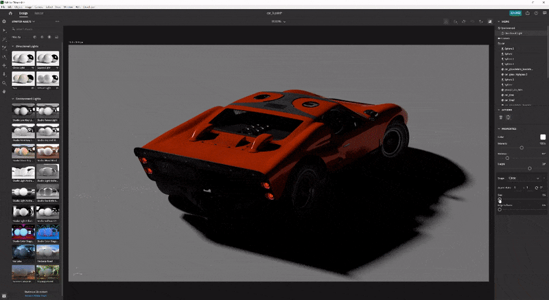
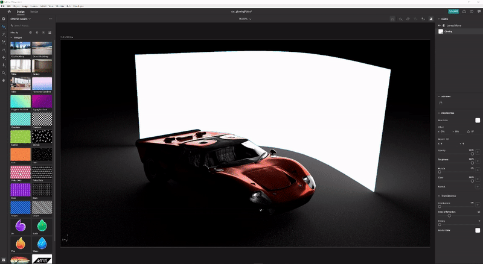

# Conseils et techniques pour maîtriser l’éclairage 3D dans CGI

Découvrez l’éclairage 3D et apprenez à créer différentes conditions d’éclairage susceptibles de modifier totalement une scène générée par ordinateur et l’apparence des objets.

Nous percevons le monde qui nous entoure en utilisant nos sens : on entend, on sent, on sent, on voit. Nous pouvons voir parce que nos yeux captent l&#39;information qui nous est apportée par des particules élémentaires appelées photons. Cette information est traitée par notre cerveau pour produire une image. Ce que nous interprétons comme une couleur d’objet, une brillance, une translucidité ou des qualités métalliques sont tous les produits de l’interaction entre les photons et la surface de l’objet.

La mécanique de la lumière dans une scène 3D générée par ordinateur suit le même principe naturel de diffusion des photons, grâce à un processus appelé [lancer de rayon](https://en.wikipedia.org/wiki/Ray_tracing_(graphics)). Les rayons rebondissent sur les formes et interagissent avec leurs matériaux, définissant ainsi efficacement l’apparence des objets dans l’image finale. La lumière expose la profondeur de tout ce qui existe dans une scène 3D.

Certains matériaux sont plus sensibles aux conditions d’éclairage que d’autres. Prenez les métaux par exemple : un objet chrome est en fait un reflet de tout ce qui l&#39;entoure. Si une lumière est déplacée, devient plus claire ou plus grande, toutes ces informations sont visibles directement sur la surface du chrome dans des détails presque miroirs, de sorte qu&#39;il peut apparaître complètement différent d&#39;une condition de lumière à l&#39;autre.

## Comment utiliser des éclairages 3D pour créer des rendus 3D efficaces

Le processus de création d’un rendu 3D n’est jamais tout à fait le même, mais ce sont les étapes les plus courantes :

1. Création ou acquisition d’objets
1. Assemblage de scène
1. Cadrage de la scène
1. **Éclairage**
1. Création ou affectation de matières
1. Rendu

Lorsque vous arrivez à la phase d’éclairage, il est idéal de configurer vos lumières avant de travailler sur les matériaux. Pour ce faire, vous pouvez affecter un matériau gris neutre et mat à l’ensemble de la scène. Ainsi, vous pourrez mieux voir et comprendre comment les lumières affectent les silhouettes des objets dans la scène. Une fois les matériaux terminés, l’éclairage peut nécessiter d’autres améliorations.

Il est préférable de travailler sur les lumières une par une. La lumière active doit être la seule visible dans la scène, tandis que toutes les autres lumières doivent être temporairement éteintes. De cette façon, vous pourrez voir comment une lumière spécifique influence la scène et la modifier en travaillant sur ses propriétés, telles que la position, la direction, l’intensité, etc.

Une autre astuce utile est de créer une sphère avec un matériau métallique brillant (un chrome ou un miroir). Cette &quot;boule en miroir&quot; réfléchit efficacement toute la scène qui l’entoure, ce qui vous permet de déterminer facilement la position, la direction ou la taille de la lumière. Dans le cas des éclairages de l’environnement, vous pourrez voir son reflet dans la boule du miroir, ce qui vous aidera à régler son orientation dans l’espace.

## Types de lumières dans l’Adobe [!DNL Dimension]

### Lumières environnementales

Les éclairages d’environnement sont des images équirectangulaires (sphériques) qui sont enroulées autour de la scène entière. Comme leur nom l&#39;indique, ces lampes servent à émuler l&#39;ensemble de l&#39;environnement, y compris les sources lumineuses qui y sont stockées.

Lorsque vous créez une scène dans [[!DNL Dimension]](https://www.adobe.com/products/dimension.html), un éclairage d’environnement par défaut sera créé pour vous. C&#39;est pourquoi vous êtes immédiatement en mesure de voir réellement n&#39;importe quoi dans la scène. Adobe [!DNL Dimension] Les ressources de démarrage incluent un certain nombre d’éclairages d’environnement, que vous pouvez essayer immédiatement. En outre, [Adobe [!DNL Stock]](https://stock.adobe.com/search?filters[content_type:3d]=1&amp;filters[3d_type_id][0]=2&amp;load_type=3d+lp) offre une vaste sélection de lumières d&#39;environnement sélectionnées.

Les éclairages d’environnement produisent des résultats très réalistes et peuvent vous faire gagner beaucoup de temps. Pour obtenir manuellement un résultat similaire, vous devez créer l’environnement complet en 3D (y compris diverses sources de lumière), ce qui représente un travail considérable.

Il existe plusieurs façons de créer des éclairages d’environnement, notamment en capturant des images à partir d’une scène 3D, d’une photo et en utilisant des systèmes paramétriques. Si l’éclairage d’environnement est constitué d’une scène 3D, le processus est simple. L’image de sortie doit être de 32 bits, ce qui capture les informations de lumière de toutes les lumières de la scène. La caméra 3D doit utiliser la projection équirectangulaire (pour produire une image sphérique).

Vous pouvez également créer des éclairages d’environnement en capturant des photos du monde réel. Pour ce workflow, une caméra 360 est nécessaire (par ex. [Ricoh Theta Z1](https://theta360.com/en/about/theta/z1.html)). L’appareil photo est ensuite utilisé pour le bracketing d’exposition, ou pour prendre plusieurs photos du même environnement, prises avec une plage de valeurs d’exposition différentes (de la sous-exposition à la surexposition). Ces plans sont ensuite utilisés pour construire des images 32 bits, souvent appelées HDR (High Dynamic Range). Pour assembler une telle image, vous pouvez utiliser la fonction Fusion HDR de Photoshop. La plage d’exposition intégrée deviendra la propriété d’intensité.

Dans les deux cas, les sources lumineuses (et leurs intensités) sont &quot;cuites&quot; dans ces images et émettent la lumière une fois qu&#39;elles sont utilisées [!DNL Dimension].

Avec ces méthodes, vous avez capturé tout l’éclairage, les reflets et les détails dont vous avez besoin. Mais avec les applications 3D, vous pouvez continuer à les modifier dans l’espace 3D, ce qui vous permet d’ajuster la rotation de l’éclairage et de modifier l’intensité et la couleur générales.

### Éclairages directionnels

En plus des éclairages d’environnement, qui émettent de la lumière à partir de 360 degrés, il existe également des éclairages directionnels, qui émettent de la lumière d’une seule direction. Ils sont utilisés pour émuler des lampes de poche et d&#39;autres types de lumières provenant d&#39;un émetteur bien défini, et ils peuvent être formés comme un cercle ou un carré.

L’utilisation de lumières directionnelles offre un contrôle total sur la configuration de l’éclairage. L’éclairage de la scène à l’aide de ces lumières se fait de la même manière que pour la photographie traditionnelle, où chaque lumière peut être contrôlée indépendamment, ce qui vous permet de créer votre propre éclairage photographique virtuel. L&#39;un des systèmes d&#39;éclairage les plus couramment utilisés est le système d&#39;éclairage à 3 points.

[!DNL Dimension] propose une action pratique, Diriger la lumière vers le point (Aim Light at Point), qui vous permet de contrôler la rotation et la hauteur par un simple clic et un glissement sur un objet 3D. De cette façon, vous pouvez diriger les rayons lumineux de manière dynamique. Ces paramètres peuvent également être ajustés manuellement.

Vous pouvez modifier la couleur et l’intensité des lumières directionnelles, ainsi qu’ajuster la forme de la source de lumière : rendez-la circulaire ou rectangulaire, étirez-la ou agrandissez-la. Enfin, vous pouvez adoucir les bords de la source de lumière.

![Modification de la forme d’une lumière directionnelle dans un Adobe [!DNL Dimension]](assets/Mastering3dlighting_12.gif)

Si vous rendez la source de lumière plus petite que l’objet, les ombres seront plus nettes et le contour plus net, car les rayons ne peuvent pas dépasser l’objet éclairé. Les sources lumineuses plus grandes produisent des ombres plus douces, car dans ce cas, les rayons proviennent de tous les côtés de l’objet (marqués en rouge dans l’illustration ci-dessous), ce qui crée un ensemble d’ombres. Ces ombres sont adoucies par les rayons provenant de la direction opposée.

### Soleil et ciel

La lumière du soleil est un type spécial de lumière directionnelle. Le processus de mise en place est très similaire à une lumière directionnelle régulière, mais cette lumière changera automatiquement la couleur avec la hauteur ; lorsqu’il est proche de l’horizon (valeurs d’angle de faible hauteur), il devient progressivement plus chaud pour simuler le coucher de soleil. La couleur peut également être modifiée à l’aide de paramètres prédéfinis. Pendant ce temps, le caractère nuageux affectera la douceur de l’ombre.

![Manipulation des propriétés d’éclairage pour l’éclairage du soleil sur un modèle de voiture 3D dans Adobe [!DNL Dimension]](assets/Mastering3dlighting_15.gif)

Nous sommes en mesure d’émuler le ciel à l’aide de lumières d’environnement, et toute lumière d’environnement représentant le ciel peut être utilisée. Maintenant, nous devons aligner la lumière du soleil (made in [!DNL Dimension]) avec le Soleil, capturé dans la lumière de l&#39;environnement. Une façon rapide de le faire est de créer une sphère et de lui assigner un matériau métallique ; nous disposerons ainsi de réflexions en temps réel sur l’environnement, ce qui nous permettra d’utiliser la lumière de l’objectif à un moment donné pour aligner la lumière du soleil sur celle du soleil.

Si la lumière de l’environnement est un ciel couvert, la propriété de trouble peut être utilisée pour mieux correspondre à ces conditions.

![Manipulation des propriétés d’opacité pour l’éclairage de l’environnement du ciel sur un modèle de voiture 3D dans Adobe [!DNL Dimension]](assets/Mastering3dlighting_17.gif)

Une fois la lumière du soleil et la lumière de l’environnement du ciel associées, vous pouvez les faire pivoter ensemble à l’aide de la propriété Rotation globale.

### Éclairages basés sur un objet

Les objets peuvent être transformés en sources de lumière en activant la propriété Lueur diffuse pour leurs matières. De cette façon, il est possible de créer des objets comme des ampoules, des néons, des boîtes à lumière, et toutes sortes d&#39;écrans et d&#39;écrans.

Le principal avantage de ce type d&#39;éclairage est le retrait d&#39;intensité, qui produit des résultats très naturels. Cela s’avère très utile pour la visualisation de produits ou d’autres scènes en studio.

Vous pouvez contrôler la douceur des ombres en redimensionnant l’objet lumineux vers le haut ou vers le bas à l’aide de l’outil de transformation. En l’agrandissant, vous augmenterez également l’intensité lumineuse.

Contrairement aux éclairages précédents que nous avons étudiés, ceux-ci peuvent également utiliser des textures, en plus des couleurs unies. Les textures peuvent être fixées à la couleur de base de leurs matériaux, et l&#39;intensité lumineuse est contrôlée par l&#39;intermédiaire d&#39;un curseur de lueur.

## Exemples d’éclairage 3D efficace

### Éclairage des produits

Il existe de nombreuses techniques photographiques pour configurer la lumière dans une photo de produit. Nous utiliserons l&#39;une des configurations les plus couramment utilisées, qui est le système d&#39;éclairage à 3 points.

Cette configuration se compose de trois lumières :

1. **Feu de touche :** utilisé comme source principale, il brille approximativement par rapport à la direction de la caméra

   

1. **Feu de bordure :** orienté à l’opposé de la touche, il est utilisé pour exposer la silhouette du sujet.

   

1. **Lumière de fond :** moins intensif et servant à remplir les zones plus sombres, il est utilisé pour les zones que les deux lumières précédentes n’atteignent pas.

   

Il existe deux façons de créer un éclairage à 3 points dans [!DNL Dimension] - en utilisant des lumières directionnelles (en les ajoutant individuellement à la scène ou en utilisant un paramètre prédéfini Lumière à 3 points) ou via des objets lumineux.

### Éclairage créatif

L’éclairage créatif est utilisé là où l’objectif principal n’est pas la précision physique. Cela inclut des scènes abstraites et surréalistes de toutes sortes, il n&#39;y a donc pas de limites réelles où notre imagination peut nous emmener.

Dans l&#39;exemple ci-dessus, l&#39;idée était de représenter un environnement onirique : bonbons, couleurs pastel et surfaces lisses. Le système d&#39;éclairage est composé de trois plaques lumineuses (deux sur le côté, et la principale brillant du bas). Toutes les plaques brillantes sont excessivement grandes, ce qui crée des ombres et des hautes lumières très lisses. Les sources lumineuses sont colorées et cette couleur est transférée dans le matériau attribué aux objets de la scène.

Le sujet de la scène (tuyaux) est complètement entouré par la géométrie des murs. Les rayons lumineux vont alors rebondir et se mélanger de manière intéressante. Jouer avec des tons froids VS chauds produit souvent un contraste agréable (cette technique est parfois utilisée en photographie de portrait).

### Visualisation intérieure

La création d’une visualisation d’un intérieur 3D suit un certain ensemble de règles, qui garantit presque toujours de bons résultats. Pour ce cas d&#39;utilisation, nous ne prendrons en compte que la lumière naturelle (pas de sources artificielles, comme les lampes).

Tout d&#39;abord, une scène comme celle-ci doit être dans un environnement clos. Tout comme dans la vraie vie, l&#39;intérieur aura besoin de murs, de plancher, de plafond et de fenêtres. Ainsi, la lumière passe à travers les fenêtres, puis rebondit (via un processus appelé lancer de rayon). Ce comportement produit une lumière très naturelle (par exemple, les zones masquées, comme les angles, seront plus sombres).

Comme la scène est presque entièrement entourée par la géométrie architecturale, nous verrons très peu d&#39;éclairage et presque aucune réflexion provenant de la lumière de l&#39;environnement. Cependant, dans ce cas, nous construisons notre propre environnement, qui est l&#39;intérieur lui-même. Ainsi, la lumière réagira avec les objets de la scène en rebondissant sur eux et les murs environnants. Les objets se réfléchiront les uns les autres et les murs autour d&#39;eux. Néanmoins, il est conseillé d’ajouter une lumière d’environnement, représentant le ciel. Cela ajoutera un fond bleu diffus.

Le moyen le plus simple de régler cette lumière est d&#39;utiliser des avions avec des matériaux brillants. Dans ce cas d&#39;utilisation, nous avons trois plans, qui couvrent toutes les ouvertures à l&#39;intérieur.

L’intensité de la lumière est contrôlée par la propriété de la lueur sur les matériaux des avions. Vous pouvez ajouter une couleur ou même une texture, qui peut être utilisée pour projeter des ombres intéressantes. L’utilisation de matériaux luisants produira également un affaiblissement de l’intensité lumineuse, ce qui est très important pour l’éclairage intérieur.

### Éclairage extérieur

La création d’un éclairage extérieur est assez simple et se résume à utiliser un système de lumière du soleil et du ciel (voir ci-dessus). Il est important de faire correspondre correctement la lumière du soleil avec la lumière de l’environnement basée sur le ciel, en prêtant attention à l’orientation et à la valeur du trouble.

La scène elle-même joue un rôle important à cet égard. Pour produire des résultats convaincants, utilisez les objets de votre scène comme catalyseurs qui interagissent avec la lumière. Dans le rendu de forêt ci-dessus, les objets (plantes, troncs et arbres) sont placés les uns à côté des autres.

Cela signifie qu’il y aura beaucoup d’interactions complexes de lancer de rayon, lorsque la lumière rebondira entre les objets. Les zones ombrées paraîtront sombres (comme prévu), tandis que les zones exposées resteront lumineuses.

![Utilisation de la rotation globale dans l’Adobe [!DNL Dimension] pour réorienter le système de lumière du soleil et du ciel dans une scène 3D](assets/Mastering3dlighting_34.gif)

J’espère que cette présentation illustre l’importance de la maîtrise des éclairages 3D dans diverses situations. Vous devriez être prêt à produire des résultats plus convaincants.

Bon éclairage ! Téléchargez le fichier [dernière version](https://creativecloud.adobe.com/apps/download/Dimension) de Dimension aujourd&#39;hui.
