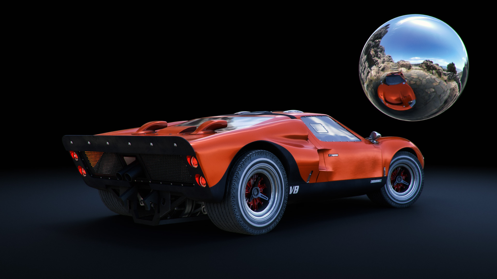

# Conseils et techniques pour maîtriser l’éclairage 3D en imagerie de synthèse

Découvrez l’éclairage 3D et comment créer différentes conditions d’éclairage susceptibles de modifier complètement une scène générée par ordinateur et l’aspect des objets qu’elle contient.

Nous percevons le monde qui nous entoure en utilisant nos sens : nous entendons, nous sentons, nous voyons. Nous pouvons voir parce que nos yeux captent des informations qui nous sont apportées par des particules élémentaires appelées photons. Ces informations sont traitées par notre cerveau pour produire une image. Ce que nous interprétons comme une couleur d&#39;objet, une brillance, une translucidité ou des qualités métalliques sont tous des produits de l&#39;interaction entre les photons et la surface de l&#39;objet.

La mécanique de la lumière dans une scène 3D générée par ordinateur suit le même principe naturel de diffusion de photons, à travers un processus appelé lancer de rayons. Les rayons rebondissent sur les formes et interagissent avec leurs matières, définissant ainsi la façon dont les objets apparaissent dans l’image finale. Les lumières révèlent la dimensionnalité de tout ce qui existe dans une scène 3D.

Certaines matières sont plus sensibles que d’autres aux conditions d’éclairage. Prenez les métaux par exemple : un objet chromé reflète pratiquement tout ce qui l’entoure. Si une lumière est déplacée, devient plus claire ou s’élargit, toutes ces informations sont visibles directement sur la surface chromée dans des détails presque miroirs, de sorte qu’elle peut sembler complètement différente d’une condition d’éclairage à l’autre.

## Comment utiliser des éclairages 3D pour créer des rendus 3D efficaces

Le processus de création d’un rendu 3D n’est jamais tout à fait le même, mais voici les étapes les plus courantes :

1. Création ou acquisition d’objets
1. Assemblage de scène
1. Cadrage de la scène
1. **Éclairage**
1. Création ou affectation de matières
1. Rendu

Lorsque vous arrivez à la phase d&#39;éclairage, il est idéal de configurer vos lumières avant de travailler sur les matériaux. Pour ce faire, vous pouvez attribuer une matière gris neutre et mate à l’ensemble de la scène. De cette façon, vous pourrez voir et comprendre plus clairement comment les lumières affectent la silhouette des objets de la scène. Une fois les matériaux terminés, l&#39;éclairage peut nécessiter d&#39;autres améliorations.

Il est préférable de travailler sur les lumières une par une. L’éclairage actif doit être le seul visible dans la scène, tandis que tous les autres éclairages doivent être temporairement éteints. De cette façon, vous pourrez voir comment une lumière spécifique influence la scène et changer cela en travaillant sur ses propriétés, telles que la position, la direction, l&#39;intensité, etc.

Une autre astuce utile consiste à créer une sphère avec un matériau métallique brillant (chrome ou miroir). Cette « boule miroir » reflétera efficacement toute la scène qui l&#39;entoure, ce qui vous permettra de déterminer facilement la position, la direction ou la taille de la lumière. En cas d&#39;éclairage de l&#39;environnement, vous pourrez voir son reflet dans la boule miroir, ce qui aidera à définir son orientation dans l&#39;espace.

## Types de lumières dans l&#39;Adobe [!DNL Dimension]

### Éclairages d’environnement

Les éclairages de l’environnement sont des images équirectangulaires (sphériques) qui englobent l’ensemble de la scène. Comme leur nom l’indique, ces éclairages servent à imiter l’ensemble de l’environnement, y compris les sources lumineuses qui y sont stockées.

Lorsque vous créez une scène dans [[!DNL Dimension]](https://www.adobe.com/products/dimension.html), un éclairage d&#39;environnement par défaut est créé pour vous. C’est pourquoi vous pouvez voir immédiatement tout ce qui se trouve dans la scène. Les ressources de démarrage de l’Adobe [!DNL Dimension] incluent un certain nombre d’éclairages de l’environnement, que vous pouvez tester immédiatement. En outre, [Adobe [!DNL Stock]](https://stock.adobe.com/search?filters[content_type:3d]=1&amp;filters[3d_type_id][0]=2&amp;load_type=3d+lp) offre une vaste sélection d&#39;éclairages de l&#39;environnement.

Les éclairages de l’environnement produisent des résultats très réalistes et peuvent vous faire gagner beaucoup de temps. Pour obtenir un résultat similaire manuellement, vous devez créer l’ensemble de l’environnement en 3D (y compris les différentes sources de lumière), ce qui représente un travail considérable.

Il existe de nombreuses façons de créer des éclairages de l’environnement, y compris la capture à partir d’une scène 3D, d’une photo et l’utilisation de systèmes paramétriques. Si l’éclairage de l’environnement est réalisé à partir d’une scène 3D, le processus est simple. L’image de sortie doit être de 32 bits, ce qui permet de capturer les informations de lumière de toutes les lumières de la scène. La caméra 3D doit utiliser la projection équirectangulaire (pour générer une image sphérique).

Vous pouvez également créer des éclairages de l’environnement en capturant des photos du monde réel. Pour ce workflow, une caméra 360° est nécessaire (par exemple, [Ricoh Theta Z1](https://theta360.com/en/about/theta/z1.html)). L’appareil photo est ensuite utilisé pour prendre des expositions différentes (bracketing) ou plusieurs photos du même environnement, avec une plage de valeurs d’exposition différentes (de la sous-exposition à la surexposition). Ces prises de vue sont ensuite utilisées pour construire des images 32 bits, souvent appelées HDR (abréviation de High Dynamic Range). La fonction Fusion HDR de Photoshop permet d’assembler une telle image. La plage d’exposition intégrée devient la propriété d’intensité.

Dans les deux cas, les sources lumineuses (et leur intensité) sont « bakées » dans ces images et émettront la lumière une fois qu&#39;elles seront utilisées dans [!DNL Dimension].

Dans ces méthodes, vous avez capturé tous les éclairages, reflets et détails dont vous avez besoin, mais les applications 3D vous permettent de continuer à les modifier dans l’espace 3D, de sorte que vous pouvez ajuster la rotation de l’éclairage ainsi que modifier l’intensité et la couleur globales.

### Éclairages directionnels

En plus des éclairages de l’environnement, qui émettent de la lumière à 360 degrés, il existe également des éclairages directionnels, qui émettent de la lumière à partir d’une seule direction. Ils sont utilisés pour imiter les lampes de poche et d’autres types de lumières provenant d’un point bien défini, et peuvent être en forme de cercle ou de carré.

L’utilisation d’éclairages directionnels offre un contrôle total sur la configuration de l’éclairage. L’éclairage de la scène à l’aide de ces lumières s’effectue de la même manière que dans la photographie traditionnelle, où chaque lumière peut être contrôlée indépendamment, ce qui vous permet de créer votre propre éclairage photographique virtuel. L’une des configurations d’éclairage les plus couramment utilisées est le système d’éclairage à 3 points.

[!DNL Dimension] propose une action pratique, Diriger l’éclairage vers le point, qui vous permet de contrôler la rotation et la hauteur en cliquant et en faisant glisser sur un objet 3D. De cette façon, vous pouvez diriger dynamiquement les rayons de lumière. Ces paramètres peuvent également être ajustés manuellement.

Vous pouvez modifier la couleur et l’intensité des éclairages directionnels, mais aussi ajuster la forme de la source lumineuse : rendez-la circulaire ou rectangulaire, étirez-la ou agrandissez-la. Enfin, vous pouvez adoucir les bords de la source de lumière.

![Modification de la forme d&#39;un éclairage directionnel dans l&#39;Adobe [!DNL Dimension]](assets/Mastering3dlighting_12.gif)

Si vous réduisez la taille de la source lumineuse par rapport à l’objet, les ombres seront plus nettes et le contour plus net, car les rayons ne peuvent pas dépasser l’objet illuminé. Les sources lumineuses plus grandes produisent des ombres plus douces, car dans ce cas, les rayons proviennent de tous les côtés de l’objet (en rouge dans l’illustration ci-dessous), créant un ensemble d’ombres. Ces ombres sont adoucies par les rayons venant de la direction opposée.

### Soleil et ciel

La lumière du soleil est un type spécial d’éclairage directionnel. Le processus de configuration est très similaire à un éclairage directionnel normal, mais cet éclairage modifie automatiquement la couleur en fonction de la hauteur ; lorsqu’il est proche de l’horizon (valeurs d’angle de hauteur faibles), il devient progressivement plus chaud pour simuler le coucher de soleil. La couleur peut également être modifiée à l’aide de paramètres prédéfinis. En même temps, la nébulosité affectera la douceur de l’ombre.

![Manipulation des propriétés d&#39;éclairage pour l&#39;éclairage de la lumière du soleil sur un modèle de voiture 3D dans l&#39;Adobe [!DNL Dimension]](assets/Mastering3dlighting_15.gif)

Nous sommes en mesure d’imiter le ciel à l’aide des éclairages de l’environnement, et tout éclairage de l’environnement mettant en scène le ciel peut être utilisé. Maintenant, nous devons aligner la lumière du soleil (créée dans [!DNL Dimension]) avec le soleil, capturée dans la lumière de l&#39;environnement. Pour ce faire, un moyen rapide consiste à créer une sphère et à lui attribuer un matériau métallique. Cela nous fournira des reflets en temps réel de l’environnement, afin que nous puissions utiliser l’option Diriger l’éclairage sur le point pour aligner la lumière du soleil avec le soleil.

Si la luminosité de l’environnement présente un ciel couvert, la propriété Brouillard peut être utilisée pour mieux correspondre à ces conditions.

![Manipulation des propriétés de nébulosité pour l’éclairage de l’environnement du ciel sur un modèle de voiture 3D dans l’Adobe [!DNL Dimension]](assets/Mastering3dlighting_17.gif)

Une fois que la lumière du soleil et la luminosité de l’environnement du ciel sont associées, vous pouvez les faire pivoter ensemble à l’aide de la propriété Rotation globale.

### Éclairages basés sur l’objet

Les objets peuvent être transformés en sources lumineuses, en activant la propriété Rayonnement pour leurs matériaux. De cette façon, il est possible de créer des objets comme des ampoules, des néons, des boîtes à lumière et toutes sortes d&#39;écrans et d&#39;affichages.

Le principal avantage de ce type d’éclairage est la baisse d’intensité, qui produit des résultats très naturels. Ceci est très utile pour la visualisation de produits ou d’autres scènes en studio.

Vous pouvez contrôler la douceur des ombres en redimensionnant l’objet lumineux vers le haut ou vers le bas, à l’aide de l’outil de transformation. L’agrandir augmentera également l’intensité lumineuse.

Contrairement aux types d’éclairage précédents, ces éclairages peuvent également utiliser des textures, en plus des couleurs unies. Les textures peuvent être associées à la couleur de base de leurs matières et l’intensité lumineuse est contrôlée via un curseur Lueur.

## Exemples d’éclairage 3D efficace

### Éclairage du produit

Il existe de nombreuses techniques photographiques pour configurer la lumière d’une prise de vue de produit. Nous allons utiliser l’une des configurations les plus couramment utilisées, à savoir le système d’éclairage à 3 points.

Cette configuration se compose de trois éclairages :

1. **Lumière clé :** utilisée comme source principale, elle brille approximativement dans le sens de la caméra

   

1. **Lumière du contour :** orientée du côté opposé à la touche, elle est utilisée pour exposer la silhouette du sujet.

   

1. **Lumière de remplissage :** moins intense et servant à remplir les zones plus sombres, elle est utilisée pour les zones que les deux lumières précédentes n&#39;atteignent pas.

   

Il existe deux façons de créer l&#39;éclairage à 3 points dans [!DNL Dimension] : à l&#39;aide d&#39;éclairages directionnels (en les ajoutant individuellement à la scène ou en utilisant un paramètre prédéfini d&#39;éclairage à 3 points) ou via des objets lumineux.

### Éclairage créatif

L’éclairage créatif est utilisé lorsque l’exactitude physique n’est pas l’objectif principal. Cela inclut des scènes abstraites et surréalistes de toutes sortes, il n&#39;y a donc pas de limites réelles où notre imagination peut nous mener.

Dans l’exemple ci-dessus, l’idée était de dépeindre un environnement onirique : couleurs pastel, bonbons et surfaces lisses. Le système d&#39;éclairage est composé de trois plaques lumineuses (deux sur le côté et la principale qui brille du bas). Toutes les plaques lumineuses sont de taille irréaliste, ce qui crée des ombres et des hautes lumières très lisses. Les sources lumineuses sont colorées et cette couleur est transférée dans la matière affectée aux objets de la scène.

Le sujet de la scène (les tuyaux) est complètement entouré par la géométrie des murs. Cela permet aux rayons lumineux de rebondir d’avant en arrière et de se mélanger de manière intéressante. Jouer avec des tons froids plutôt que chauds produit souvent un contraste agréable (cette technique est parfois utilisée dans la photographie de portraits).

### Visualisation d’intérieur

La création d’une visualisation d’un intérieur 3D suit un certain ensemble de règles, ce qui garantit presque toujours de bons résultats. Pour ce cas d’utilisation, nous ne prendrons en compte que la lumière naturelle (pas de sources artificielles, comme les lampes).

Tout d’abord, une scène comme celle-ci doit se trouver dans un environnement fermé. Tout comme dans la vie réelle, l&#39;intérieur aura besoin de murs, de sol, de plafond et de fenêtres. Cela permettra de s’assurer que la lumière traverse les fenêtres, puis rebondit (via un processus appelé lancer de rayons). Ce comportement produit un éclairage très naturel (par exemple, les zones occultées, comme les coins, seront plus sombres).

Comme la scène est presque entièrement entourée de géométrie architecturale, nous verrons très peu d&#39;éclairage et presque aucun reflet provenant de la lumière de l&#39;environnement. Cependant, dans ce cas-ci, nous construisons notre propre environnement, c&#39;est-à-dire l&#39;intérieur lui-même. Ainsi, la lumière réagira avec les objets de la scène en rebondissant sur eux et les murs environnants. Les objets ne se reflètent que les uns les autres et les murs qui les entourent. Néanmoins, il est judicieux d’ajouter une luminosité de l’environnement représentant le ciel. Cela ajoutera un fond bleu diffus.

Le moyen le plus simple de définir cette lumière est d’utiliser des plans avec des matériaux lumineux. Dans ce cas d&#39;utilisation, nous avons trois plans, qui couvrent toutes les ouvertures à l&#39;intérieur.

L’intensité de la lumière est contrôlée par la propriété Rayonnement sur les matériaux des plans. Vous pouvez ajouter une couleur ou même une texture, qui peut être utilisée pour projeter des ombres intéressantes. L’utilisation de matériaux lumineux apportera également une baisse de l’intensité lumineuse, ce qui est très important pour l’éclairage intérieur.

### Éclairage extérieur

La création d’un éclairage extérieur est assez simple et se résume à l’utilisation d’un système d’éclairage Lumière du soleil et ciel (voir ci-dessus). Il est important de faire correspondre correctement la lumière du soleil avec la lumière de l’environnement basée sur le ciel, en faisant attention à la fois à l’orientation et à la valeur Brouillard.

La scène elle-même joue un rôle important dans ce contexte. Pour produire des résultats convaincants, utilisez les objets de votre scène comme catalyseurs qui interagissent avec la lumière. Dans le rendu de la forêt illustré ci-dessus, les objets (plantes, bûches et arbres) sont placés les uns à côté des autres.

Cela signifie qu’il y aura beaucoup d’interactions complexes de lancer de rayons, car la lumière rebondit entre les objets. Les zones ombrées apparaîtront sombres (comme prévu), tandis que les zones exposées resteront lumineuses.

![Utilisation de la rotation globale dans l&#39;Adobe [!DNL Dimension] pour réorienter le système Lumière du soleil et ciel dans une scène 3D](assets/Mastering3dlighting_34.gif)

J’espère que cette présentation illustre l’importance de la maîtrise des éclairages 3D dans différentes situations. Vous devriez être prêt à commencer à produire des résultats plus convaincants.

Bon éclairage ! Téléchargez la [dernière version](https://creativecloud.adobe.com/apps/download/Dimension) de Dimension dès aujourd&#39;hui.
