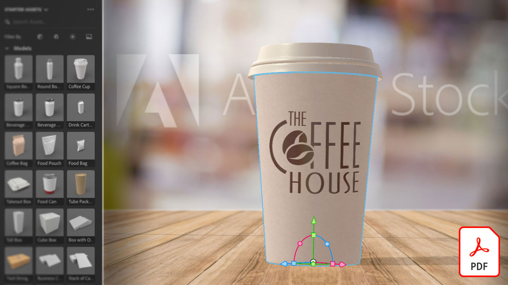

# Tutoriels Adobe 3D et VR

Créez plus rapidement du contenu attrayant en 3D avec des modèles, des matières et un éclairage de haute qualité. [!DNL Dimension] facilite la création de visualisations de marque, d’illustrations, de maquettes de produits, de conceptions de packaging et autres travaux créatifs. Sélectionnez une image pour afficher un tutoriel.

<table>
<tr>
 <td>
   
    

   <a href="substance-3d-stager.md"><strong>Conception et rendu 3D</strong></a>
    

    <em>Importez du contenu, organisez votre scène, appliquez des matières et des textures, ajustez l’éclairage physique et basé sur l’image, enregistrez des appareils photo avec des résolutions différentes et générez des images photoréalistes</em>
     
  </td>
  <td>
   
    

   <a href="assets/CreateRealistic3DMockupswithAdobeStockandDimension.pdf"><strong>Créer des maquettes 3D réalistes avec Adobe [!DNL Stock] et [!DNL Dimension] (PDF)</strong></a>
    

    <em>Combinez facilement une conception 2D avec un modèle 3D à l’aide de l’Adobe [!DNL Stock] et les graphiques placés dans l’Adobe [!DNL Dimension]</em>
     
  </td>
  <td>
   
    

   <a href="assets/VisualizeTextileDesignsorPatternson3DObjectswithAdobeDimension.pdf"><strong>Visualiser les motifs ou les motifs de textiles sur des objets 3D avec Adobe [!DNL Dimension] (PDF)</strong></a>
    

    <em>Créez une représentation ultra-réaliste de votre produit final en quelques minutes</em>
     
  </td>
  <td>
   
    

   <a href="../cce/assets/VisualizeyourProductinaRealisticEnvironment.pdf"><strong>Visualiser votre produit dans un environnement réaliste (PDF)</strong></a>
    

    <em>Lorsque vous voulez voir à quoi ressembleront vos produits dans le monde réel, l'Adobe [!DNL Dimension] est votre application de référence</em>
     
  </td>
</tr>
<tr>
  <td>
   
    

   <a href="mastering3dlighting.md"><strong>Conseils et techniques pour maîtriser l’éclairage 3D en imagerie de synthèse</strong></a>
    

    <em>Découvrez l’éclairage 3D et comment créer différentes conditions d’éclairage susceptibles de modifier complètement une scène générée par ordinateur et l’aspect des objets qu’elle contient</em>
     
  </td>
  <td>
   
    

   <a href="photorealistic.md"><strong>Création de photographies virtuelles photoréalistes avec rendu et composition 3D</strong></a>
    

    <em>Apprenez à créer des photographies virtuelles étonnamment trompeuses et photoréalistes grâce à la composition et au rendu d’images 3D en Adobe [!DNL Dimension]</em>
     
  </td>
  <td>
   
    

   <a href="3ddimensionstock.md"><strong>Personnalisez et signez un modèle 3D avec [!DNL Dimension] et Adobe [!DNL Stock]</strong></a>
    

    <em>Personnalisation et branding d’un modèle 3D dans [!DNL Dimension] utilisation des matériaux, des propriétés environnementales, de l’éclairage et de la photographie pour créer des images photoréalistes pour tout projet de conception</em>
     
  </td>
  <td>
    
    

     
  </td>
</tr>
</table>