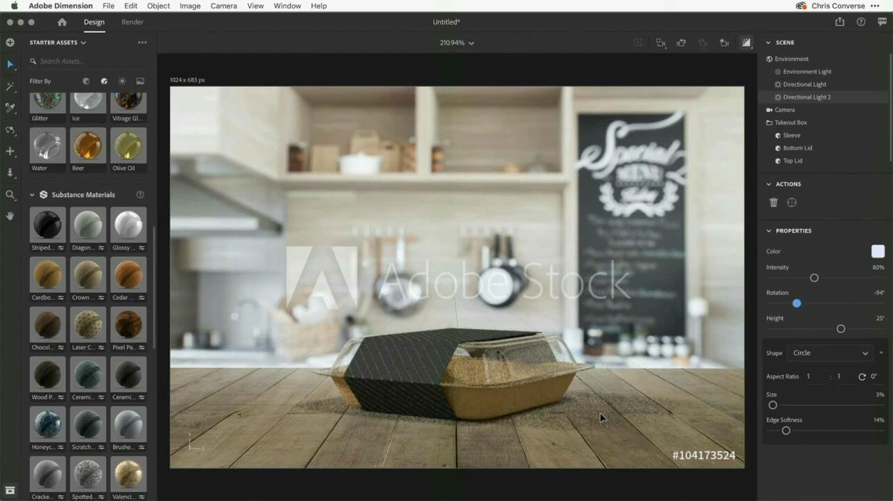

# Tutoriels Adobe 3D et VR

Créez plus rapidement du contenu 3D attrayant grâce à des modèles, des matières et des éclairages de haute qualité. [!DNL Dimension] permet de créer facilement des visuels de marque, des illustrations, des maquettes de produits, des designs de packaging et bien plus encore.

## Cliquer pour visionner un tutoriel sur la 3D et la réalité virtuelle dans Adobe

<table>
<tr>
 <td>
   
    

   <a href="assets/CreateRealistic3DMockupswithAdobeStockandDimension.pdf"><strong>Création de maquettes 3D réalistes avec Adobe [!DNL Stock] et [!DNL Dimension] (PDF)</strong></a>
    

    <em>Associez facilement un design 2D à un modèle 3D à l’aide d’Adobe [!DNL Stock] et a placé des graphiques dans Adobe [!DNL Dimension]</em>
     
  </td>
  <td>
   
    

   <a href="assets/VisualizeTextileDesignsorPatternson3DObjectswithAdobeDimension.pdf"><strong>Visualisation de designs ou motifs textiles sur des objets 3D avec Adobe [!DNL Dimension] (PDF)</strong></a>
    

    <em>Créez une représentation ultra-réaliste de votre produit final en quelques minutes</em>
     
  </td>
  <td>
   
    

   <a href="../cce/assets/VisualizeyourProductinaRealisticEnvironment.pdf"><strong>Visualisez votre produit dans un environnement réaliste (PDF)</strong></a>
    

    <em>Lorsque vous voulez voir à quoi ressembleront vos produits dans le monde réel, Adobe [!DNL Dimension] est votre application de prédilection</em>
     
  </td>
</tr>
   <tr>
 <td>
   
    

   <a href="mastering3dlighting.md"><strong>Conseils et techniques pour maîtriser l’éclairage 3D dans CGI</strong></a>
    

    <em>Découvrez l’éclairage 3D et apprenez à créer différentes conditions d’éclairage susceptibles de modifier totalement une scène générée par ordinateur et l’apparence des objets qu’elle contient</em>
     
  </td>
  <td>
   
    

   <a href="photorealistic.md"><strong>Création de photographies virtuelles photoréalistes avec rendu 3D et composition</strong></a>
    

    <em>Apprenez à créer une photographie virtuelle incroyablement trompeuse et photoréaliste avec la composition et le rendu d’images 3D dans Adobe [!DNL Dimension]</em>
     
  </td>
  <td>
   
    

   <a href="3ddimensionstock.md"><strong>Personnalisez et conférez une marque à un modèle 3D avec [!DNL Dimension] et Adobe [!DNL Stock]</strong></a>
    

    <em>Personnalisez un modèle 3D et définissez sa marque dans [!DNL Dimension] en utilisant des matériaux, des propriétés environnementales, l’éclairage et la photographie, pour créer des images photoréalistes pour n’importe quel projet de design</em>
     
  </td>
</tr>
</table>
