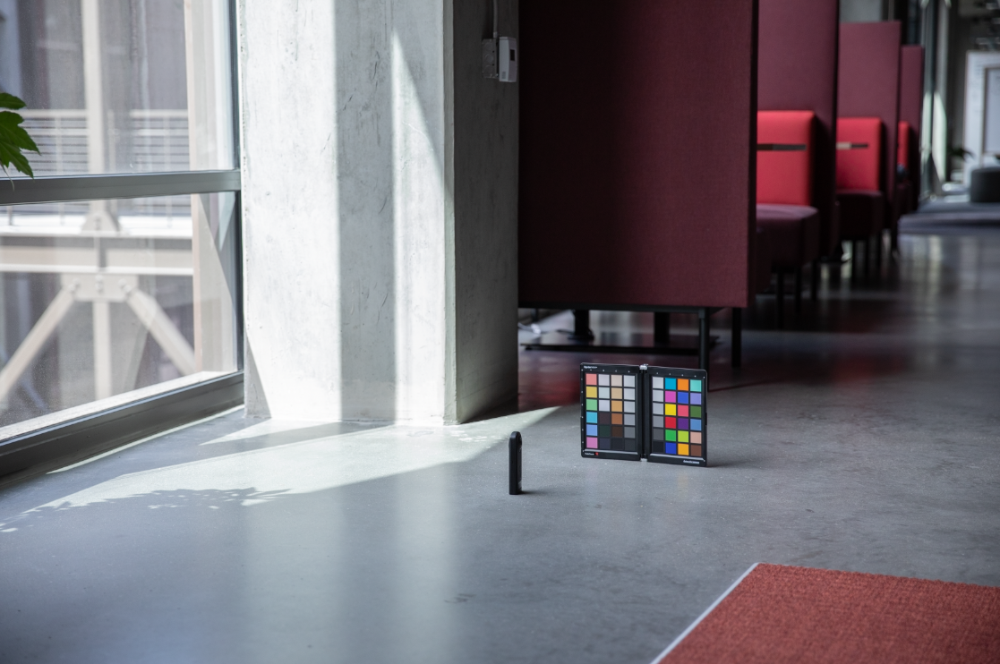
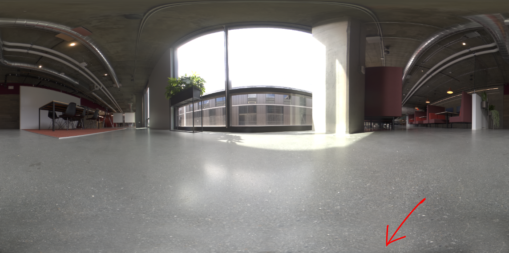

# Création de photographies virtuelles photoréalistes avec rendu 3D et composition

![Collage d&#39;exemples de photographies virtuelles photoréalistes conçues avec l&#39;Adobe [!DNL Dimension]](assets/Photorealistic_1.png)

En regardant les images ci-dessus, on vous pardonnerait de supposer que tout ce que vous voyez est réel. Avec les progrès technologiques dans le rendu d’images 3D photoréalistes, il est plus difficile que jamais de déterminer ce qui est réel et ce qui est virtuel. Dans ce cas, les images sont un mélange de contenu 3D réel, de photographie et de rendu, et c’est exactement le type de design 3D dans lequel les entreprises investissent.

Cette technique, consistant à superposer, ou à &quot;composer&quot; des modèles 3D dans une image ou une vidéo, n’est pas nouvelle, et ses origines remontent aux débuts des effets spéciaux (jusqu’aux années 1980). Ce qui est nouveau et excitant, c&#39;est que cette technique est devenue un outil puissant pour [Adobe [!DNL Dimension]](https://www.adobe.com/products/dimension.html) utilisateurs et un nouveau workflow intriguant pour les photographes.

## La technologie qui permet de créer des images composites dans l’Adobe [!DNL Dimension]

![Modification du plan d&#39;un modèle de sphère métallique dans un Adobe [!DNL Dimension] composite](assets/Photorealistic_3.png)

Adobe [!DNL Dimension] a permis aux utilisateurs de combiner de manière transparente des éléments 2D et 3D directement dans l’application à l’aide de la fonction d’image de correspondance optimisée par Adobe Sensei. Le principal avantage de cette méthode de composition d’éléments est qu’elle permet de booster le processus de création d’une image réaliste en remplaçant une scène 3D entièrement réalisée par une image d’arrière-plan, qui peut être capturée à partir de la réalité.

![Fonction Adapter à l’image dans Adobe [!DNL Dimension] analyse l’image d’arrière-plan et estime la distance focale et la position de l’appareil photo utilisé pour la capturer.](assets/Photorealistic_4.gif)

La fonction Adapter à l’image analyse l’image d’arrière-plan et estime la distance focale et la position de l’appareil photo utilisé pour la capturer. Une caméra 3D est ensuite créée dans le [!DNL Dimension] scène qui peut être utilisée pour rendre des éléments 3D dans la même perspective que l’image d’arrière-plan afin qu’ils se composent ensemble.

Mais qu&#39;en est-il de tout ce qui n&#39;est pas capturé dans le cadre de la caméra ?  L’environnement complet dans lequel une image est capturée a son importance, car il définit l’apparence de chaque élément. Dans une image, un objet réfléchit la lumière du monde qui l’entoure, y compris tout ce qui se trouve derrière l’appareil photo. Pour que les éléments 3D multicalques se fondent parfaitement dans l’arrière-plan de l’image, ils doivent refléter pleinement l’éclairage de l’environnement dans lequel l’image a été prise.

L’option Adapter à l’image tentera d’&quot;halluciner&quot; l’environnement d’éclairage dans lequel une image d’arrière-plan a été prise. Il fait un travail impressionnant qui produira d&#39;excellents résultats en peu de temps, mais capturer l&#39;environnement avec l&#39;image d&#39;arrière-plan produira des résultats encore plus réalistes. Il s’agit même de la méthode utilisée pour entraîner la fonction Adobe Sensei à procéder seule.

Plongez dans l’univers des images panoramiques HDR à 360°. Ces images sont depuis longtemps utilisées dans les graphiques 3D pour accélérer les effets d’éclairage d’un environnement d’éclairage universel. Le processus de saisie des données dans le passé a été assez complexe en raison du niveau élevé de connaissances et de l&#39;équipement spécialisé nécessaire à leur fabrication. Avec l&#39;avènement des appareils photo à 360°, la création de ces images est plus possible que jamais.

Les appareils photo comme Ricoh Theta, Gopro MAX et Insta 360 permettent de capturer 360 panoramas. Le Ricoh Theta est doté d&#39;un bracketing d&#39;exposition automatique, qui est un élément clé du processus de capture. Cela réduit le temps et les efforts de capture des images HDR et les rend plus accessibles aux photographes.

## Processus de création d’images composites photoréalistes

### [!DNL Capture]

Pour commencer à capturer des environnements pour la composition, vous avez besoin de deux éléments principaux ; une ou plusieurs images d’arrière-plan de haute qualité et un panorama HDR à 360° de l’environnement dans lequel elles ont été prises.

L’un des aspects les plus importants de la capture efficace de ce type de contenu est de tirer parti des compétences et des outils existants d’un photographe. La création d&#39;une belle image d&#39;arrière-plan exige un oeil attentif à la composition et aux détails. Les images d’arrière-plan nécessitent également un état d’esprit particulier afin de créer quelque chose d’utile pour la composition d’éléments 3D.

### Choix d’un emplacement

Recherchez des lieux intéressants à la fois pour leur contexte et leur éclairage. Lorsque vous considérez le contexte, il peut être utile d’imaginer l’utilisation potentielle d’une scène. Par exemple, une vue d’une route vide peut être utilisée pour l’ajout dans une voiture 3D, tandis qu’une vue d’une table dans un café peut être utilisée pour [affichage du packaging](https://www.adobe.com/products/dimension/packaging-design-mockup.html) de produits alimentaires.

Lors de la capture de l&#39;image d&#39;arrière-plan, il est important de garder à l&#39;esprit que des éléments 3D y seront intégrés. Il doit y avoir une zone de mise au point vide pour laisser de la place pour ces objets. Le contenu 3D étant souvent le centre d’intérêt principal de la composition finale, il est important que l’arrière-plan ne se démarque pas de lui-même.

La situation de l’éclairage dans l’image est tout aussi importante, car elle affectera considérablement le contenu 3D composite. La lumière doit venir de l’épaule ou du côté du sujet. Elle produira les meilleurs résultats, car elle servira de lumière principale lorsque des objets 3D seront placés dans la scène. Il peut être tentant de photographier vers la lumière lorsqu’il n’y a aucun élément de mise au point en vue, mais n’oubliez pas que cela entraînera un contenu toujours rétroéclairé. L’ajout d’un objet temporaire et fixe à la scène peut être utile pour composer et évaluer l’éclairage.

## Capture du panorama HDR

### Placement de caméra

Placez votre appareil photo à 360° au centre de la zone sur laquelle vous allez vous concentrer pour capturer les arrière-plans. Il peut être idéal dans les cas où les arrière-plans montrent une scène plus large pour soulever la caméra du sol avec un monopode, sinon la caméra peut être réglée directement sur le sol.

### Color

Il est très important de conserver la couleur entre l’appareil utilisé pour photographier l’environnement et celui utilisé pour photographier l’arrière-plan, car les images seront utilisées ensemble. Ici, nous avons la température de couleur des deux caméras réglée à 5000k et a pris une photo d&#39;un tableau de couleurs avec les deux caméras pour un alignement plus en post-production.

### Valeurs d’exposition entre crochets

Pour créer un environnement HDR avec la caméra 360°, plusieurs fichiers EV doivent être capturés pour être combinés dans une image HDR en post-production. La quantité d’EV n’est pas normalisée, mais vous voulez généralement que l’extrémité supérieure de la plage d’exposition atteigne un point où il n’y a plus d’informations dans les tons foncés et l’extrémité inférieure de la plage d’exposition à un point où il n’y a plus d’informations dans les tons clairs.

Dans l’idéal, la caméra à 360° est dotée d’une fonction de bracketing automatique qui permet aux différentes expositions d’être groupées par la caméra. L’idéal est d’utiliser la valeur ISO la plus basse disponible pour éviter le bruit et une valeur d’ouverture élevée pour la netteté. Les valeurs d&#39;exposition peuvent ensuite être modifiées en utilisant la vitesse d&#39;obturation et ventilées par arrêts ; réduire de moitié ou doubler l’exposition.

Voici un exemple de véhicules électriques utilisés pour photographier un IBL en extérieur :

01 - F 5.6, ISO 80, Vitesse d&#39;obturation 1/25000, WB 5000 K

02 - F 5.6, ISO 80, Vitesse d&#39;obturation 1/12500, WB 5000 K

03 - F 5.6, ISO 80, Vitesse d&#39;obturation 1/6400, WB 5000 K

...

16 - F 5.6, ISO 80, Vitesse d&#39;obturation 1, WB 5000 K

Si le 360° utilisé est capable de sortir des images RAW, les EV peuvent être divisés par incréments de 2-4 arrêts puisqu&#39;ils conservent plus d&#39;informations que des images 8 bits comme JPEG.

Après avoir effectué des réglages colorimétriques sur les fichiers EV, ils peuvent être exportés temporairement dans des fichiers individuels pour ensuite être fusionnés dans Photoshop. Le type de fichier doit dépendre de la source, mais n&#39;utilisez pas un format compressé comme JPEG dans les deux cas. Dans Photoshop, choisissez Fichier > Automatisation > Fusionner vers HDR Pro... et sélectionnez tous les fichiers EV exportés.

Assurez-vous que &quot;Mode&quot; est défini sur 32 bits. L&#39;utilisation de &quot;supprimer les fantômes&quot; peut aider à supprimer les détails qui ont changé entre les EV, mais ne l&#39;utilisez pas si vous n&#39;en avez pas besoin. Le curseur situé sous l’histogramme n’affecte que l’exposition de l’aperçu. Ignorez-le donc. Décochez la case &quot;Terminer le virage dans Adobe Camera Raw&quot; et appuyez sur OK.

Le résultat est une image HDR qui peut être utilisée pour éclairer des scènes en 3D.

La dernière étape consiste à supprimer les pattes des trépieds et des ombres visibles au bas de l&#39;image, puis à régler l&#39;exposition par défaut de l&#39;image pour éclairer correctement la scène. La suppression des détails peut être effectuée à l’aide de l’outil de duplication de Photoshop. Le réglage de l’exposition doit être effectué en conjonction avec les arrière-plans dans [!DNL Dimension], car la valeur d’exposition de l’IBL HDR est les valeurs d’éclairage des objets 3D.

### Capture des arrière-plans

Après avoir capturé l’environnement, vous pouvez désormais capturer des arrière-plans à l’aide de l’appareil photo de votre choix. Plus la qualité est élevée, plus la résolution est élevée. C’est ce qui, avec l’oeil pour la composition dont disposent les photographes, constitue le principal avantage de ce processus. Les images ci-dessus ont été prises avec un Canon 5D MK IV.

La marge de manoeuvre est grande pour cadrer et composer avec les arrière-plans. L’appareil photo peut avoir des ouvertures hautes ou basses pour une profondeur de champ variable, utiliser des distances focales longues ou courtes et être incliné vers le haut ou vers le bas. La principale exigence est que la caméra soit dirigée vers le point central de l&#39;endroit où l&#39;environnement a été capturé avec la caméra 360.

Une fois la capture terminée, les images doivent être post-traitées pour correspondre le plus près possible à la couleur de l’environnement. La couleur et l&#39;exposition doivent être aussi neutres et naturelles que possible. Une fois les éléments 3D assemblés dans l’image avec l’Adobe, tous les styles stylisés doivent être appliqués [!DNL Dimension].

## Assemblage de votre image composite dans [!DNL Dimension]

Une fois ces éléments réunis et terminés, ils peuvent désormais être assemblés dans une scène en Adobe [!DNL Dimension]. Cela revient à faire glisser l’arrière-plan dans la scène, où il sera ensuite appliqué à l’arrière-plan ; ajoutez ensuite le panneau HDR dans l’emplacement de l’image d’éclairage d’environnement.

Faites glisser l’image d’arrière-plan dans une zone vide de la zone de travail, ou sélectionnez Environnement dans le panneau Scène et ajoutez l’image à l’entrée d’arrière-plan.

![L’image d’arrière-plan d’une photo virtuelle peut être sélectionnée dans le menu Propriétés de l’Adobe [!DNL Dimension]](assets/Photorealistic_20.png)

Ajoutez le panneau HDR en sélectionnant Lumière de l’environnement et en l’ajoutant à l’entrée Image.

![La source de lumière d’environnement peut être ajoutée à l’image d’arrière-plan d’une photo virtuelle à partir du menu Scène dans l’Adobe [!DNL Dimension]](assets/Photorealistic_21.png)

Vous pouvez ensuite utiliser &quot;Adapter à l’image&quot; sur votre arrière-plan pour faire correspondre la résolution et l’aspect ainsi que la perspective de la caméra. Au lieu de générer l’environnement à partir de l’image d’arrière-plan, l’image panoramique HDR capturée est utilisée pour éclairer la scène. L’option &quot;Créer des lumières&quot; peut donc être laissée non cochée.

![Utilisation de la fonction Adapter à l’image dans Adobe [!DNL Dimension] pour effectuer le rendu d’une image de sphère métallique 3D avec les éclairages d’environnement d’un panoramique HDR](assets/Photorealistic_22.png)

Désormais, les objets ajoutés à la scène seront composés de manière réaliste en arrière-plan, car ils sont éclairés par l’environnement dans lequel l’image a été prise.

Pour évaluer rapidement l&#39;orientation et l&#39;exposition du pano HDR par rapport à l&#39;arrière-plan, une sphère primitive avec un matériau métallique, prise à partir du panneau de ressources libre dans [!DNL Dimension], peut être placé dans la scène. La rotation de la lumière d&#39;environnement peut alors être positionnée de sorte que les reflets semblent corrects. Si l’éclairage du panorama HDR survole ou sous-expose la sphère, l’exposition du panorama HDR doit être augmentée ou réduite pour compenser.

Pour évaluer rapidement l&#39;orientation et l&#39;exposition du pano HDR par rapport à l&#39;arrière-plan, une sphère primitive avec un matériau métallique, prise à partir du panneau de ressources libre dans [!DNL Dimension], peut être placé dans la scène. La rotation de la lumière d&#39;environnement peut alors être positionnée de sorte que les reflets semblent corrects. Si l’éclairage du panorama HDR survole ou sous-expose la sphère, l’exposition du panorama HDR doit être augmentée ou réduite pour compenser.

## Résultat final : Image composite photoréaliste

![Accéléré de composition et de rendu 3D pour une photographie de produit virtuelle dans Adobe [!DNL Dimension]](assets/Photorealistic_24.gif)

Une fois la scène terminée, le workflow de l’utilisateur final est simple. Il vous suffit de glisser-déposer votre propre modèle ou un [Adobe [!DNL Stock] 3D](https://stock.adobe.com/3d-assets) contenu directement dans l’image pour le rendre comme s’il se trouvait là lorsque la photo a été prise. Cela ouvre de nouvelles perspectives pour la création de contenu publicitaire très réaliste, ou la possibilité d&#39;itérer sur des conceptions dans de nombreux contextes différents.

Résultat : un mélange convaincant de réalité et de 3D qui aide les utilisateurs finaux à créer des images photoréalistes en un minimum d’efforts. Testez vous-même avec quelques [gratuit [!DNL Dimension] scènes](https://assets.adobe.com/public/3926726a-2a17-43d4-4937-6d84a4d29338) nous avons créé une démonstration du workflow.

[Télécharger la dernière version](https://creativecloud.adobe.com/apps/download/dimension) de [!DNL Dimension] et lancez-vous dans la création d&#39;images photoréalistes.
