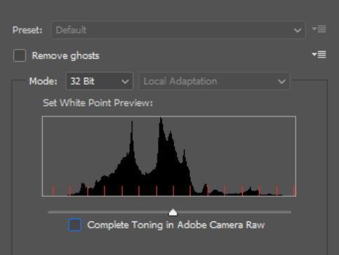

# Création de photos virtuelles photoréalistes avec rendu et composition 3D

![Un collage d&#39;exemples de photographies virtuelles photoréalistes conçues avec un Adobe  [!DNL Dimension]](assets/Photorealistic_1.png)

En regardant les images ci-dessus, on vous pardonnerait d&#39;avoir supposé que tout ce que vous voyez est réel. Avec les avancées technologiques dans le rendu de l&#39;imagerie 3D photoréaliste, cependant, il est plus difficile que jamais de déterminer ce qui est réel et ce qui est virtuel. Dans ce cas, les images sont un mélange de contenu 3D réel, photographique et rendu — et c&#39;est exactement le type de design 3D dans lequel les entreprises investissent.

Cette technique de superposition, ou de &quot;composition&quot; de modèles 3D dans une image ou une vidéo, n’est pas nouvelle, et ses origines remontent en fait aux débuts de l’effet visuel (jusqu’aux années 1980). Ce qui est nouveau et passionnant, c’est que cette technique est devenue un outil puissant pour les [utilisateurs d’Adobes [!DNL Dimension]](https://www.adobe.com/products/dimension.html) et un nouveau workflow intrigant pour les photographes.

## Technologie de création d’images composites dans l’Adobe [!DNL Dimension]

![Modification du plan d’un modèle de sphère métallique dans une  [!DNL Dimension] composition d’Adobe](assets/Photorealistic_3.png)

L’Adobe [!DNL Dimension] permet aux utilisateurs de combiner aisément des éléments 2D et 3D directement dans l’application à l’aide de la fonction d’image de correspondance optimisée par Adobe Sensei. Le principal avantage de la composition d’éléments de cette façon est qu’elle stimule le processus de création d’une image réaliste en substituant une scène 3D entièrement réalisée à une image d’arrière-plan, qui peut être capturée à partir de la réalité.

![La fonction Adapter à l’image de l’Adobe  [!DNL Dimension] analyse l’image d’arrière-plan et estime la distance focale et la position de la caméra utilisée pour la capturer.](assets/Photorealistic_4.gif)

La fonction Adapter à l’image analyse l’image d’arrière-plan et estime la distance focale et la position de la caméra utilisée pour la capture. Une caméra 3D est alors créée dans la scène [!DNL Dimension] qui peut être utilisée pour effectuer le rendu d’éléments 3D dans la même perspective que l’image d’arrière-plan afin qu’ils soient composés ensemble.

Mais qu’en est-il de tout ce qui n’est pas capturé dans le cadre de la caméra ?  L’environnement complet d’une image est capturé dans des matières importantes, car il définit l’apparence de tout ce qui s’y trouve. Un objet d’une image reflète la lumière du monde qui l’entoure, ce qui inclut également tout ce qui se trouve derrière la caméra. Ainsi, pour que les éléments 3D à calques puissent réellement se fondre avec l’arrière-plan de votre image, ils doivent refléter entièrement l’éclairage dans l’environnement dans lequel l’image a été prise.

L’option Adapter à l’image tente d’halluciner l’environnement d’éclairage dans lequel une image d’arrière-plan a été prise. Il fait un travail impressionnant qui produira d&#39;excellents résultats en peu de temps, mais la capture de l&#39;environnement avec l&#39;image d&#39;arrière-plan produira des résultats encore plus réalistes. Il s&#39;agit même de la méthode utilisée pour former la fonction Adobe Sensei à le faire seule.

Entrez dans l’univers des images panoramiques HDR à 360°. Ces images sont utilisées depuis longtemps dans les graphiques 3D pour accélérer les effets d’éclairage d’un environnement d’éclairage global. Le processus d&#39;acquisition de ces armes par le passé a été assez complexe en raison du niveau élevé de connaissances et de l&#39;équipement spécialisé nécessaire pour les acquérir. Avec l’avènement des caméras à 360°, la création de ces images est plus que jamais possible.

Les caméras comme Ricoh Theta, Gopro MAX et Insta 360 peuvent capturer 360 panoramas. Le Ricoh Theta est équipé d&#39;un support d&#39;exposition automatique qui est un élément clé du processus de capture. Cela réduit le temps et l’effort de capture des images HDR et le rend plus accessible pour les photographes.

## Processus de création d’images composites photoréalistes

### [!DNL Capture]

Pour commencer à capturer des environnements pour la composition, vous avez besoin de deux éléments principaux ; une image ou des images d’arrière-plan de qualité supérieure et un panorama HDR de 360° de l’environnement dans lequel elle a été prise.

L’un des aspects les plus importants de la capture efficace de ce type de contenu est de tirer parti des compétences et des outils existants d’un photographe. La création d’une belle image d’arrière-plan nécessite un oeil pour la composition et l’attention portée aux détails. Les images d’arrière-plan nécessitent également un état d’esprit spécial afin de créer quelque chose d’utile pour la composition d’éléments 3D dans.

### Choix d’un emplacement

Recherchez des emplacements intéressants pour leur contexte et leur éclairage. Lors de la prise en compte du contexte, il peut être utile d’imaginer l’utilisation potentielle d’une scène. Par exemple, une vue d&#39;une route vide pourrait être utilisée pour ajouter dans une voiture 3D tandis qu&#39;une vue d&#39;une table dans un café pourrait être utilisée pour [afficher l&#39;emballage](https://www.adobe.com/products/dimension/packaging-design-mockup.html) des produits alimentaires.

Lorsqu’il s’agit de capturer l’image d’arrière-plan, il est important de garder à l’esprit que les éléments 3D y seront composés. Il devrait y avoir une zone de mise au point vide pour laisser de la place pour ces objets. Le contenu 3D étant souvent le point de mire principal de la composition finale, il est important que l’arrière-plan ne se distingue pas trop par lui-même.

La situation de l’éclairage dans l’image est tout aussi importante, car elle affectera considérablement le contenu 3D composite. La lumière doit entrer dans la prise de vue par-dessus l’épaule ou par le côté — elle produira les meilleurs résultats, car elle servira de lumière clé lorsque des objets 3D seront placés dans la scène. Il peut être tentant de tourner vers la lumière lorsqu’il n’y a pas d’élément de mise au point dans la vue, mais n’oubliez pas que cela entraînera un contenu toujours rétroéclairé. L’ajout d’un objet temporaire de veille à la scène peut s’avérer utile pour composer et évaluer l’éclairage.

## Capture du panorama HDR

### Emplacement de la caméra

Placez votre appareil photo à 360° au centre général de la zone sur laquelle vous vous concentrerez pour capturer les arrière-plans. Il peut s’avérer idéal lorsque les arrière-plans montrent une scène plus large pour faire sortir la caméra du sol avec un monopole, sinon la caméra peut être directement fixée sur le sol.

### Couleur

Il est très important de conserver les couleurs entre la caméra utilisée pour prendre des photos de l’environnement et la caméra utilisée pour prendre des photos d’arrière-plan, car les images seront utilisées ensemble. Ici, la température de couleur des caméras est définie sur 5000 k et nous avons pris une photo d&#39;un graphique de couleurs avec les deux caméras pour un alignement ultérieur.

### Valeurs d’exposition avec crochet

Pour créer un environnement HDR avec la caméra à 360°, plusieurs fichiers EV doivent être capturés pour être combinés dans une image HDR en post-production. La quantité de VE n’est pas normalisée, mais en général, vous voulez que l’extrémité supérieure de la plage d’exposition atteigne un point où il n’y a plus d’informations dans les tons foncés et l’extrémité inférieure de la plage d’exposition jusqu’à un point où il n’y a plus d’informations dans les tons clairs.

Dans l&#39;idéal, la caméra à 360° sera dotée d&#39;une fonction d&#39;équerre automatique qui permettra à la caméra de traiter les différentes expositions par lots. Les paramètres idéaux sont d’utiliser la valeur ISO la plus basse disponible pour éviter le bruit et une valeur d’ouverture élevée pour la netteté. Les valeurs d’exposition peuvent ensuite être variées à l’aide de la vitesse d’obturation et divisées par des arrêts ; réduire de moitié ou doubler l’exposition.

Voici un exemple de véhicules électriques utilisés pour filmer un IBL à l&#39;extérieur :

01 - F 5.6, ISO 80, Vitesse d&#39;obturation 1/25000, WB 5000 K

02 - F 5.6, ISO 80, Vitesse d&#39;obturation 1/12500, WB 5000 K

03 - F 5.6, ISO 80, Vitesse d&#39;obturation 1/6400, WB 5000 K

...

16 - F 5.6, ISO 80, Vitesse d&#39;obturation 1, WB 5000 K

Si le 360° utilisé est capable de générer des images RAW, les fichiers EV peuvent être fractionnés par incréments de 2 à 4 arrêts, car ils conservent plus d’informations que les images 8 bits telles que JPEG.

Après avoir effectué des réglages de couleur sur les fichiers EV, ils peuvent être exportés temporairement vers des fichiers individuels pour ensuite être fusionnés dans Photoshop. Le type de fichier doit dépendre de la source, mais n’utilisez pas de format compressé comme JPEG dans les deux cas. Dans Photoshop, choisissez Fichier > Automatiser > Fusionner avec HDR Pro... et sélectionnez tous les fichiers EV exportés.

Assurez-vous que le mode est défini sur 32 bits. L’utilisation de l’option &quot;supprimer les fantômes&quot; peut aider à supprimer les détails qui ont changé entre les VE, mais ne l’utilisez pas si vous n’en avez pas besoin. Le curseur situé sous l’histogramme affecte uniquement l’exposition de l’aperçu. Par conséquent, ignorez-le. Décochez la case Terminer le virage à Adobe Camera Raw et appuyez sur OK.

Le résultat est une image HDR qui peut être utilisée pour éclairer des scènes en 3D.

La dernière étape consiste à supprimer les pattes d’ombrage et de trépied visibles au niveau du nadir de l’image et à régler l’exposition par défaut de l’image pour éclairer correctement la scène. La suppression des détails peut être effectuée à l’aide de l’outil de duplication dans Photoshop. Le réglage de l’exposition doit être effectué en conjonction avec les arrière-plans de [!DNL Dimension], puisque la valeur d’exposition de l’IBL HDR est les valeurs d’éclairage des objets 3D.

### Capture des arrière-plans

Après avoir capturé l’environnement, vous pouvez désormais capturer des arrière-plans à l’aide d’une caméra de votre choix. Plus la qualité est élevée, plus la résolution est élevée. Cette opération, ainsi qu’un oeil pour la composition dont disposent les photographes, constituent le principal avantage de ce processus. Les images ci-dessus ont été capturées avec un Canon 5D MK IV.

Il y a beaucoup de marge de manoeuvre pour encadrer et composer avec les arrière-plans. La caméra peut avoir des ouvertures hautes ou basses pour une profondeur de champ variée, utiliser des distances focales longues ou courtes et être orientée vers le haut ou le bas. La principale exigence est que la caméra soit dirigée vers le centre de l’endroit où l’environnement a été capturé avec la caméra 360.

Une fois la capture terminée, les images doivent être post-traitées pour correspondre à la couleur de l’environnement aussi près que possible. La couleur et l’exposition doivent être aussi neutres et naturelles que possible. Tout aspect stylisé doit être appliqué une fois que des éléments 3D ont été composés dans l’image avec l’Adobe [!DNL Dimension].

## Assemblage de votre image composite dans [!DNL Dimension]

Une fois ces éléments rassemblés et complets, ils peuvent désormais être assemblés dans une scène dans l’Adobe [!DNL Dimension]. Il suffit simplement de faire glisser l’arrière-plan dans la scène, où il sera ensuite appliqué à l’arrière-plan ; ajoutez ensuite le panneau HDR dans l’emplacement d’image de lumière de l’environnement.

Faites glisser l’image d’arrière-plan dans une zone vide de la zone de travail, ou sélectionnez l’environnement dans le panneau Scène et ajoutez l’image à l’entrée d’arrière-plan.

![L’image d’arrière-plan d’une photo virtuelle peut être sélectionnée dans le menu Propriétés de l’Adobe.  [!DNL Dimension]](assets/Photorealistic_20.png)

Ajoutez le panneau HDR en sélectionnant Lumière d’environnement et en l’ajoutant à l’entrée Image.

![La source Lumière de l’environnement peut être ajoutée à l’image d’arrière-plan d’une photo virtuelle à partir du menu Scène dans l’Adobe  [!DNL Dimension]](assets/Photorealistic_21.png)

Vous pouvez ensuite utiliser &quot;Adapter à l’image&quot; sur votre arrière-plan pour faire correspondre la résolution et l’aspect ainsi que la perspective de l’appareil photo. Au lieu de générer l’environnement à partir de l’image d’arrière-plan, l’image du panorama HDR capturée est utilisée pour éclairer la scène, de sorte que l’option &quot;Créer des lumières&quot; peut être laissée non cochée.

![Utilisation de la fonction Adapter à l’image dans l’Adobe  [!DNL Dimension] pour effectuer le rendu d’une image de sphère métallique 3D avec les lumières de l’environnement à partir d’un panorama HDR](assets/Photorealistic_22.png)

Désormais, les objets ajoutés à la scène sont composés de manière réaliste dans l’arrière-plan, car ils sont éclairés par l’environnement dans lequel l’image a été prise.

Pour évaluer rapidement l’orientation et l’exposition du panorama HDR par rapport à l’arrière-plan, une sphère primitive avec un matériau métallique, extrait du panneau Actifs libres dans [!DNL Dimension], peut être placée dans la scène. La rotation de la lumière de l’environnement peut alors être positionnée de manière à ce que les reflets semblent corrects. Si l’éclairage du panorama HDR survole ou sous-expose la sphère, l’exposition du panorama HDR doit être augmentée ou diminuée pour compenser.

Pour évaluer rapidement l’orientation et l’exposition du panorama HDR par rapport à l’arrière-plan, une sphère primitive avec un matériau métallique, extrait du panneau Actifs libres dans [!DNL Dimension], peut être placée dans la scène. La rotation de la lumière de l’environnement peut alors être positionnée de manière à ce que les reflets semblent corrects. Si l’éclairage du panorama HDR survole ou sous-expose la sphère, l’exposition du panorama HDR doit être augmentée ou diminuée pour compenser.

## Résultat final : Image composite photoréaliste

![Temps écoulé entre la composition et le rendu 3D d’une photo de produit virtuelle dans l’Adobe  [!DNL Dimension]](assets/Photorealistic_24.gif)

Une fois la scène terminée, le workflow de l’utilisateur final est simple. Il vous suffit de faire glisser et de déposer votre propre modèle ou tout contenu [Adobe [!DNL Stock] 3D](https://stock.adobe.com/3d-assets) directement dans l’image pour effectuer le rendu comme s’il était là lors de la prise de vue. Cela ouvre de nouvelles voies pour créer des contenus publicitaires hautement réalistes, ou pour reproduire des designs dans de nombreux contextes différents.

Le résultat final est un mélange convaincant de réalité et de 3D qui aide les utilisateurs finaux à atteindre l&#39;objectif de créer des images photoréalistes avec un minimum d&#39;efforts. Testez-le avec des [scènes [!DNL Dimension] gratuites](https://assets.adobe.com/public/3926726a-2a17-43d4-4937-6d84a4d29338) que nous avons créées pour présenter le flux de travaux.

[Téléchargez la dernière ](https://creativecloud.adobe.com/apps/download/dimension) version d’ [!DNL Dimension] aujourd’hui et commencez à créer vos images photoréalistes.
