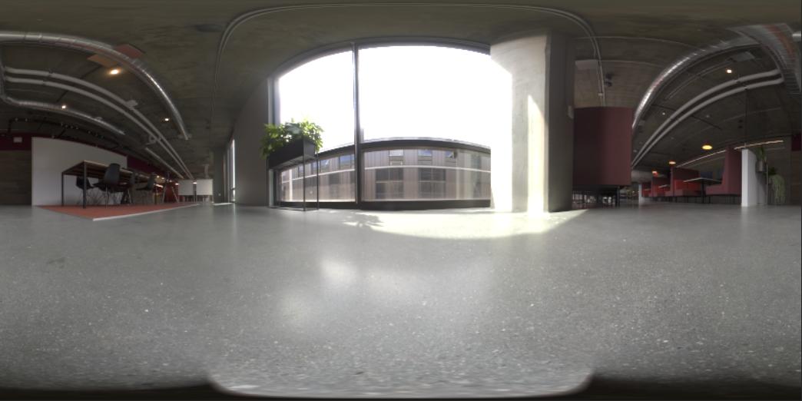

# Création de photographies virtuelles photoréalistes avec rendu et composition 3D

![Un collage d’exemples présentant des photographies virtuelles photoréalistes conçues avec Adobe [!DNL Dimension]](assets/Photorealistic_1.png)

En regardant les images ci-dessus, vous serez pardonné de supposer que tout ce que vous voyez est réel. Toutefois, avec les progrès technologiques dans le rendu d’images 3D photoréalistes, il est plus difficile que jamais de déterminer ce qui est réel et ce qui est virtuel. Dans ce cas, les images sont un mélange de vrai, de photographie et de contenu 3D rendu. C’est exactement le type de conception 3D dans lequel les entreprises investissent.

Cette technique, qui consiste à superposer ou à « composer » des modèles 3D dans une image ou une vidéo, n’est pas nouvelle. En fait, ses origines remontent aux premiers jours des effets spéciaux (qui remontent aux années 1980). Ce qui est nouveau et passionnant, c&#39;est que cette technique est devenue un outil puissant pour les utilisateurs de [l&#39;Adobe [!DNL Dimension]](https://www.adobe.com/products/dimension.html), ainsi qu&#39;un nouveau workflow intrigant pour les photographes.

## Technologie derrière la création d&#39;images composites dans l&#39;Adobe [!DNL Dimension]

![Modification du plan d’un modèle de sphère métallique dans une composition [!DNL Dimension] d’Adobe](assets/Photorealistic_3.png)

L&#39;Adobe [!DNL Dimension] a permis aux utilisateurs de combiner facilement des éléments 2D et 3D directement dans l&#39;application à l&#39;aide de la fonction de correspondance d&#39;image d&#39;Adobe Sensei. Le principal avantage de cette composition d’éléments est qu’elle accélère le processus de création d’une image réaliste en remplaçant une scène 3D entièrement réalisée par une image d’arrière-plan, qui peut être capturée à partir de la réalité.

![La fonction Adapter à l&#39;image de l&#39;Adobe [!DNL Dimension] analyse l&#39;image d&#39;arrière-plan et estime la distance focale et la position de la caméra utilisée pour la capture](assets/Photorealistic_4.gif)

La fonction Adapter à l’image analyse l’image d’arrière-plan et estime la distance focale et la position de la caméra utilisée pour la capture. Une caméra 3D est ensuite créée dans la scène [!DNL Dimension]. Elle peut être utilisée pour effectuer le rendu d&#39;éléments 3D dans la même perspective que l&#39;image d&#39;arrière-plan afin qu&#39;ils se combinent.

Mais qu&#39;en est-il de tout ce qui ne se trouve pas dans le cadre de l&#39;appareil photo ?  L’environnement complet dans lequel une image est capturée est important, car il définit l’aspect de tout ce qui s’y trouve. Un objet dans une image reflète la lumière du monde qui l’entoure, y compris tout ce qui se trouve derrière l’appareil photo. Ainsi, pour que les éléments 3D superposés se fondent vraiment dans l’arrière-plan de votre image, ils doivent refléter pleinement l’éclairage de l’environnement dans lequel l’image a été prise.

L’option Adapter à l’image tentera d’« halluciner » l’environnement d’éclairage dans lequel une image d’arrière-plan a été prise. Il accomplit un travail impressionnant qui produira d&#39;excellents résultats en peu de temps, mais la capture de l&#39;environnement en même temps que l&#39;image d&#39;arrière-plan produira des résultats encore plus réalistes. Il s’agit même de la méthode utilisée pour entraîner la fonction Adobe Sensei à le faire seule.

Entrez dans l’univers des images panoramiques HDR à 360°. Ces images sont utilisées depuis longtemps dans les graphiques 3D pour accélérer les effets d’éclairage d’un environnement d’éclairage mondial complet. Le processus de capture a été assez complexe par le passé en raison du haut niveau de connaissances et de l&#39;équipement spécialisé nécessaire pour les réaliser. Avec l&#39;arrivée des caméras à 360°, la création de ces images est désormais plus possible que jamais.

Les appareils photo comme Ricoh Theta, Gopro MAX et Insta 360 peuvent capturer des panoramas à 360 degrés. La Ricoh Theta est dotée d’un bracketing d’exposition automatique, qui constitue un élément clé du processus de capture. Cela réduit le temps et les efforts de capture des images HDR et les rend plus accessibles aux photographes.

## Processus de création d’images composites photoréalistes

### [!DNL Capture]

Pour commencer à capturer des environnements pour la composition, vous avez besoin de deux éléments principaux : une ou plusieurs images d’arrière-plan de haute qualité et un panorama HDR à 360° de l’environnement dans lequel elles ont été prises.

L&#39;un des aspects les plus importants pour capturer efficacement ce type de contenu est de tirer parti des compétences et des outils existants du photographe. La création d’une belle image d’arrière-plan nécessite un œil attentif pour la composition et une attention particulière portée aux détails. Les images d’arrière-plan nécessitent également un état d’esprit particulier afin de créer quelque chose d’utile pour la composition d’éléments 3D.

### Choix d’un emplacement

Recherchez des emplacements intéressants à la fois pour leur contexte et leur éclairage. Pour le contexte, il peut être utile d’imaginer l’utilisation potentielle d’une scène. Par exemple, une vue d&#39;une route vide peut être utilisée pour ajouter une voiture 3D, tandis qu&#39;une vue d&#39;une table dans un café peut être utilisée pour [afficher le packaging](https://www.adobe.com/products/dimension/packaging-design-mockup.html) de produits alimentaires.

Lors de la capture de l’image d’arrière-plan, il est important de garder à l’esprit que des éléments 3D y seront intégrés. Il doit y avoir une zone d’intérêt vide pour laisser de la place à ces objets. Le contenu 3D est souvent le point de mire principal de la composition finale. Il est donc important que l’arrière-plan ne se démarque pas excessivement.

La situation d’éclairage dans l’image est tout aussi importante, car elle affectera considérablement le contenu 3D composite. La lumière doit entrer dans la prise de vue par-dessus l’épaule ou par le côté. Cela produira les meilleurs résultats, car elle agira comme une lumière clé lorsque des objets 3D sont placés dans la scène. Il peut être tentant de tirer vers la lumière lorsqu’il n’y a aucun élément de mise au point dans la vue, mais n’oubliez pas que cela entraînera un contenu toujours rétroéclairé. L’ajout d’un objet de mise au point temporaire peut être utile pour composer et évaluer l’éclairage.

## Capture du panorama HDR

### Emplacement de l’appareil photo

Placez votre appareil photo 360° au centre général de la zone sur laquelle vous allez vous concentrer pour capturer les arrière-plans. Il peut être idéal, lorsque les arrière-plans montrent une scène plus large, de soulever la caméra du sol avec un monopode, sinon la caméra peut être posée directement sur le sol.

### Color

Il est très important de conserver les mêmes couleurs entre l’appareil photo utilisé pour prendre des photos de l’environnement et celui utilisé pour prendre l’arrière-plan, car les images seront utilisées ensemble. Ici, la température de couleur des deux appareils photo est réglée sur 5 000 k et nous avons pris une photo d&#39;un nuancier de couleurs avec les deux appareils photo pour un meilleur alignement en post-édition.

### Valeurs d’exposition entre crochets

Pour créer un environnement HDR avec la caméra 360°, plusieurs fichiers EV doivent être capturés pour être combinés dans une image HDR en post-traitement. La quantité de valeurs d’exposition n’est pas standardisée, mais en règle générale, vous souhaitez que la limite supérieure de la plage d’exposition atteigne un point où il n’y a plus d’informations dans les ombres et la limite inférieure de la plage d’exposition un point où il n’y a plus d’informations dans les hautes lumières.

Dans l’idéal, la caméra 360° doit être dotée d’une fonction de bracketing automatique qui permet à la caméra de traiter les différentes expositions par lots. Dans l’idéal, utilisez la valeur ISO la plus basse possible pour éviter le bruit et une valeur d’ouverture élevée pour la netteté. Vous pouvez ensuite faire varier les valeurs d’exposition à l’aide de la vitesse d’obturation et les diviser par des arrêts, en réduisant de moitié ou en doublant l’exposition.

Voici un exemple de véhicules électriques utilisés pour photographier un IBL à l’extérieur :

01 - F 5.6, ISO 80, vitesse d&#39;obturation de 1/25000, balance de 5000 K

02 - F 5.6, ISO 80, vitesse d&#39;obturation de 1/12500, balance de 5000 K

03 - F 5.6, ISO 80, vitesse d&#39;obturation de 1/6400, balance de 5000 K

...

16 - F 5.6, ISO 80, vitesse d&#39;obturation de 1, balance de 5000 K

Si le 360° utilisé est capable de générer des images RAW, les fichiers EV peuvent être fractionnés par incréments de 2 à 4 arrêts, car ils conservent plus d’informations que les images 8 bits telles que JPEG.

Après avoir réglé les couleurs des fichiers EV, exportez-les temporairement vers des fichiers individuels pour les fusionner dans Photoshop. Le type de fichier doit dépendre de la source, mais n’utilisez pas de format compressé comme JPEG dans les deux cas. Dans Photoshop, choisissez Fichier > Automatisation > Fusion HDR Pro... et sélectionnez tous les fichiers EV exportés.

Vérifiez que le mode est défini sur 32 bits. L’option Supprimer les fantômes permet de supprimer les détails qui ont changé entre les véhicules électriques, mais n’utilisez pas cette option si vous n’en avez pas besoin. Le curseur situé sous l’histogramme affecte uniquement l’exposition de l’aperçu. Par conséquent, ignorez-le. Décochez « Terminer la tonalité dans Adobe Camera Raw » et appuyez sur OK.

Le résultat est une image HDR qui peut être utilisée pour éclairer des scènes en 3D.

Les dernières étapes consisteront à supprimer les ombres et les pieds de trépied visibles au plus bas de l’image et à ajuster l’exposition par défaut de l’image pour éclairer correctement la scène. La suppression des détails peut être effectuée à l’aide de l’outil de duplication dans Photoshop. Le réglage de l&#39;exposition doit être effectué en conjonction avec les arrière-plans dans [!DNL Dimension], car la valeur d&#39;exposition de l&#39;IBL HDR correspond aux valeurs d&#39;éclairage des objets 3D.

### Capture des arrière-plans

Après avoir capturé l’environnement, vous pouvez désormais capturer des arrière-plans à l’aide de l’appareil photo de votre choix. Plus la qualité et la résolution sont élevées, mieux c’est. C’est, avec l’œil tourné vers la composition que portent les photographes, le principal avantage de ce processus. Les images ci-dessus ont été prises avec un Canon 5D MK IV.

Le cadrage et la composition avec les arrière-plans laissent beaucoup de marge de manœuvre. La caméra peut avoir des ouvertures hautes ou basses pour une profondeur de champ variable, utiliser des distances focales longues ou courtes et être inclinée vers le haut ou vers le bas. La principale exigence est que la caméra soit dirigée vers le centre de l’endroit où l’environnement a été capturé avec la caméra 360.

Une fois la capture terminée, les images doivent être post-traitées pour correspondre le plus possible à la couleur de l’environnement. La couleur et l’exposition doivent être aussi neutres et naturelles que possible. Tous les looks stylisés doivent être appliqués après la composition des éléments 3D dans l&#39;image avec l&#39;Adobe [!DNL Dimension].

## Assemblage de votre image composite dans [!DNL Dimension]

Une fois ces éléments rassemblés et terminés, ils peuvent maintenant être assemblés dans une scène à l&#39;Adobe [!DNL Dimension]. Il suffit de faire glisser l’arrière-plan dans la scène, où il sera ensuite appliqué à l’arrière-plan. Ajoutez ensuite le panorama HDR à l’emplacement de l’image avec la lumière de l’environnement.

Faites glisser l’image d’arrière-plan dans une zone vide de la zone de travail ou sélectionnez l’environnement dans le panneau Scène et ajoutez l’image à l’entrée d’arrière-plan.

![L&#39;image d&#39;arrière-plan d&#39;une photo virtuelle peut être sélectionnée à partir du menu Propriétés dans l&#39;Adobe [!DNL Dimension]](assets/Photorealistic_20.png)

Ajoutez le panorama HDR en sélectionnant Luminosité de l’environnement et en l’ajoutant à l’entrée Image.

![La source Luminosité de l&#39;environnement peut être ajoutée à l&#39;image d&#39;arrière-plan d&#39;une photo virtuelle à partir du menu Scène dans l&#39;Adobe [!DNL Dimension]](assets/Photorealistic_21.png)

Vous pouvez ensuite utiliser « Adapter à l’image » sur votre arrière-plan pour faire correspondre la résolution et l’aspect, ainsi que la perspective de l’appareil photo. Au lieu de générer l’environnement à partir de l’image d’arrière-plan, l’image du panorama HDR capturée est utilisée pour éclairer la scène, de sorte que l’option « Créer des éclairages » peut être laissée décochée.

![Utilisation de la fonction Adapter à l’image dans l’Adobe [!DNL Dimension] pour effectuer le rendu d’une image de sphère métallique 3D avec les éclairages de l’environnement à partir d’un panorama HDR](assets/Photorealistic_22.png)

Désormais, les objets ajoutés à la scène seront intégrés de manière réaliste à l’arrière-plan, car ils sont éclairés par l’environnement dans lequel l’image a été prise.

Pour évaluer rapidement l’orientation et l’exposition du panorama HDR par rapport à l’arrière-plan, une sphère primitive avec un matériau métallique, extraite du panneau des ressources libres dans [!DNL Dimension], peut être placée dans la scène. La rotation de la lumière de l’environnement peut alors être positionnée de sorte que les reflets soient corrects. Si l’éclairage du panorama HDR surexpose ou sous-expose la sphère, l’exposition du panorama HDR doit être augmentée ou diminuée pour compenser.

Pour évaluer rapidement l’orientation et l’exposition du panorama HDR par rapport à l’arrière-plan, une sphère primitive avec un matériau métallique, extraite du panneau des ressources libres dans [!DNL Dimension], peut être placée dans la scène. La rotation de la lumière de l’environnement peut alors être positionnée de sorte que les reflets soient corrects. Si l’éclairage du panorama HDR surexpose ou sous-expose la sphère, l’exposition du panorama HDR doit être augmentée ou diminuée pour compenser.

## Résultat final : une image composite photoréaliste

![Vidéo intermittente de composition et de rendu 3D pour une photo de produit virtuelle dans l&#39;Adobe [!DNL Dimension]](assets/Photorealistic_24.gif)

Une fois la scène terminée, le workflow de l’utilisateur final est simple. Il vous suffit de glisser-déposer votre propre modèle ou tout contenu [Adobe [!DNL Stock] 3D](https://stock.adobe.com/3d-assets) directement dans l&#39;image pour le rendre comme s&#39;il était là lorsque la photo a été prise. Cela ouvre de nouvelles voies pour créer du contenu publicitaire hautement réaliste, ou la possibilité d’itérer des conceptions dans de nombreux contextes différents.

Le résultat final est un mélange convaincant de réalité et de 3D qui aide les utilisateurs finaux à atteindre l’objectif de créer des images photoréalistes avec un minimum d’effort. Essayez vous-même avec quelques [scènes [!DNL Dimension] gratuites](https://assets.adobe.com/public/3926726a-2a17-43d4-4937-6d84a4d29338) que nous avons créées pour vous montrer le workflow.

[Téléchargez la dernière version](https://creativecloud.adobe.com/apps/download/dimension) de [!DNL Dimension] dès aujourd&#39;hui et commencez à créer vos images photoréalistes.
