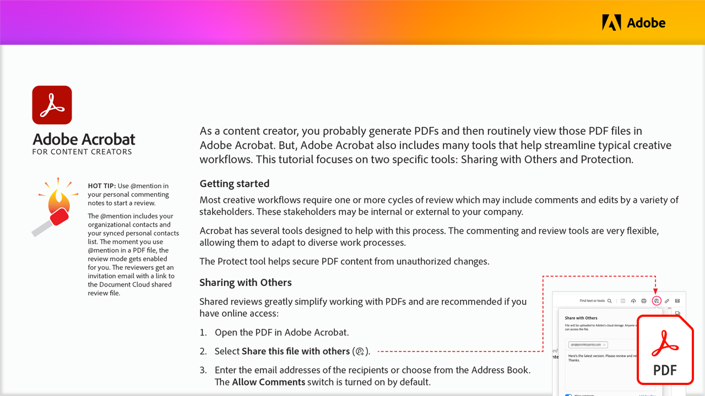

# Acrobat pour les créateurs de contenu

En tant que créateur de contenu, vous générez probablement des PDF, puis affichez régulièrement ces fichiers de PDF dans Acrobat. Mais il existe de nombreux autres outils qui aident à rationaliser les workflows créatifs typiques.

Sélectionnez l’image ci-dessous pour afficher ou télécharger ce tutoriel du PDF.

[{« width=680 »}](assets/Acrobat-for-Content-Creators.pdf){target="blank"}
