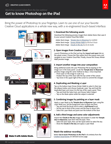

# Créer des compositions uniques avec l’Adobe [!DNL Stock] et Photoshop pour iPad

Mettez la puissance de Photoshop à portée de main. Apprenez à utiliser l’une de vos applications de Creative Cloud préférées d’une toute nouvelle manière, avec une interface tactile repensée.

>[!VIDEO](https://video.tv.adobe.com/v/331004?hidetitle=true)

  

[**Télécharger Le Guide Du PDF De Référence Rapide**](../quick-reference/GettoknowPhotoshopontheiPad.pdf)

