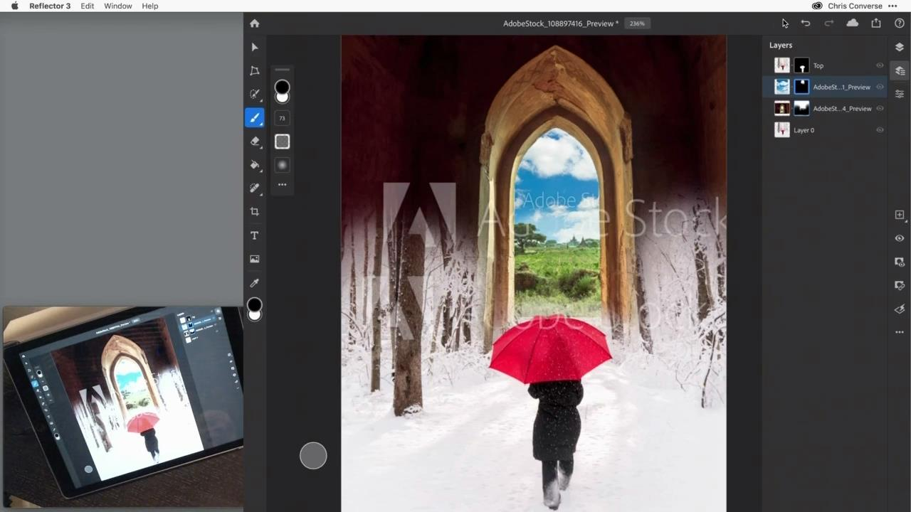

# Tutoriels Creative Cloud abonnement Entreprise

En tant que créatif d’entreprise, vous devez collaborer avec des équipes réparties dans le monde entier, mettre en place des processus évolutifs et respecter les directives et les systèmes de l’entreprise. Ces tutoriels vous aident à découvrir les nouvelles fonctionnalités de Creative Cloud — d’un point de vue professionnel.

## Cliquer pour afficher un tutoriel de produit

### Adobe Acrobat

<table style="table-layout:fixed">
<tr>
 <td>
   
    

   <a href="assets/AcrobatforContentCreators.pdf"><strong>Acrobat pour les créateurs de contenu (PDF)</strong></a>
    

    <em>Découvrez les outils Acrobat qui simplifient les workflows de création</em>
     
  </td>
  <td>
    
    

     
  </td>
  <td>
    
    

     
  </td>
  <td>
    
    

     
  </td>
</tr>
</table>

### Creative Cloud abonnement Entreprise

<table style="table-layout:fixed">
<tr>
 <td>
   
    

   <a href="assets/FromHandLetteringtoIllustratorviaCreativeCloud.pdf"><strong>Du lettrage manuscrit à Illustrator via un Creative Cloud (PDF)</strong></a>
    

    <em>Exploitant la puissance de Creative Cloud abonnement Entreprise, les applications pour Adobes mobiles et ordinateurs vous permettent de capturer, de convertir et de créer où que vous soyez, sur n’importe quel appareil</em>
     
  </td>
  <td>
   
    

   <a href="assets/FromLightroomWebtoInDesignviaCreativeCloud.pdf"><strong>De Lightroom Web à InDesign via un Creative Cloud (PDF)</strong></a>
    

    <em>Laissez libre cours à votre créativité, de l’appareil photo au design final, en passant par les fichiers et bibliothèques de votre Creative Cloud</em>
     
  </td>
  <td>
    
    

     
  </td>
  <td>
    
    

     
  </td>
</tr>
</table>

### Adobe Express (anciennement Adobe Spark)

<table style="table-layout:fixed">
<tr>
 <td>
   
    

   <a href="assets/AddingaGlideshowtoyourSparkPageAdobeBlog.pdf"><strong>Ajout d'un diaporama à votre Spark Page (PDF)</strong></a>
    

    <em>Adobe Spark offre des composants de mise en page étonnants et faciles à utiliser qui donnent vie à vos récits web</em>
     
  </td>
  <td>
   
    

   <a href="assets/CreatingYourBrandinAdobeSpark.pdf"><strong>Création de votre marque dans Adobe Spark (PDF)</strong></a>
    

    <em>Adobe Spark vous aide à définir votre marque</em>
     
  </td>
  <td>
   
    

   <a href="assets/MeetYourNewProductionArtistAdobeSparkPost.pdf"><strong>Rencontrez Votre Nouvel Artiste De Production : Adobe Spark Post (PDF)</strong></a>
    

    <em>Adobe Spark apprend de vous lors de la création de mises en page, de la définition de couleurs, de l’importation d’illustrations et de l’agencement d’éléments dans vos compositions</em>
     
  </td>
  <td>
    
    

     
  </td>
</tr>
</table>

### Photoshop

<table style="table-layout:fixed">
<tr>
  <td>
    
    

    <a href="alphabetsoup.md"><strong>Décodage de la soupe d'alphabets de formats graphiques</strong></a>
    

    <em>Les fichiers JPG, PNG, SVG, GIF et EPS sont tous couramment utilisés dans le design, certains pour les pages web, d’autres pour les présentations, les publications et les projets créatifs. Mais qu'est-ce qu'ils veulent dire, et lequel choisir ?</em>
     
  </td>
  <td>
    
    

    <a href="compositepsipad.md"><strong>Création de compositions originales avec Adobe [!DNL Stock] et Photoshop pour iPad</strong></a>
    

    <em>Mettez toute la puissance de Photoshop à portée de main. Apprenez à utiliser l’une de vos applications de Creative Cloud préférées d’une toute nouvelle manière, avec une interface tactile repensée</em>
     
  </td>
  <td>
    
    

    <a href="cinemagraphps.md"><strong>Création de cinémagraphes avec Photoshop</strong></a>
    

    <em>Dans ce tutoriel vidéo d'atelier, vous allez créer une photographie vivante en associant des images d'Adobe [!DNL Stock] avec des techniques de masquage astucieuses dans Photoshop</em>
     
  </td>
  <td>
    
    

    <a href="assets/AddRemarkableLightingtoaPhotowithPhotoshopandAfterEffects.pdf"><strong>Ajouter un éclairage remarquable à une photo avec Photoshop et After Effects (PDF)</strong></a>
    

    <em>Apprenez à améliorer une photo de manière spectaculaire avec l'effet Lumière éclatée de Adobe After Effects</em>
     
  </td>
</tr>
<tr>
  <td>
    
    

    <a href="assets/CreateCinemagraphsinaSnapwithPhotoshopandAdobeStock.pdf"><strong>Création de cinémagraphes en un clin d’oeil avec Photoshop et Adobe [!DNL Stock] (PDF)</strong></a>
    

    <em>Recherche de vidéos en boucle sur l’Adobe [!DNL Stock] pour assembler rapidement des cinémagraphes accrocheurs dans Photoshop</em>
     
  </td>
  <td>
    
    

    <a href="assets/CreatingaLivingPhotographwithPhotoshopPart1.pdf"><strong>Création d’une photo réaliste avec Photoshop — Partie 1 (PDF)</strong></a>
    

    <em>Adobe Photoshop vous permet de transformer rapidement vos courtes vidéos en photos qui captiveront votre audience sur les réseaux sociaux</em>
     
  </td>
  <td>
    
    

    <a href="assets/CreatingaLivingPhotographwithPhotoshopPart2.pdf"><strong>Création d’une photo réaliste avec Photoshop — Partie 2 (PDF)</strong></a>
    

    <em>L’association de photos et de vidéos est un moyen efficace d’ajouter une qualité attrayante à vos photos sans sacrifier le message ou la tonalité de votre image originale</em>
     
  </td>
  <td>
    
    

    <a href="assets/PhotoshopAfterEffectsAwesomenessAdobeMAX2018LabRecap.pdf"><strong>Photoshop + After Effects = Génial : Adobe MAX 2018 Lab Recap (PDF)</strong></a>
    

    <em>Dans ce laboratoire pratique et détaillé, associez Photoshop à After Effects pour créer des images et des effets époustouflants exploitables sur tout type de support</em>
     
  </td>
</tr>
<tr>
  <td>
    
    

    <a href="assets/QuicklyBrandYourInstagramPhotoswithAdobePhotoshopActions.pdf"><strong>Personnalisez rapidement vos photos Instagram à l'aide des actions Adobe Photoshop (PDF)</strong></a>
    

    <em>Éliminez la corvée et gagnez un temps considérable en utilisant les actions de Photoshop</em>
     
  </td>
</tr>
<tr>
  <td>
    
    

    <a href="assets/WorkSmarterNotHarderwithPhotoshop.pdf"><strong>Gagnez en efficacité avec Photoshop (PDF)</strong></a>
    

    <em>Les modifications apportées à Photoshop peuvent prendre du temps, mais cela n’est pas une fatalité</em>
     
  </td>
  <td>
    
    

    <a href="assets/AnyoneCanBeCreativewithAdobeCreativeCloud.pdf"><strong>Ajoutez un peu d’Adobe Photoshop à votre ensemble de compétences créatives (PDF)</strong></a>
    

    <em>Ajoutez un peu d’Adobe Photoshop à vos compétences créatives</em>
     
  </td>
  <td>
    
    

    <a href="assets/GreenScreenisNotJustforVideo.pdf"><strong>Le fond vert n'est pas que pour la vidéo (PDF)</strong></a>
    

    <em>Vous pouvez utiliser un fond vert dans un studio photo et utiliser After Effects pour préparer l’utilisation de la photo dans Photoshop</em>
     
  </td>
  <td>
    
    

     
  </td>
</tr>  
</table>

### Fresco

<table>
<tr>
 <td>
   
    

   <a href="frescoworkshop.md"><strong>Essayez-vous à Fresco sur iPad (et iPhone)</strong></a>
    

    <em>Explorez un tout nouvel univers de dessin et de peinture numériques avec Adobe Fresco dans cet atelier pratique de 15 minutes</em>
     
  </td>
  <td>
    
    

     
  </td>
  <td>
    
    

     
  </td>
  <td>
    
    

     
  </td>
</tr>
</table>

### Adobe Portfolio

<table  style="table-layout:fixed">
<tr>
   <td>
   
    

   <a href="assets/GettingStartedWithAdobePortfolio.pdf"><strong>Prise En Main D’Adobe Portfolio (PDF)</strong></a>
    

    <em>Partager vos meilleurs travaux avec Adobe Portfolio est un moyen efficace de partager vos succès et d’attirer de nouveaux talents créatifs</em>
     
  </td>
  <td>
   
    

   <a href="assets/ConnectingLightroomandBehancetoYourAdobePortfolio.pdf"><strong>Connexion de Lightroom et Bēhance à votre Adobe Portfolio (PDF)</strong></a>
    

    <em>Utilisation de projets Bēhance comme pages de votre portfolio</em>
     
  </td>
  <td>
   
    

   <a href="assets/ShowYourBestWorkwithAdobePortfolio.pdf"><strong>Présentez vos meilleurs travaux avec Adobe Portfolio (PDF)</strong></a>
    

    <em>Adobe Portfolio vous permet de transférer, d’organiser et de partager votre travail avec vos collaborateurs et clients potentiels dans le monde entier</em>
     
  </td>
  <td>
    
    

     
  </td>
 </tr>
 </table>

### Bibliothèques CC

<table  style="table-layout:fixed">
<tr>
  <td>
   
   

   <a href="ccteamlibraries.md"><strong>Création de bibliothèques de Creative Cloud pour les équipes</strong></a>
    

    <em>Découvrez comment partager des ressources au sein d’un groupe ou d’une équipe à l’aide des bibliothèques de Creative Cloud pour les équipes</em>
     
  </td>
  <td>
   
   

   <a href="sharecclibraries.md"><strong>Partage de ressources de marque avec les Bibliothèques Creative Cloud pour les équipes</strong></a>
    

    <em>Découvrez comment créer, utiliser et partager des ressources de branding pour votre groupe ou votre équipe à l’aide des bibliothèques de Creative Cloud pour les équipes</em>
     
  </td>
  <td>
   
    

   <a href="assets/CreateAddandShareYourBrandAssetswithCreativeCloudLibraries.pdf"><strong>Création, ajout et partage de vos ressources de marque avec les Bibliothèques Creative Cloud (PDF)</strong></a>
    

    <em>Les bibliothèques de Creative Cloud fournissent un système de marque intégré qui permet aux designers de partager des ressources de marque entre les équipes de création</em>
     
  </td>
  <td>
   
    

   <a href="assets/ShareTextStylesFromIllustratorwithCreativeCloudLibraries.pdf"><strong>Partage de styles de texte d’Illustrator avec les bibliothèques de Creative Cloud (PDF)</strong></a>
    

    <em>Gagnez en efficacité dans Illustrator.</em>
     
  </td>
</tr>
</table>

### Fonts

<table  style="table-layout:fixed">
<tr>
  <td>
   
    

   <a href="assets/CreatingBeautifulTypographywithCreativeCloud.pdf"><strong>Création d’une superbe typographie avec un Creative Cloud (PDF)</strong></a>
    

    <em>Découvrez comment tirer parti des commandes typographiques de pointe disponibles dans vos outils de création préférés</em>
     
  </td>
   <td>
   
    

   <a href="assets/DiscoveringFontswithCreativeCloud.pdf"><strong>Découverte des polices avec Creative Cloud (PDF)</strong></a>
    

    <em>Parfois, il est difficile de trouver la bonne police pour un projet. Grâce à divers services et applications de Creative Cloud, il est maintenant amusant et inspirant de trouver la bonne police</em>
     
  </td>
  <td>
   
    

   <a href="assets/UnleashHiddenGemsinOpenTypefonts.pdf"><strong>Libérer les gemmes cachées dans les polices d’OpenType (PDF)</strong></a>
    

    <em>Le format OpenType permet à une police de contenir jusqu’à 65 536 glyphes</em>
     
  </td>
  <td>
    
    

     
  </td>
</tr>
</table>

### InDesign

<table  style="table-layout:fixed">
<tr>
  <td>
   
    

   <a href="assets/CreatingInteractivePDFsfromInDesign.pdf"><strong>Création de PDF interactifs à partir d’InDesign (PDF)</strong></a>
    

    <em>InDesign offre de nombreuses fonctions qui vous aident à mettre en forme, styliser, gérer et suivre le contenu de vos documents</em>
     
  </td>
   <td>
   
    

   <a href="assets/EasilyGatherandIncorporateDesignFeedbackwithAdobeAcrobatandInDesign.pdf"><strong>Collectez et intégrez facilement les commentaires de design avec Adobe Acrobat et InDesign (PDF)</strong></a>
    

    <em>Les parties prenantes peuvent utiliser Acrobat pour ajouter des commentaires et des annotations détaillés, puis vous pouvez rapidement ramener ces annotations dans Adobe InDesign pour les voir dans le contexte de votre mise en page</em>
     
  </td>
  <td>
   
    

   <a href="assets/StyleWebContentwithInDesign.pdf"><strong>Mise en forme du contenu web avec Adobe InDesign CC (PDF)</strong></a>
    

    <em>Saviez-vous que vous pouvez exploiter la puissance de l’InDesign pour produire des graphiques Web et de HTML ?</em>
     
  </td>
  <td>
   
    

   <a href="assets/InteractivePDFBookmarksandLinkedTOCsfromInDesign.pdf"><strong>PDF interactif : Signets et tables des matières liées depuis l’InDesign (PDF)</strong></a>
    

    <em>Découvrez comment utiliser la fonction Table des matières dans InDesign pour générer des signets et des hyperliens qui permettent à vos lecteurs de retrouver rapidement des informations dans vos fichiers de PDF</em>
     
  </td>
</tr>
<tr>
  <td>
   
    

   <a href="assets/InteractivePDFGraphicalHyperlinksandNestedMasterPagesinInDesign.pdf"><strong>PDF interactif : Hyperliens graphiques et pages principales imbriquées dans InDesign (PDF)</strong></a>
    

    <em>L'application d'hyperliens avec des pages principales vous permet de gérer rapidement un système de navigation dans toutes vos pages</em>
     
  </td>
  <td>
    
    

     
  </td>
  <td>
    
    

     
  </td>
  <td>
    
    

     
  </td>
</tr>
</table>

### Illustrator

<table  style="table-layout:fixed">
<tr>
   <td>
   
    

   <a href="assets/GettoKnowGraphicStylesinIllustrator.pdf"><strong>Découverte des styles graphiques dans Illustrator (PDF)</strong></a>
    

    <em>Illustrator vous permet de mettre en forme des illustrations de la même manière que votre texte</em>
     
  </td>
   <td>
   
    

   <a href="assets/WorkSmarterNotHarderwithIllustrator.pdf"><strong>Gagnez en efficacité avec Adobe Illustrator CC (PDF)</strong></a>
    

    <em>Accélérez vos dessins vectoriels dans Illustrator</em>
     
  </td>
  <td>
   
    

   <a href="assets/IllustratorSymbolsandLayersequalsPerfectStructureforResponsiveSVG.pdf"><strong>Illustrator Symbols + Layers = Structure parfaite pour un SVG réactif ! (PDF)</strong></a>
    

    <em>Illustrator fournit une prise en charge inégalée du format SVG, notamment la création de symboles, de groupes, d’ID et de définitions vectorielles précises de votre illustration</em>
     
  </td>
  <td>
    
    

     
  </td>
</tr>
</table>

### [!DNL Dimension]

<table  style="table-layout:fixed">
<tr>
   <td>
   
    

   <a href="assets/VisualizeyourProductinaRealisticEnvironment.pdf"><strong>Visualisez votre produit dans un environnement réaliste (PDF)</strong></a>
    

    <em>Lorsque vous voulez voir à quoi ressemblent vos produits dans le monde réel, Adobe [!DNL Dimension] est votre application de prédilection</em>
     
  </td>
  <td>
    
    

     
  </td>
  <td>
    
    

     
  </td>
  <td>
    
    

     
  </td>
</tr>
</table>
