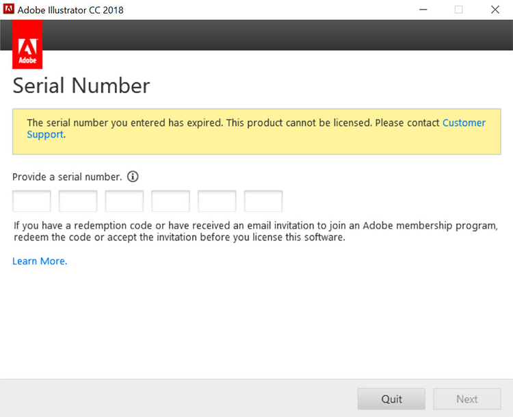
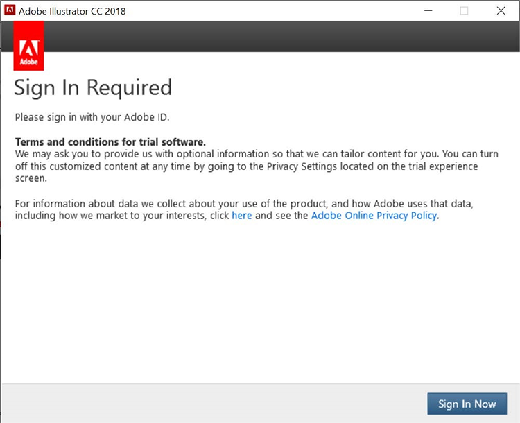
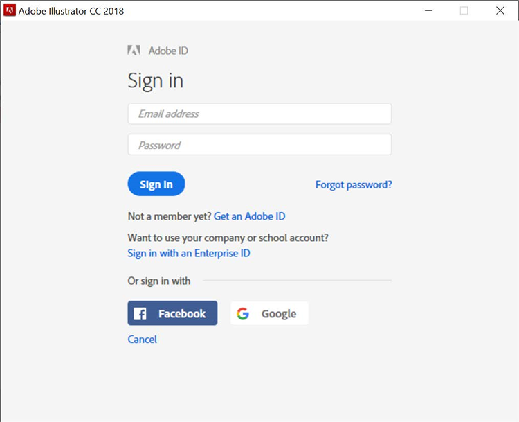
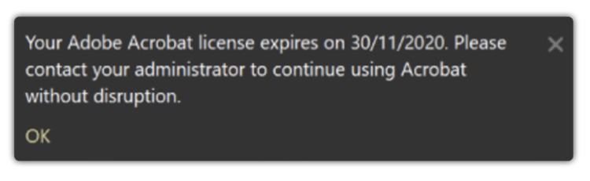
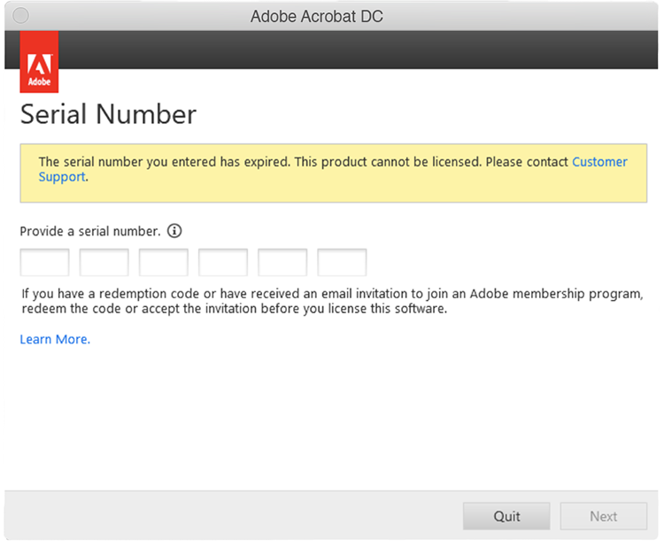

# Présentation du mot de Creative Cloud pour les entreprises et expiration des numéros de série Acrobat

Historiquement, l’Adobe émettait des numéros de série avec nos applications (par exemple, Creative Suite, Creative Cloud abonnement Entreprise, Acrobat XI, Acrobat DC) pour les clients ayant conclu un contrat de licence d’entreprise (ETLA). Ces numéros de série ont une date d’expiration. Une fois la date d’expiration passée, le produit ne fonctionnera plus. Il est donc important de planifier votre migration avant l’expiration de vos numéros de série. Cette page décrit les étapes nécessaires pour s’assurer que vos utilisateurs finaux disposent d’un accès continu à leurs applications et services d’Adobe.

## Vérification de la date d’expiration de vos numéros de série

### Recherche de votre/vos numéro(s) de série

Les licences avec numéro de série associées à votre contrat ETLA sont disponibles via le [Adobe Licensing Website](https://licensing.adobe.com/) (LWS). Suivez ces instructions pour afficher et télécharger :

1. Se connecter à [Adobe Licensing Website](https://licensing.adobe.com/) (LWS) avec votre Adobe ID et votre mot de passe.
1. Choisissez **Licences > Récupérer les numéros de série**.
1. Saisissez votre **ID utilisateur final** ou **ID de déploiement**.
1. (Facultatif) Sélectionnez un élément **Nom du produit**, **Version du produit**, ou **Plateforme** pour filtrer les résultats.
1. Cliquez sur Rechercher.
1. Le nom de produit et les numéros de série s’affichent.
1. (Facultatif) Sélectionnez &quot;EXPORTER AU FORMAT CSV&quot; pour télécharger la liste des numéros de série.

### Vérifiez la date d’expiration

La [AdobeExpiryCheck](https://helpx.adobe.com/enterprise/kb/volume-license-expiration-check.html) est un utilitaire de ligne de commande permettant aux administrateurs informatiques de vérifier si les produits d’un Adobe sur un ordinateur utilisent des numéros de série qui ont expiré ou vont bientôt expirer. L’outil affiche des informations telles que l’identifiant de licence du produit (LEID), le numéro de série chiffré et la date d’expiration. Ceci [page](https://helpx.adobe.com/enterprise/kb/volume-license-expiration-check.html) contient des instructions sur le téléchargement et l’utilisation de l’outil sur les ordinateurs Mac ou Windows.

## Comprendre l’expérience de l’utilisateur final avant et après l’expiration du numéro de série

Les applications Acrobat et Creative Cloud abonnement Entreprise commenceront à afficher des messages (dans les applications) 60 jours avant leur expiration. Une fois le numéro de série expiré, les produits cessent de fonctionner et invitent l’utilisateur à prendre des mesures.

### Expérience Creative Cloud abonnement Entreprise

Les informations suivantes décrivent l’expérience de l’utilisateur final. Vous trouverez ci-dessous une courte vidéo suivie d’un aperçu de l’expérience de l’utilisateur final.

>[!VIDEO](https://video.tv.adobe.com/v/331746?hidetitle=true)

**Avant expiration**

À partir de 60 jours avant l’expiration du numéro de série, toutes les applications Creative Cloud abonnement Entreprise affichent une boîte de dialogue dans le produit à l’attention de l’utilisateur final. Ce message apparaîtra toutes les semaines, jusqu&#39;à 30 jours avant l&#39;expiration, il apparaîtra ensuite tous les jours jusqu&#39;à la date d&#39;expiration commençant *Votre licence arrive à expiration. Ce produit Adobe utilise une licence qui doit expirer le 29 novembre 2020. Veuillez contacter votre administrateur pour garantir un accès continu*.

**Après expiration**

Une fois le numéro de série expiré, les utilisateurs n’auront plus accès au Creative Cloud pour les applications d’entreprise. Lors du premier lancement après expiration, l’utilisateur est invité à afficher une boîte de dialogue indiquant *Le numéro de série que vous avez entré a expiré. Ce produit ne peut pas être sous licence. Contactez le service clientèle*.

Pour toutes les tentatives ultérieures de lancement des applications, l’utilisateur final sera invité à **Se connecter maintenant** , puis l’option de création de leur propre Adobe ID et de passer en mode d’évaluation. Cependant, tout nouvel Adobe ID créé par l’utilisateur final ne sera pas associé aux licences de votre organisation et entraînera une confusion supplémentaire pour vos utilisateurs. Pour éviter toute interruption d’activité et/ou confusion inutile, migrez vos utilisateurs vers des licences nominatives avant l’expiration de vos numéros de série.

### Expérience Acrobat

Les informations suivantes décrivent l’expérience de l’utilisateur final. Vous trouverez ci-dessous une courte vidéo suivie d’un aperçu de l’expérience de l’utilisateur final.

>[!VIDEO](https://video.tv.adobe.com/v/331749?hidetitle=true)

**Avant expiration**

À partir de 60 jours avant l’expiration du numéro de série, Acrobat affiche un message contextuel dans le produit pour l’utilisateur final. Il apparaîtra une fois par semaine jusqu&#39;à 7 jours avant expiration. Il commencera alors à apparaître tous les jours en déclarant *Votre licence Adobe Acrobat expire le 30/11/2020. Contactez votre administrateur pour continuer à utiliser Acrobat sans interruption.*

**Après expiration**

Une fois le numéro de série expiré, les utilisateurs n’auront plus accès à Acrobat. Lors du premier lancement après expiration, l’utilisateur est invité à afficher une boîte de dialogue indiquant *Le numéro de série que vous avez entré a expiré. Ce produit ne peut pas être sous licence. Contactez le service clientèle.*

Pour toutes les tentatives ultérieures de lancement d’Acrobat, l’utilisateur final sera invité à **Se connecter maintenant** , puis l’option de création de leur propre Adobe ID et de passer en mode d’évaluation. Cependant, tout nouvel Adobe ID créé par l’utilisateur final ne sera pas associé aux licences de votre organisation et entraînera une confusion supplémentaire pour vos utilisateurs.

## Contactez-nous si vous avez besoin d’aide

Si vous avez des questions concernant l’utilisation du [AdobeExpiryCheck](https://helpx.adobe.com/enterprise/kb/volume-license-expiration-check.html) ou avez besoin d’aide pour migrer du déploiement par numéro de série vers l’utilisateur nommé, vous disposez de quelques options :
* Envoyer un e-mail à l’équipe d’intégration Adobe Enterprise - **entonb@adobe.com**
* Ouvrez un ticket d’assistance dans [Admin Console](https://adminconsole.adobe.com/support)
* Contactez votre équipe en charge du compte d’Adobe
