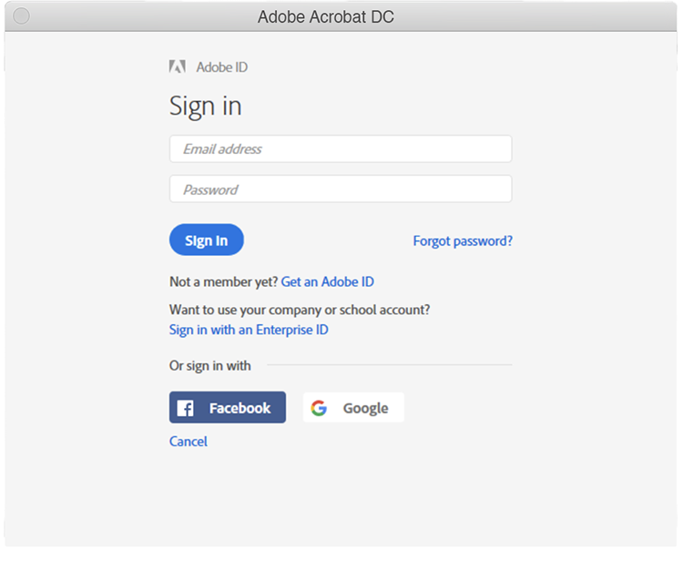

# Expiration du Creative Cloud pour les entreprises et du numéro de série Acrobat

Historiquement, l’Adobe émettait des numéros de série avec nos applications (c’est-à-dire Creative Suite, Creative Cloud pour entreprise, Acrobat XI, Acrobat DC) aux clients sous contrat de licence d’entreprise (ETLA). Ces numéros de série ont une date d’expiration. Une fois la date d’expiration passée, le produit ne fonctionnera plus. Il est donc important de planifier votre migration avant l’expiration de vos numéros de série. Cette page décrit les étapes nécessaires pour garantir à vos utilisateurs finaux un accès continu à leurs applications et services Adobe.

## Vérification de la date d’expiration de vos numéros de série

### Recherche de vos numéros de série

Les licences par numéro de série associées à votre contrat ETLA sont disponibles via le [site web d’achat de licences d’Adobe](https://licensing.adobe.com/) (LWS). Suivez ces instructions pour afficher et télécharger :

1. Connectez-vous au [site web d&#39;achat de licences d&#39;Adobe](https://licensing.adobe.com/) (LWS) avec votre Adobe ID et votre mot de passe.
1. Choisissez **Licences > Récupérer les numéros de série**.
1. Saisissez votre **ID d&#39;utilisateur final** ou votre **ID de déploiement**.
1. (Facultatif) Sélectionnez un **Nom du produit**, une **Version du produit** ou une **Plateforme** pour filtrer les résultats.
1. Cliquez sur Recherche.
1. Le nom de produit et les numéros de série s’affichent.
1. (Facultatif) Sélectionnez « EXPORTER AU FORMAT CSV » pour télécharger la liste des numéros de série.

### Vérifier la date d’expiration

L&#39;[AdobeExpiryCheck](https://helpx.adobe.com/fr/enterprise/kb/volume-license-expiration-check.html) est un utilitaire de ligne de commande permettant aux administrateurs informatiques de vérifier si les produits Adobes d&#39;un ordinateur utilisent des numéros de série qui ont expiré ou qui expirent. L’outil affiche des informations telles que l’identifiant de licence de produit (LEID), le numéro de série chiffré et la date d’expiration. Cette [page](https://helpx.adobe.com/fr/enterprise/kb/volume-license-expiration-check.html) contient des instructions sur le téléchargement et l&#39;utilisation de l&#39;outil sur les ordinateurs Mac ou Windows.

## Présentation de l’expérience de l’utilisateur final avant et après l’expiration du numéro de série

Les applications Acrobat et Creative Cloud abonnement Entreprise commenceront à afficher des messages (dans les applications) 60 jours avant l’expiration. Une fois le numéro de série expiré, les produits cessent de fonctionner et l’utilisateur est invité à prendre des mesures.

### Creative Cloud abonnement Entreprise

Les informations suivantes décrivent l’expérience de l’utilisateur final. Vous trouverez ci-dessous une courte vidéo, suivie d’une présentation de l’expérience utilisateur.

>[!VIDEO](https://video.tv.adobe.com/v/331746?hidetitle=true)

**Avant l&#39;expiration**

À partir de 60 jours avant l’expiration du numéro de série, toutes les applications Creative Cloud abonnement Entreprise affichent une boîte de dialogue dans le produit à l’attention de l’utilisateur final. Ce message s’affichera toutes les semaines jusqu’à 30 jours avant l’expiration, puis tous les jours jusqu’à la date d’expiration indiquant *Votre licence expire. Ce produit Adobe utilise une licence qui doit expirer le 29 novembre 2020. Contactez votre administrateur pour garantir un accès continu*.

**Après l&#39;expiration**

Une fois le numéro de série expiré, les utilisateurs n’auront plus accès aux applications Creative Cloud abonnement Entreprise. Lors du premier lancement après l&#39;expiration, l&#39;utilisateur est invité à indiquer *Le numéro de série que vous avez entré a expiré. Ce produit ne peut pas être concédé sous licence. Contactez le service clientèle*.

Pour toutes les tentatives suivantes de lancement des applications, l&#39;utilisateur final sera invité à **Se connecter maintenant**, puis à créer son propre Adobe ID et à passer en mode d&#39;évaluation. Cependant, tout nouvel Adobe ID créé par l’utilisateur final ne sera pas associé aux licences de votre organisation et entraînera une confusion supplémentaire pour vos utilisateurs. Pour éviter toute interruption d’activité et/ou confusion inutile, migrez vos utilisateurs vers des licences nominatives avant l’expiration de votre ou vos numéros de série.

### expérience Acrobat

Les informations suivantes décrivent l’expérience de l’utilisateur final. Vous trouverez ci-dessous une courte vidéo, suivie d’une présentation de l’expérience utilisateur.

>[!VIDEO](https://video.tv.adobe.com/v/331749?hidetitle=true)

**Avant l&#39;expiration**

60 jours avant l’expiration du numéro de série, Acrobat affiche un message contextuel dans le produit à l’utilisateur final. Elle apparaîtra une fois par semaine jusqu’à 7 jours avant l’expiration. Il apparaîtra ensuite quotidiennement indiquant *Votre licence Adobe Acrobat expire le 30/11/2020. Contactez votre administrateur pour continuer à utiliser Acrobat sans interruption.*

**Après l&#39;expiration**

Une fois le numéro de série expiré, les utilisateurs n’auront plus accès à Acrobat. Lors du premier lancement après l&#39;expiration, l&#39;utilisateur est invité à indiquer *Le numéro de série que vous avez entré a expiré. Ce produit ne peut pas être concédé sous licence. Contactez le service clientèle.*

Pour toutes les tentatives suivantes de lancement d&#39;Acrobat, l&#39;utilisateur final sera invité à **Se connecter maintenant**, puis à créer son propre Adobe ID et à passer en mode d&#39;évaluation. Cependant, tout nouvel Adobe ID créé par l’utilisateur final ne sera pas associé aux licences de votre organisation et entraînera une confusion supplémentaire pour vos utilisateurs.

## Contactez-nous si vous avez besoin d’aide

Si vous avez des questions sur l&#39;utilisation de l&#39;outil [AdobeExpiryCheck](https://helpx.adobe.com/fr/enterprise/kb/volume-license-expiration-check.html) ou si vous avez besoin d&#39;aide pour migrer du déploiement par numéro de série vers un utilisateur nommé, vous disposez de quelques options :
* Envoyer un e-mail à l’équipe d’intégration d’Adobe Enterprise - **entonb@adobe.com**
* Ouvrir un ticket d&#39;assistance dans [Admin Console](https://adminconsole.adobe.com/support)
* Contactez l’équipe chargée de votre compte Adobe
