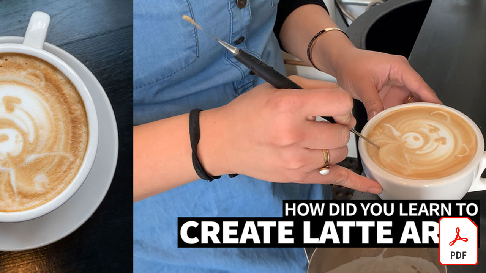

# Guides de référence rapide vidéo

Donnez vie à vos idées avec des applications et des logiciels Adobes pour le montage vidéo, les animations graphiques, les effets visuels, l’animation, etc. Sélectionnez une image pour télécharger ou afficher un PDF du guide de référence rapide.

## Adobe Audition

<table>
<tr>
   <td>
      
      

      <a href="assets/QuicklyRemoveUnwantedAudioContentwiththeSpotHealingBrushinAdobeAudition.pdf" target="_blank"><strong>Suppression rapide de contenu audio indésirable à l’aide du Correcteur localisé d’Adobe Audition (PDF)</strong></a>
      

      <em>Saviez-vous que l’outil Correcteur localisé d’Adobe Photoshop vous permet de supprimer les sons gênants de vos fichiers audio dans Adobe Audition ?</em>
       
  </td>
  <td>
    
    

     
  </td>
  <td>
    
    

     
  </td>
  <td>
    
    

     
  </td>
</tr>
</table>

## Adobe Express (anciennement Adobe Spark)

<table>
<tr>
<td>
   
    

   <a href="assets/ShowcaseyourSparkVideoinyourSparkPage.pdf" target="_blank"><strong>Présentez votre Spark Video dans votre Spark Page (PDF)</strong></a>
    

    <em>Adobe Spark Page vous permet de charger des vidéos à partir de diverses sources, y compris des vidéos que vous créez avec Spark Video !</em>
     
  </td>
  <td>
    
    

     
  </td>
  <td>
    
    

     
  </td>
  <td>
    
    

     
  </td>
</tr>
</table>

## After Effects

<table>
<tr>
 <td>
   
    

   <a href="assets/AfterEffectsforPhotography.pdf" target="_blank"><strong>After Effects pour la photographie (PDF)</strong></a>
    

    <em>Apprenez à utiliser les effets incroyables d’After Effects pour embellir vos photos</em>
     
  </td>
  <td>
   
    

   <a href="assets/CinemagraphsTheMesmerizingPlaceBetweenaPhotoandaVideo.pdf" target="_blank"><strong>Cinémagraphes : le lieu fascinant entre une photo et une vidéo (PDF)</strong></a>
    

    <em>En savoir plus sur les cinémagraphes, ces hybrides accrocheurs qui existent quelque part entre une photo et une vidéo</em>
     
  </td>
  <td>
   
    

   <a href="assets/CreateanIllustrationfromanAdobeStockPhotowithAfterEffects.pdf" target="_blank"><strong>Création d’une illustration à partir d’un Adobe [!DNL Stock] Photo avec After Effects (PDF)</strong></a>
    

    <em>Combinez les effets Teinte/Saturation et Niveaux avec les effets Dessin animé dans After Effects pour créer une illustration stylisée unique à partir d’un Adobe [!DNL Stock] photo</em>
     
  </td>
   <td>
   
    

   <a href="assets/CreateBeautifulKaleidoscopePatternswithAfterEffects.pdf" target="_blank"><strong>Création de magnifiques motifs kaléidoscopiques avec After Effects (PDF)</strong></a>
    

    <em>Créez un nombre illimité de motifs et de textures à partir de n’importe quelle image à l’aide de l’effet CC Kaleida de Adobe After Effects</em>
     
  </td>
</tr>
<tr>
<td>
   
    

   <a href="assets/CreateIntricateTransparencyinyourPhotographswithKeyinginAfterEffects.pdf" target="_blank"><strong>Création d’une transparence complexe dans vos photos à l’aide de l’incrustation dans After Effects (PDF)</strong></a>
    

    <em>L’incrustation est très utilisée pour la vidéo. Elle peut également être très utile lorsque vos photos sont nécessaires pour des projets de conception</em>
     
  </td>
 <td>
   
    

   <a href="assets/CreateAnimatedTitlesUsingMotionGraphicsTemplatesinAdobePremiereRush.pdf" target="_blank"><strong>Création de titres animés à l’aide de modèles d’animations graphiques dans Adobe Premiere [!DNL Rush] (PDF)</strong></a>
    

    <em>Rendez vos vidéos encore plus incroyables en ajoutant des modèles d’animations graphiques conçus par des professionnels qui correspondent à votre histoire ou à votre marque personnelle</em>
     
  </td>
  <td>
      
      

      <a href="assets/DazzlingLightEffectsforPhotographywithAfterEffects.pdf" target="_blank"><strong>Effets de lumière éblouissants pour la photographie avec After Effects (PDF)</strong></a>
      

      <em>Les effets d’éclairage de Adobe After Effects peuvent modifier radicalement l’aspect de votre photo</em>
       
  </td>
  <td>
      
      

      <a href="assets/EditingVRPhotography360photoswithAfterEffects.pdf" target="_blank"><strong>Retouche de photos VR (photos à 360 degrés) avec After Effects (PDF)</strong></a>
      

      <em>Bien que les jeux et expériences interactifs plus immersifs ne soient pas aussi courants, la photographie à 360 degrés est déjà là</em>
       
  </td>
</tr>
</table>

## Premiere Rush

<table>
<tr>
   <td>
      
      

      <a href="assets/SmoothlyCombineMusicandDialogueorNarrationwithAutoduckinginAdobePremiereRush.pdf" target="_blank"><strong>Combinaison fluide de musique et de dialogue ou de commentaire avec l’auto-ducking dans [!DNL Adobe Premiere Rush] (PDF)</strong></a>
      

      <em>Adobe Premiere [!DNL Rush] propose des fonctionnalités avancées de montage vidéo dans une application simple d’utilisation, afin que chacun puisse créer une vidéo de qualité professionnelle en quelques minutes</em>
       
  </td>
  <td>
    
    

     
  </td>
  <td>
    
    

     
  </td>
  <td>
    
    

     
  </td>
</tr>
</table>
