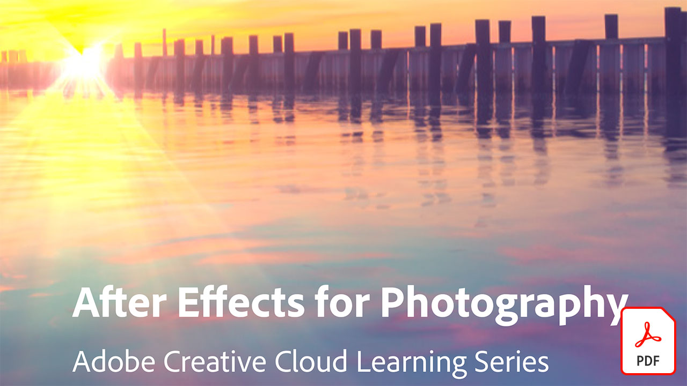

# Tutoriels Adobe Video

Donnez vie à toutes vos idées avec les applications de montage vidéo, d&#39;animation graphique, d&#39;effets visuels, d&#39;animation, etc., et leurs Adobes.

## Cliquer pour visionner un tutoriel vidéo sur l’Adobe

<table>
<tr>
 <td>
   
    

   <a href="assets/AfterEffectsforPhotography.pdf"><strong>After Effects pour la Photo (PDF)</strong></a>
    

    <em>Apprenez à utiliser les remarquables effets d'After Effects pour embellir vos photos</em>
     
  </td>
  <td>
   
    

   <a href="assets/CinemagraphsTheMesmerizingPlaceBetweenaPhotoandaVideo.pdf"><strong>Cinémagraphes : L’espace fascinant entre une photo et une vidéo (PDF)</strong></a>
    

    <em>En savoir plus sur les cinémagraphes — ces hybrides accrocheurs qui existent quelque part entre une photo et une vidéo</em>
     
  </td>
  <td>
   
    

   <a href="assets/CreateanIllustrationfromanAdobeStockPhotowithAfterEffects.pdf"><strong>Création d’une illustration à partir d’un Adobe [!DNL Stock] Photo avec After Effects (PDF)</strong></a>
    

    <em>Associez les effets Teinte/Saturation et Niveaux avec les effets Dessin animé d'After Effects pour obtenir une illustration stylisée unique à partir d'un Adobe [!DNL Stock] photo</em>
     
  </td>
</tr>
<tr>
 <td>
   
    

   <a href="assets/CreateAnimatedTitlesUsingMotionGraphicsTemplatesinAdobePremiereRush.pdf"><strong>Création de titres animés à l’aide de modèles d’animations graphiques dans Adobe Premiere [!DNL Rush] (PDF)</strong></a>
    

    <em>Sublimez vos vidéos en ajoutant des templates d’animations graphiques conçus par des professionnels et adaptés à votre histoire ou à votre marque personnelle</em>
     
  </td>
  <td>
   
    

   <a href="assets/CreateBeautifulKaleidoscopePatternswithAfterEffects.pdf"><strong>Création de superbes motifs kaléidoscopiques avec After Effects PDF)</strong></a>
    

    <em>Créez un nombre illimité de motifs et de textures à partir de n’importe quelle image en utilisant l’effet CC Kaleida dans Adobe After Effects</em>
     
  </td>
  <td>
   
    

   <a href="assets/CreateIntricateTransparencyinyourPhotographswithKeyinginAfterEffects.pdf"><strong>Création d’une transparence complexe dans vos photos avec l’incrustation dans After Effects (PDF)</strong></a>
    

    <em>Le masquage est souvent utilisé pour la vidéo, mais il peut également être d’une grande utilité lorsque vos photos sont nécessaires pour des projets de conception</em>
     
  </td>
</tr>
<tr>
 <td>
   
    

   <a href="assets/DazzlingLightEffectsforPhotographywithAfterEffects.pdf"><strong>Effets de lumière éblouissants pour la photographie avec After Effects (PDF)</strong></a>
    

    <em>Les effets d'éclairage de Adobe After Effects peuvent radicalement modifier l'aspect de votre photo</em>
     
  </td>
  <td>
   
    

   <a href="assets/EditingVRPhotography360photoswithAfterEffects.pdf"><strong>Retouche de photos de réalité virtuelle (photos à 360 degrés) avec After Effects (PDF)</strong></a>
    

    <em>Si les jeux et expériences interactifs plus immersifs sont moins courants, la photographie à 360 degrés est déjà là</em>
     
  </td>
  <td>
   
    

   <a href="assets/QuicklyRemoveUnwantedAudioContentwiththeSpotHealingBrushinAdobeAudition.pdf"><strong>Supprimez rapidement le contenu audio indésirable avec l’outil Correcteur localisé d’Adobe Audition (PDF)</strong></a>
    

    <em>Saviez-vous que l’outil Correcteur localisé d’Adobe Photoshop vous permet de supprimer les sons indésirables de vos fichiers audio dans Adobe Audition ?</em>
     
  </td>
</tr>
<tr>
   <td>
   
    

   <a href="assets/ShowcaseyourSparkVideoinyourSparkPage.pdf"><strong>Présentation de Spark Video dans votre Spark Page (PDF)</strong></a>
    

    <em>Adobe Spark Page vous permet de charger des vidéos à partir de différentes sources, y compris celles créées avec Spark Video !</em>
     
  </td>
  <td>
   
    

   <a href="assets/SmoothlyCombineMusicandDialogueorNarrationwithAutoduckinginAdobePremiereRush.pdf"><strong>Associez facilement musique et dialogue ou narration avec l’autoducking dans Adobe Premiere [!DNL Rush] (PDF)</strong></a>
    

    <em>Adobe Premiere [!DNL Rush] fournit des fonctionnalités de montage vidéo avancées dans une application simple d’emploi, afin que chacun puisse créer une vidéo de qualité professionnelle en quelques minutes</em>
     
  </td>
</tr>
</table>
