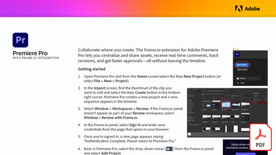

# Révision vidéo avec Frame.io

Collaborez là où vous créez. Découvrez comment l’extension Frame.io pour Adobe Premiere Pro vous permet de centraliser et de partager des actifs, de recevoir des commentaires en temps réel, de suivre les révisions et d’obtenir des validations plus rapidement, le tout sans quitter le montage chronologique de ce tutoriel pratique.

**Sélectionnez l’image ci-dessous pour télécharger la révision vidéo avec Frame.io (PDF).**

