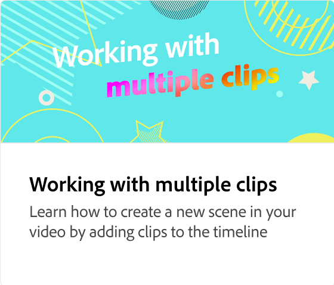

# Comment ajouter de l’audio

Apprenez à créer des projets attrayants et mémorables en ajoutant de l’audio. Vous pouvez charger vos propres fichiers audio ou choisir parmi des fichiers audio libres de droits. Vous pouvez également enregistrer des voix hors champ et régler le volume des données audio et des voix hors champ.

>[!VIDEO](https://video.tv.adobe.com/v/3427092?quality=12&learn=on&hidetitle=true)

## Vidéos supplémentaires dans cette série

<table style="table-layout:fixed">
<tr>
   <td>
         
   </td>
  <td>
         
   </td>
   <td>
         
   </td>
   <td>
         
   </td>
</tr>
<tr>
    <td>
         
   </td>
   <td>
    
    

     
   </td>
   <td>
    
    

     
   </td>
   <td>
    
    

     
   </td>
</tr>
</table>
