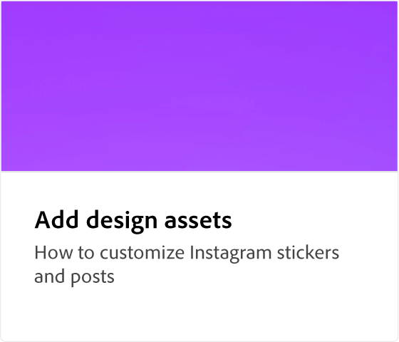
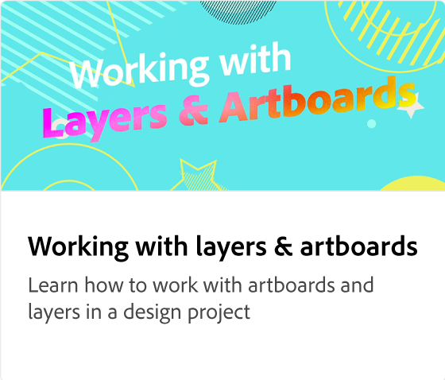

# Comment ajouter une image d’IA généralisée

Découvrez comment ajouter des images d’IA générative, optimisées par Adobe Firefly, à vos projets créatifs. Personnalisez votre contenu en générant des images basées sur des invites textuelles, avec des options pour différents styles et types de contenu.

>[!VIDEO](https://video.tv.adobe.com/v/3426933?quality=12&learn=on&hidetitle=true)

## Vidéos supplémentaires dans cette série

<table style="table-layout:fixed">
<tr>
 <td>
      
  </td>
   <td>
      
  </td>
   <td>
      
  </td>
  <td>
      
  </td>
</tr>
<tr>
   <td>
      
  </td>
  <td>
      
  </td>
   <td>
         
   </td>
    <td>
         
   </td>
</tr>
<tr>
   <td>
   
   </td>
   <td>
   
   </td>
   <td>
   
   </td>
   <td>
      
      

       
   </td>
</tr>
</table>
