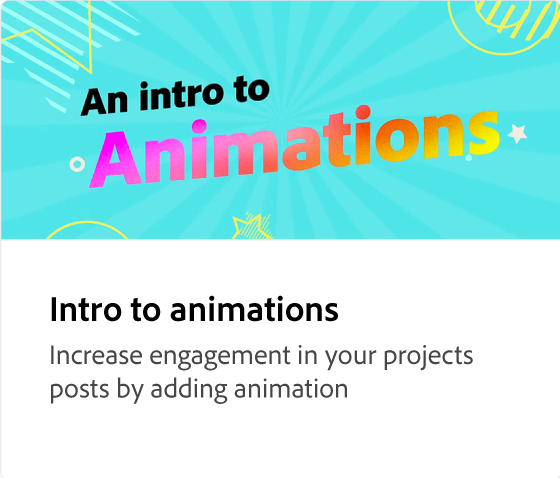
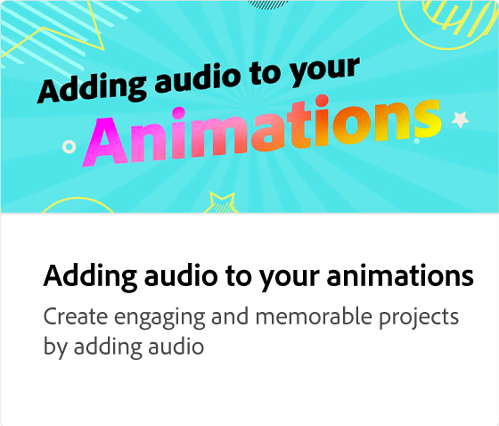

# Quel est le montage chronologique de l’animation ?

Apprenez à naviguer dans le montage de l’animation et à le régler. Le montage chronologique est une vue d’ensemble de l’animation, dans laquelle vous pouvez prévisualiser et réduire/étendre la longueur de l’animation.

>[!VIDEO](https://video.tv.adobe.com/v/3426978?quality=12&learn=on&hidetitle=true)

## Vidéos supplémentaires dans cette série

<table style="table-layout:fixed">
<tr>
   <td>
         
   </td>
   <td>
         
   </td>
   <td>
         
   </td>
   <td>
         
   </td>
</tr>
<tr>
   <td>
         
   </td>
   <td>
         
   </td>
   <td>
         
   </td>
   <td>
         
   </td>
</tr>
</table>
