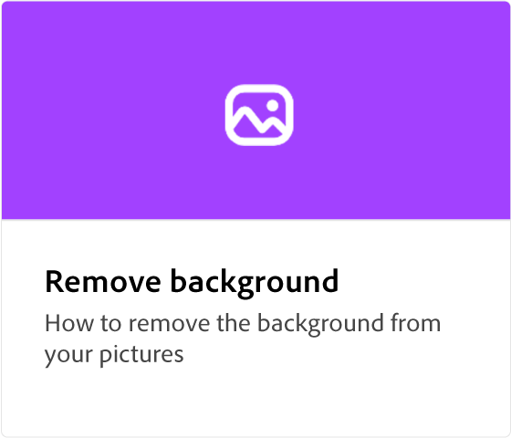
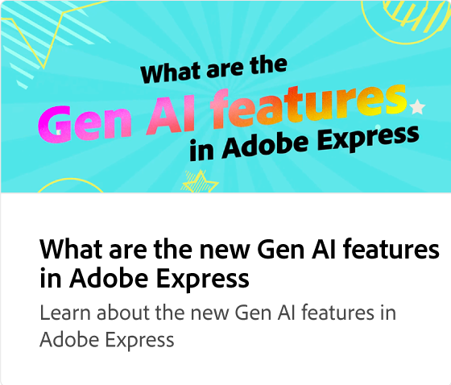
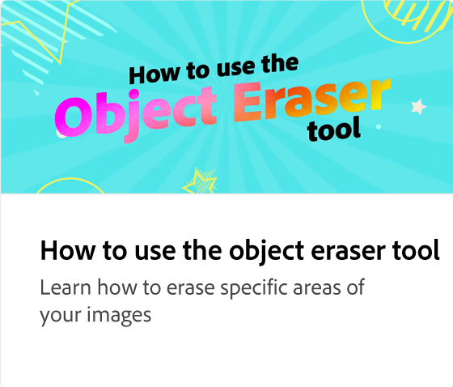
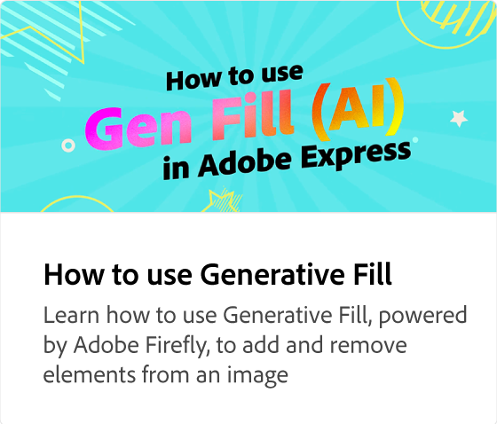
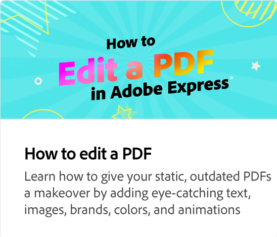

# Comment translater votre contenu en bloc

Apprenez à créer des variantes linguistiques de vos projets en translatant automatiquement le contenu dans 46 langues différentes. Vous pouvez sélectionner la langue souhaitée, dupliquer et translater le contenu, et conserver toutes les animations.

>[!NOTE]
>
>Il est important de vérifier l’exactitude des traductions avant de les partager ou de les télécharger.

>[!VIDEO](https://video.tv.adobe.com/v/3438270?captions=fre_fr&quality=12&learn=on&hidetitle=true)

## Vidéos supplémentaires dans cette série

<table style="table-layout:fixed">
<tr>
   <td>
         
   </td>
   <td>
         
   </td>
   <td>
         
   </td>
   <td>
         
   </td>      
</tr>
<tr>
   <td>
      
   </td>
   <td>
      
   </td>
   <td>
      
   </td>
   <td>
      
   </td>
</tr>
</table>
