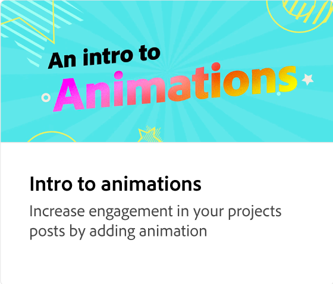

# Différents types d’animations

Découvrez les trois différents types d’animations (intro, boucle et outro) que vous pouvez ajouter à vos projets pour les rendre plus attrayants. Chaque animation possède un style différent que vous pouvez prévisualiser et sélectionner.

>[!VIDEO](https://video.tv.adobe.com/v/3426976?quality=12&learn=on&hidetitle=true)

## Vidéos supplémentaires dans cette série

<table style="table-layout:fixed">
<tr>
   <td>
         
   </td>
   <td>
         
   </td>
   <td>
         
   </td>
   <td>
         
   </td>
</tr>
<tr>
   <td>
         
   </td>
   <td>
         
   </td>
   <td>
         
   </td>
   <td>
         
   </td>
</tr>
</table>
