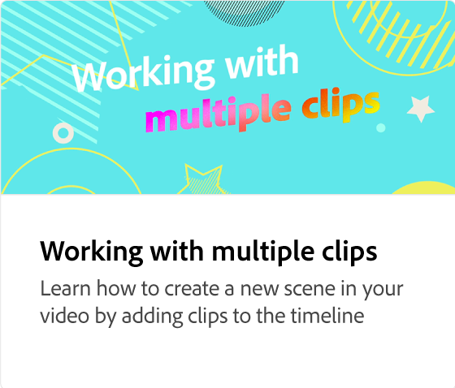

# Exportation d’une vidéo

Découvrez comment définir la résolution de votre vidéo, la télécharger et la partager directement sur les réseaux sociaux.

>[!VIDEO](https://video.tv.adobe.com/v/3436017?captions=fre_fr&quality=12&learn=on&hidetitle=true)

## Vidéos supplémentaires dans cette série

<table style="table-layout:fixed">
<tr>
   <td>
         
   </td>
  <td>
         
   </td>
   <td>
         
   </td>
   <td>
         
   </td>
</tr>
<tr>
  <td>
         
   </td>
   <td>
    
    

     
   </td>
   <td>
    
    

     
   </td>
   <td>
    
    

     
   </td>
</tr>
</table>
