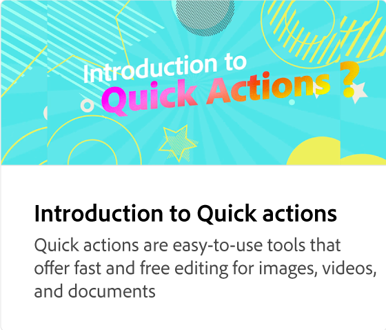

# Contenu de la page d’accueil

Explorez la page d’accueil pour naviguer facilement dans l’application. Découvrez les actions rapides, les modèles, les designs saisonniers, les marques, les bibliothèques, la planification, les tutoriels et plus encore.

>[!VIDEO](https://video.tv.adobe.com/v/3426924?quality=12&learn=on&hidetitle=true)

## Vidéos supplémentaires dans cette série

<table style="table-layout:fixed">
<tr>
    <td>
      
    </td>
    <td>
      
    </td>
    <td>
      
      

       
    </td>
   <td>
      
      

       
   </td>
</tr>
</table>
