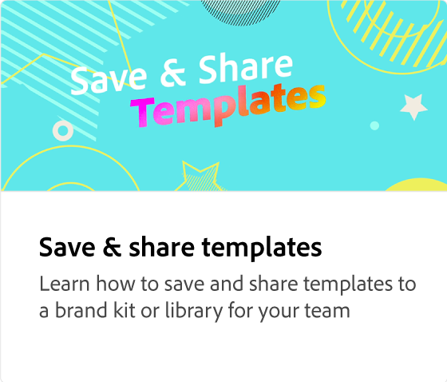

# Comment et pourquoi verrouiller des calques

Découvrez pourquoi il est important de verrouiller divers éléments de votre modèle afin qu’ils ne puissent pas être modifiés. Certains éléments, tels que les logos, ne doivent pas être modifiés afin de pouvoir être verrouillés avant de partager votre modèle.

>[!VIDEO](https://video.tv.adobe.com/v/3427095?quality=12&learn=on&hidetitle=true)

## Vidéos supplémentaires dans cette série

<table style="table-layout:fixed">
<tr>
   <td>
         
         

         <a href="create-templates.md"><strong>Optimiser l'efficacité : créer des modèles réutilisables</strong></a>
         

         <em>Découvrez comment apporter à votre entreprise cohérence, efficacité et économies grâce aux modèles</em>
          
   </td>
   <td>
         
         

         <a href="share-templates.md"><strong>Enregistrer et partager des modèles</strong></a>
         

         <em>Découvrez comment enregistrer et partager des modèles dans un kit ou une bibliothèque de marque pour votre équipe</em>
          
   </td>
   <td>
         
         

         <a href="use-templates.md"><strong>Cohérence de marque sans effort avec les modèles</strong></a>
         

         <em>Découvrez comment créer rapidement et efficacement du contenu de marque dans l’ensemble de votre organisation</em>
          
   </td>
   <td>
      
      

       
   </td>
</tr>
</table>
