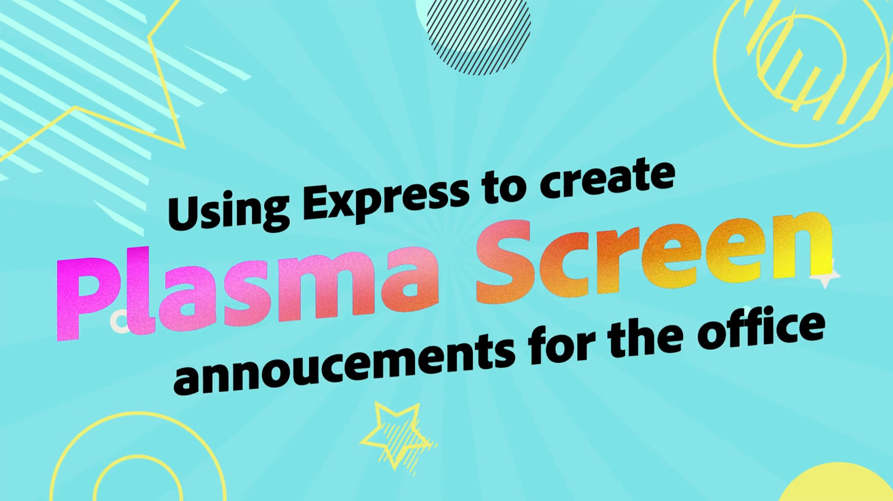

# Adobe des tutoriels de cas d’utilisation [!DNL Express]

Découvrez comment différentes équipes de votre organisation peuvent bénéficier de l’Adobe Express.

## Nouveautés

* [Création d’un visuel promotionnel pour un cours d’apprentissage en ligne](promo-visual.md)
Apprenez à créer un visuel attrayant pour un cours d’apprentissage en ligne
* [Création d&#39;une vidéo de fin d&#39;année](end-of-year-video.md)
Apprenez à créer une vidéo inspirante de fin d’année
* [Création d&#39;une newsletter](newsletter.md)
Apprenez à créer la page d&#39;accueil d&#39;un bulletin que vous pourrez imprimer, envoyer par e-mail ou publier sur le Web

<table style="table-layout:fixed">
<tr>
   <td>
      
   </td>
   <td>
      
   </td>
   <td>
      
   </td>
   <td>
      
   </td>
</tr>
<tr>
   <td>
      
   </td>
   <td>
      
   </td>
   <td>
      
   </td>
   <td>
      
   </td>
</tr>
<tr>
   <td>
      
   </td>
   <td>
      
   </td>
   <td>
      
   </td>
   <td>
      
   </td>
</tr>
<tr>
   <td>
      
   </td>
   <td>
      
   </td>
   <td>
      
   </td>
   <td>
      
      

       
   </td>
</tr>
</table>
