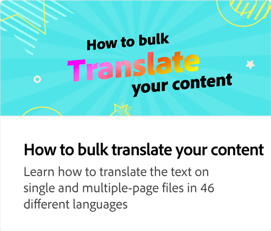

# Utilisation du planificateur pour la publication

Planifiez des publications pour les réseaux sociaux pour Instagram, Facebook, Twitter, Pinterest et LinkedIn. Vous pouvez choisir des propriétés spécifiques pour chaque plateforme. Par exemple, dans Instagram, vous pouvez choisir si votre contenu doit être une publication, une histoire ou une bande.

>[!VIDEO](https://video.tv.adobe.com/v/3420242?quality=12&learn=on&hidetitle=true)

## Vidéos supplémentaires dans cette série

<table style="table-layout:fixed">
<tr>
   <td>
         
   </td>
   <td>
         
   </td>
   <td>
         
   </td>
   <td>
         
   </td>      
</tr>
<tr>
   <td>
      
   </td>
   <td>
      
   </td>
   <td>
      
   </td>
   <td>
      
   </td>
</tr>
</table>
