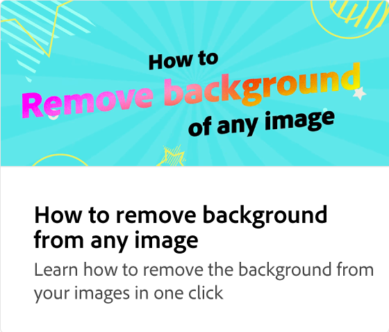

# Comment utiliser l’IA gén. de texte à modèle

Découvrez comment générer des modèles modifiables pour des publications sur les réseaux sociaux, des affiches, des dépliants et des cartes à partir d’une description textuelle en quelques secondes. Vous pouvez modifier le design, changer de police et personnaliser davantage le projet avant de le télécharger ou de le partager.

>[!VIDEO](https://video.tv.adobe.com/v/3427022?quality=12&learn=on&hidetitle=true)

## Vidéos supplémentaires dans cette série

<table style="table-layout:fixed">
<tr>
   <td>
         
   </td>
   <td>
         
   </td>
   <td>
         
   </td>
   <td>
         
   </td>      
</tr>
<tr>
   <td>
      
   </td>
   <td>
      
   </td>
   <td>
      
   </td>
   <td>
      
   </td>
</tr>
</table>
