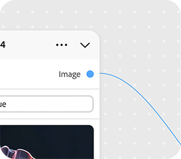

# &#x200B;2. Concepts clés du graphique en Firefly

Découvrez les concepts clés pour vous aider à démarrer avec Firefly Graph.

## Nœud

Un nœud effectue une étape du workflow : un nœud, une tâche. Un nœud peut générer une image, appliquer un masque, modifier une couleur ou exécuter toute autre action créative.

{align="center"}

## Port

Points de connexion sur un nœud. Les ports de sortie transmettent les données d&#39;un nœud ; les ports d&#39;entrée reçoivent les données entrantes. La connexion des ports est la façon dont les données circulent dans votre workflow.

{align="center"}

## Widget

Commandes interactives sur un nœud, telles que les champs de texte, les listes déroulantes et les curseurs, qui vous permettent de configurer ses paramètres directement dans l’éditeur.

{align="center"}

## Connexion

Une connexion transporte une entrée ou une sortie entre deux nœuds. Un graphique se lit de gauche à droite, de l’entrée source à la sortie finale.

{align="center"}

## Graphe

Le workflow complet que vous générez dans l’éditeur. Un graphique est composé de nœuds et de connexions disposés sur la zone de travail pour produire une sortie finale.

{align="center"}

## Étape suivante

Prêt à construire quelque chose ? Passez à [3. Créez votre premier graphique](https://experienceleague.adobe.com/fr/docs/creative-cloud-enterprise-learn/cce-learning-hub/fireflyoverview/firefly-graph/create-your-first-graph) pour une présentation étape par étape.

Revenez à [Commencer avec Firefly Graph](https://experienceleague.adobe.com/fr/docs/creative-cloud-enterprise-learn/cce-learning-hub/fireflyoverview/firefly-graph/overview-firefly-graph).
