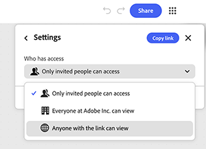

# &#x200B;5. Partager un graphe

Découvrez comment partager un graphe avec d’autres personnes. Le partage d’un graphe permet de partager le workflow en direct, pas seulement une sortie. Toute personne disposant d’un accès en écriture peut l’exécuter à nouveau, la modifier et la remettre à quelqu’un d’autre. Utilisez l’accès par lien pour bénéficier d’une large visibilité au sein de l’organisation et des invitations nommées avec un rôle spécifique pour toute personne nécessitant un accès direct.

1. Sélectionnez **Partager** dans le coin supérieur droit du graphe.

   La boîte de dialogue s’ouvre avec un champ permettant d’ajouter des noms ou des adresses e-mail, ainsi qu’un résumé des personnes ayant actuellement accès. Par défaut, seules les personnes invitées peuvent accéder au graphe.

   

1. Sélectionnez l&#39;icône en forme d&#39;engrenage pour ouvrir les **paramètres** et sélectionnez **Tous les membres de [l&#39;organisation] peuvent afficher** pour permettre à toute personne au sein de la société d&#39;ouvrir le graphe avec le lien.

   

   Trois niveaux d’accès sont disponibles : uniquement les personnes invitées, tous les membres de l’organisation ou toute personne disposant du lien.

1. Activez **Découvrable via la recherche** afin que les membres puissent retrouver le graphe sans avoir besoin du lien.

   

   Une bannière de confirmation indique exactement qui peut voir le graphe à l’aide du lien. Vérifiez cela avant d’envoyer le lien n’importe où. Cela s’applique à tous les futurs destinataires de ce lien, et pas seulement à la prochaine personne invitée.

   

1. Saisissez une adresse e-mail directement dans le champ d’invitation pour accorder un accès nommé à une personne, indépendamment du paramètre général du lien. Sélectionnez leur entrée dans la suggestion qui apparaît sous le champ.

   

1. Sélectionnez le menu déroulant du rôle en regard de son nom pour choisir **Éditeur** ou **Visualiseur**.

   

   L’éditeur peut modifier, télécharger et partager le graphe. L’observateur peut uniquement le consulter. Choisissez le rôle le plus étroit, sauf si la personne doit modifier le graphe elle-même.

1. Ajoutez une note facultative dans le champ **Message** afin que le destinataire sache pourquoi il obtient l&#39;accès. Sélectionnez **Inviter en tant qu’éditeur** ou **Inviter en tant que visionneuse** si ce rôle a été sélectionné, pour l’envoyer.

   

## Étape suivante

Vous souhaitez commencer à partir d’un modèle ? Rendez-vous sur [5. Personnalisez un modèle](https://experienceleague.adobe.com/en/docs/creative-cloud-enterprise-learn/cce-learning-hub/fireflyoverview/firefly-graph/customize-template) pour qu&#39;il reflète votre propre résumé.

Revenez à [Prise en main de Firefly Graph](https://experienceleague.adobe.com/en/docs/creative-cloud-enterprise-learn/cce-learning-hub/fireflyoverview/firefly-graph/overview-firefly-graph).