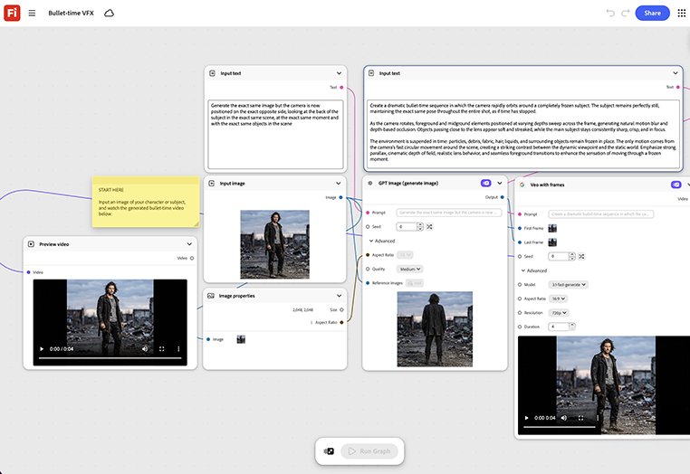

# Bullet Time VFX

Apprenez à alimenter un produit phare ou une image de sujet pour générer une séquence d’angles rotative autour de celui-ci, puis assemblez automatiquement le balayage du cadre de congélation. [Ouvrir le modèle VFX Bullet Time](https://firefly.adobe.com/graph/edit/id/urn:aaid:sc:US:3efb4f51-345d-58eb-b7c8-7b289f0dd1c4).

[!BADGE Exemples du secteur]{type=Informative tooltip="Exemples du secteur"}

* **En extérieur** - Créez une photo d&#39;héros à l&#39;image d&#39;un grimpeur en mouvement pour une annonce publicitaire payante sur les réseaux sociaux, sans squelette à plusieurs caméras sur place.
* **Vente au détail** : création d&#39;une nouvelle chaussure à 360 degrés en cadre fixe pour une page de lancement de produit.
* **Automobile** - Générez une photo d&#39;un véhicule en héros rotatif pour une salle d&#39;exposition numérique, sans session en studio avec platine tournante.

>[!TIP]
>
>**Avant de commencer** : pour obtenir de meilleurs résultats, personnalisez ce modèle en fonction de votre marque, produit et workflow. Permutez vos images de référence, vos invites et vos copies avant d’utiliser une sortie.

{align="center"}

Revenez à [Prise en main de Firefly Graph](https://experienceleague.adobe.com/en/docs/creative-cloud-enterprise-learn/cce-learning-hub/fireflyoverview/firefly-graph/overview-firefly-graph).
