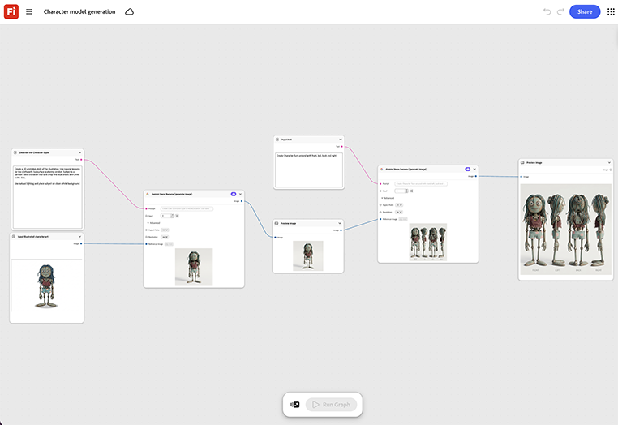

# Génération du modèle de caractère

Apprenez à créer un style d’animation 3D pour une illustration. Le modèle génère une passe de modèle 3D de base prête à être remise à un modélisateur pour nettoyage, plutôt que de partir d’une scène vide.[Ouvrez le modèle de génération de modèle de caractère](https://firefly.adobe.com/graph/edit/id/urn:aaid:sc:US:4008fbc8-083b-5766-ace9-6abf998df840).

[!BADGE Exemples du secteur]{type=Informative tooltip="Exemples du secteur"}

* **En extérieur** - Créez un modèle 3D d’un personnage de mascotte de piste à utiliser dans les rendus d’emballage et les vidéos, en commençant par un résumé de personnage approuvé unique.
* **Technologie** : générez un modèle de personnage 3D de base à partir d’un résumé écrit, prêt à être remis à un modélisateur pour nettoyage.
* **Éducation** : créez un modèle de personnage d’instructeur 3D à utiliser dans les leçons vidéo d’un cours.

>[!TIP]
>
>**Avant de commencer** : pour obtenir de meilleurs résultats, personnalisez ce modèle en fonction de votre marque, produit et workflow. Permutez vos images de référence, vos invites et vos copies avant d’utiliser une sortie.

{align="center"}

Revenez à [Prise en main de Firefly Graph](https://experienceleague.adobe.com/en/docs/creative-cloud-enterprise-learn/cce-learning-hub/fireflyoverview/firefly-graph/overview-firefly-graph).
