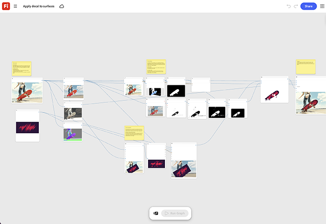

# Appliquer une décalcomanie aux surfaces

Apprenez à visualiser les décalcomanies ou les logos sur des maquettes de produit. Le gabarit adapte la décalcomanie à la géométrie de la surface afin qu&#39;elle suive correctement les contours. [Ouvrez Appliquer la décalcomanie au modèle de surfaces](https://firefly.adobe.com/graph/edit/id/urn:aaid:sc:US:78443d67-3663-50df-868e-dd231469f868).

>[!TIP]
>
>**Avant de commencer** : pour obtenir de meilleurs résultats, personnalisez ce modèle en fonction de votre marque, produit et workflow. Permutez vos images de référence, vos invites et vos copies avant d’utiliser une sortie.

[!BADGE Cas d’utilisation]{type=Informative tooltip="Exemples d’utilisation"}

* **En extérieur** : appliquez une décalcomanie de logo actualisée sur une ligne complète de maquettes de matériel pour prévisualiser une nouvelle marque avant de commander des outils de production.
* **Automobile** : prévisualisez un nouveau design de livrée ou de décalcomanie sur un modèle de véhicule avant de passer à la production.
* **Vente au détail** - Testez un nouveau positionnement de logo sur une gamme de maquettes de vêtements complète avant l&#39;approbation de l&#39;impression.

{align="center"}

Revenez à [Commencer avec Firefly Graph](https://experienceleague.adobe.com/fr/docs/creative-cloud-enterprise-learn/cce-learning-hub/fireflyoverview/firefly-graph/overview-firefly-graph).
