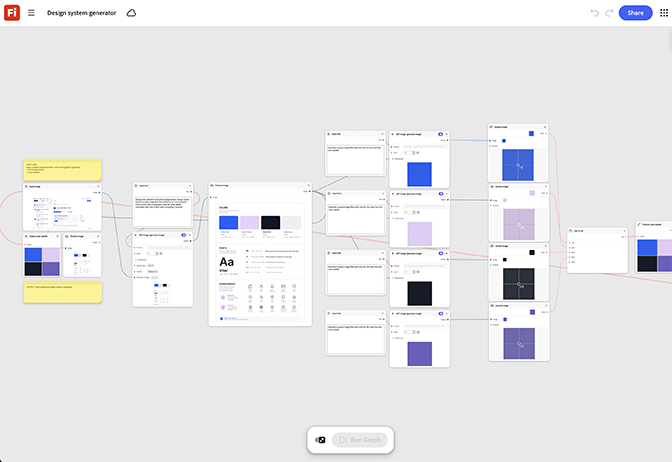

# Générateur de système de conception

Découvrez comment générer une charte graphique à partir d’une capture d’écran de site web. Le graphique produit un ensemble d’icônes, de motifs et de composants de mise en page correspondants dans une seule exécution par lots. [Ouvrez le générateur du système de conception](https://firefly.adobe.com/graph/edit/id/urn:aaid:sc:US:b40cd34c-66b2-586c-ab4a-5595490cded6).

>[!TIP]
>
>**Avant de commencer** : pour obtenir de meilleurs résultats, personnalisez ce modèle en fonction de votre marque, produit et workflow. Permutez vos images de référence, vos invites et vos copies avant d’utiliser une sortie.

[!BADGE Cas d’utilisation]{type=Informative tooltip="Exemples d’utilisation"}

* **Technologie** : générez un ensemble d’icônes et de motifs d’arrière-plan réutilisables pour un lancement trimestriel de la fonctionnalité, réutilisés dans les publicités, les pages d’accueil et les réseaux sociaux sans conception de compte-rendu.
* **Finance** - Créez une icône et un système de couleurs cohérents pour une nouvelle conception d&#39;application avant le début du développement.
* **Communications et télécom** : générez un langage visuel adapté pour un nouveau niveau de forfait sur le web et dans la signalétique en magasin.

{align="center"}

Revenez à [Commencer avec Firefly Graph](https://experienceleague.adobe.com/en/docs/creative-cloud-enterprise-learn/cce-learning-hub/fireflyoverview/firefly-graph/overview-firefly-graph).
