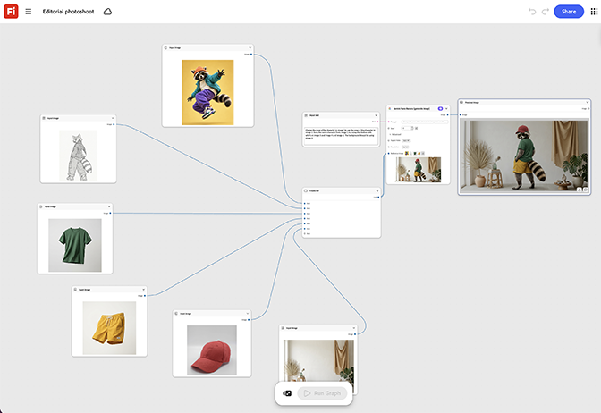

# Séance photo éditoriale

Apprenez à saisir une référence de modèle et à permuter l’entrée du vêtement pour chaque nouveau look. Les nœuds de pose et d’éclairage restent verrouillés sur l’ensemble pour une sensation éditoriale cohérente. [Ouvrir le modèle éditorial de séance photo](https://firefly.adobe.com/graph/edit/id/urn:aaid:sc:US:cfd7b810-2f86-5cdf-af80-dd2e31b8b84b).

[!BADGE Exemples du secteur]{type=Informative tooltip="Exemples du secteur"}

* **Vente au détail** : échangez des vêtements sur un modèle en une prise de vue éditoriale complète pour un lookbook de saison, sans réorganiser le modèle pour chaque look individuel.
* **Beauté** - Créez une série éditoriale cohérente sur plusieurs looks de produit à l’aide d’une seule référence de modèle.
* **En extérieur** : générez un ensemble éditorial complet sur une nouvelle gamme de coloris de veste à partir d’une seule prise de vue de mannequin.

>[!TIP]
>
>**Avant de commencer** : pour obtenir de meilleurs résultats, personnalisez ce modèle en fonction de votre marque, produit et workflow. Permutez vos images de référence, vos invites et vos copies avant d’utiliser une sortie.

{align="center"}

Revenez à [Prise en main de Firefly Graph](https://experienceleague.adobe.com/fr/docs/creative-cloud-enterprise-learn/cce-learning-hub/fireflyoverview/firefly-graph/overview-firefly-graph).
