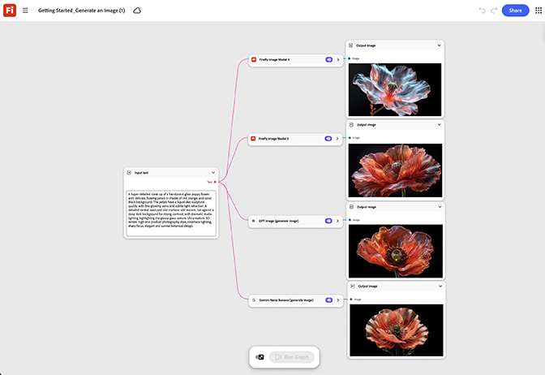

# Prise en main - Génération d’une image

Découvrez comment créer un graphe de base : un nœud d’invite en un nœud de génération en une sortie. [Ouvrez Prise en main - Générez un modèle d&#39;image](https://firefly.adobe.com/graph/edit/id/urn:aaid:sc:VA6C2:f556b557-d31b-4659-b9d1-358ed567c61d).

[!BADGE Exemples du secteur]{type=Informative tooltip=""}

* **Vente au détail** - Générez une première image d&#39;héros de produit à partir d&#39;un résumé, pour connaître le flux de nœuds de base avant de toucher un véritable actif de campagne.
* **Intégrité** : testez le flux de génération d&#39;image le plus simple sur une photo de produit d&#39;espace réservé avant de passer à un calendrier de contenu complet.
* **Éducation** : créez un premier exemple d&#39;image pour démontrer le graphe aux nouveaux membres de l&#39;équipe avant d&#39;affecter un travail réel au projet.

>[!TIP]
>
>**Avant de commencer** : pour obtenir de meilleurs résultats, personnalisez ce modèle en fonction de votre marque, produit et workflow. Permutez vos images de référence, vos invites et vos copies avant d’utiliser une sortie.

{align="center"}

Revenez à [Prise en main de Firefly Graph](https://experienceleague.adobe.com/fr/docs/creative-cloud-enterprise-learn/cce-learning-hub/fireflyoverview/firefly-graph/overview-firefly-graph).
