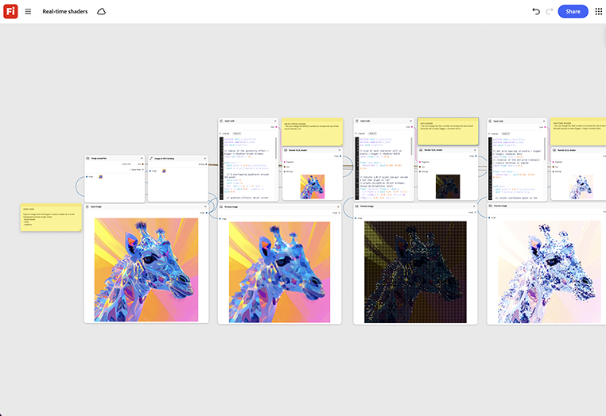

# Nuanciers en temps réel

Apprenez à utiliser une image comme point de départ, à appliquer trois nuanciers personnalisés et à prévisualiser le résultat en temps réel. Ajustez les paramètres de shader directement sur le nœud plutôt que d’effectuer un nouveau rendu à partir de zéro. [Ouvrir le modèle de nuanceurs en temps réel](https://firefly.adobe.com/graph/edit/id/urn:aaid:sc:US:51848c67-e360-5c40-8eff-8517b3395d54).

[!BADGE Exemples du secteur]{type=Informative tooltip="Exemples du secteur"}

* **Technologie** - Créez un shader stylisé personnalisé à la recherche d’un configurateur de produit 3D utilisé dans une démonstration interactive de salon.
* **Automobile** : prévisualisez les ombrages de peinture et de matériau personnalisés sur un modèle de véhicule avant qu&#39;un prototype physique n&#39;existe.
* **Vente au détail** : le matériau stylisé de test s&#39;affiche sur un rendu de produit 3D pour un affichage d&#39;étagère numérique.

>[!TIP]
>
>**Avant de commencer** : pour obtenir de meilleurs résultats, personnalisez ce modèle en fonction de votre marque, produit et workflow. Permutez vos images de référence, vos invites et vos copies avant d’utiliser une sortie.

{align="center"}

Revenez à [Prise en main de Firefly Graph](https://experienceleague.adobe.com/en/docs/creative-cloud-enterprise-learn/cce-learning-hub/fireflyoverview/firefly-graph/overview-firefly-graph).
