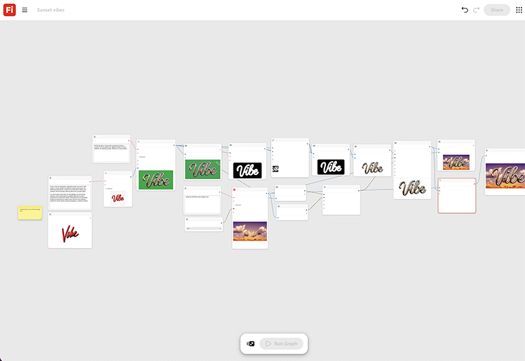

# Ambiance coucher de soleil

Apprenez à créer une image typographique 3D avec le mot « Vibe » à partir d’une invite de texte. [Ouvrir le modèle Sunset Vibes](https://firefly.adobe.com/graph/edit/id/urn:aaid:sc:US:364c621e-ca81-5a5b-a550-dabed63fb7bc).

[!BADGE Exemples du secteur]{type=Informative tooltip="Exemples du secteur"}

* **Voyage** - Superposez un nouveau slogan de destination sur un arrière-plan stylisé de coucher de soleil pour un carrousel de réseaux sociaux, créé et testé dans un après-midi.
* **Boissons** : associez un slogan de saison à un cadre de vie chaleureux pour une promotion estivale.
* **Vente au détail** - Générez un fichier texte et arrière-plan de style rapide pour une annonce de vente flash.

>[!TIP]
>
>**Avant de commencer** : pour obtenir de meilleurs résultats, personnalisez ce modèle en fonction de votre marque, produit et workflow. Permutez vos images de référence, vos invites et vos copies avant d’utiliser une sortie.

{align="center"}

Revenez à [Prise en main de Firefly Graph](https://experienceleague.adobe.com/fr/docs/creative-cloud-enterprise-learn/cce-learning-hub/fireflyoverview/firefly-graph/overview-firefly-graph).
