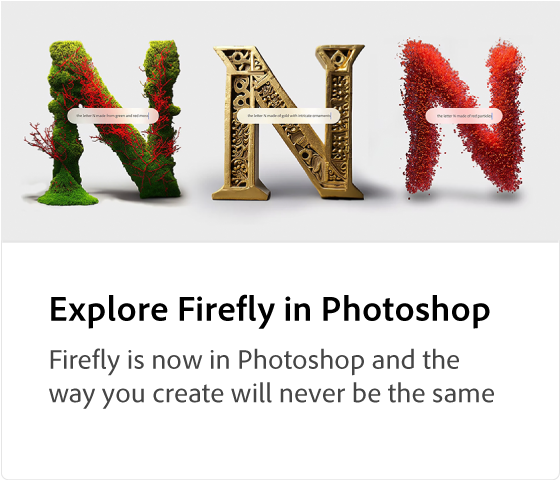

# Adobe [!DNL Firefly] Présentation

Firefly est la nouvelle famille de modèles d’IA créatifs qui s’invitent dans les produits Adobes. Elle se concentre d’abord sur la génération d’images et d’effets de texte. Firefly propose de nouveaux moyens d’idéation, de création et de communication, tout en améliorant considérablement les workflows de création.

>[!VIDEO](https://video.tv.adobe.com/v/3416970t1?quality=12&learn=on&hidetitle=true)

## En savoir plus sur Adobe Firefly

<table>
<tr>
   <td>
      
      

      <a href="https://firefly.adobe.com/" {target="_blank" }><strong>Luciole Adobe (Beta)</strong></a>
      

      <em>Rejoignez le programme Beta Adobe Firefly.</em>
       
  </td>
  <td>
      
      

      <a href="https://www.adobe.com/sensei/generative-ai/firefly.html" {target="_blank" }><strong>Découvrir le luciole dans Photoshop</strong></a>
      

      <em>La luciole est désormais disponible dans Photoshop et votre méthode de création ne sera plus jamais la même</em>
       
  </td>
  <td>
    
    

     
  </td>
  <td>
    
    

     
  </td>
</tr>
</table>
