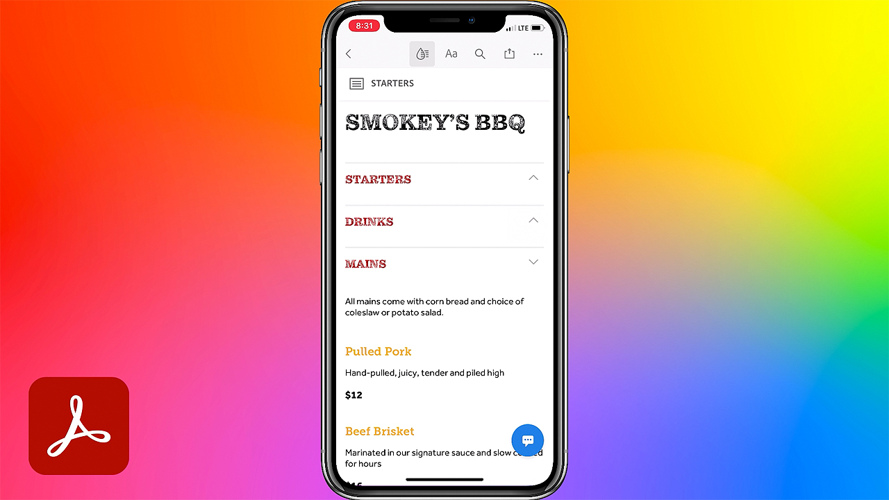

# Acrobat et Sign

Avec Adobe Document Cloud, qui comprend les meilleures solutions de PDF et de signature électronique au monde, vous pouvez transformer des processus de document manuels en processus numériques efficaces. Votre équipe peut désormais agir rapidement sur les documents, les workflows et les tâches, sur plusieurs écrans et appareils, où que vous soyez, à tout moment et dans vos applications Microsoft et Entreprise préférées.

## Parcourir les Tutorials de produit

<table style="table-layout:fixed">
<tr>
 <td>
   
    

   <a href="acrobat-sign.md#tutorial1"><strong>Lancement d'une révision partagée Acrobat</strong></a>
    

    <em>Inviter les réviseurs à ajouter leurs commentaires à un document de PDF</em>
     
  </td>
  <td>
    
    

    <a href="acrobat-sign.md#tutorial2"><strong>Créer une exemption en ligne Forms avec Adobe Sign</strong></a>
    

    <em>Convertissez rapidement des documents en formulaires en ligne et publiez-les en ligne où toute personne qui en a besoin peut les remplir et les signer</em>
     
  </td>
  <td>
   
    

    <a href="acrobat-sign.md#tutorial3"><strong>Demander une signature avec Adobe Sign</strong></a>
    

    <em>Passer de Word au PDF et envoyer pour signature avec Adobe Sign</em>
     
  </td>
</tr>
<tr>
 <td>
   
    

   <a href="acrobat-sign.md#tutorial4"><strong>Afficher les menus sur mobile avec Liquid Mode</strong></a>
    

    <em>Utilisez Liquid Mode pour améliorer l’expérience de lecture de PDF sur les appareils mobiles</em>
     
  </td>
  <td>
    
    

    <a href="acrobat-sign.md#tutorial5"><strong>Numériser des documents vers des PDF à partir de votre téléphone mobile</strong></a>
    

    <em>Avec Adobe Scan, capturez et convertissez facilement des documents, des formulaires, des cartes de visite et des tableaux blancs en PDF d’Adobe de haute qualité</em>
     
  </td>
  <td>
    
    

     
  </td>
</tr>
</table>

## Lancement d’une révision partagée Acrobat (3:49) {#tutorial1}

>[!VIDEO](https://video.tv.adobe.com/v/326777?hidetitle=true)

**Description**
Invitez les réviseurs à ajouter leurs commentaires à un document de PDF.

Dans ce tutoriel, vous apprendrez à :
* Commentaires du PDF hôte dans le Document Cloud
* Rassembler des commentaires au même endroit
* Les commentaires simultanés encouragent la collaboration

**PDF de comparaison des options de commentaire et de révision de l&#39;Adobe**

**Présenté par :**
Dan Armstrong, conseiller en solutions (médias numériques)
Rick Borstein, gestionnaire principal, Conseil en solutions (médias numériques)

## Création de Forms de renonciation en ligne avec Adobe Sign (5:19) {#tutorial2}

>[!VIDEO](https://video.tv.adobe.com/v/326776?hidetitle=true)

**Description**
Convertissez rapidement des documents en formulaires en ligne et publiez-les en ligne où toute personne qui en a besoin peut les remplir et les signer.

Dans ce tutoriel, vous apprendrez à :
* Passez au numérique en transformant des formulaires papier en documents numériques
* Publiez des formulaires numériques sur votre site Web où les clients peuvent y accéder à partir de leur propre appareil
* Les formulaires remplis sont automatiquement archivés pour vos dossiers

**Présenté par :**
Taylor Kobey, Conseiller en solutions (médias numériques)
Emily Palmer, conseillère en solutions (médias numériques)

## Demander une signature avec Adobe Sign (3:21) {#tutorial3}

>[!VIDEO](https://video.tv.adobe.com/v/326801?hidetitle=true)

**Description**
Passez de Word au PDF et envoyez pour signature avec Adobe Sign.

Dans ce tutoriel, vous apprendrez à :
* Utilisez les outils utilisés au quotidien pour envoyer des documents numériques pour signature.

**Présenté par :**
Rick Borstein, gestionnaire principal, Conseil en solutions (médias numériques)

## Afficher les menus sur mobile avec Liquid Mode (2:57) {#tutorial4}

>[!VIDEO](https://video.tv.adobe.com/v/327093?hidetitle=true)

**Description**
Utilisez le Liquid Mode pour améliorer l’expérience de lecture de PDF sur les appareils mobiles.

Dans ce tutoriel, vous apprendrez à :
* Rendre les fichiers du PDF réactifs pour les appareils mobiles
* Amélioration de la mise en page de votre PDF
* Ajoutez des fonctionnalités à la volée pour faciliter la lecture des documents sur votre téléphone et votre tablette

**Présenté par :**
Emilie Enke, conseillère en solutions associées (médias numériques)

## Numériser des documents vers des PDF à partir de votre téléphone mobile (5:53) {#tutorial5}

>[!VIDEO](https://video.tv.adobe.com/v/327094?hidetitle=true)

**Description**
Avec Adobe Scan, capturez et convertissez facilement des documents, formulaires, cartes de visite et tableaux blancs en PDF d’Adobe de haute qualité.

Dans ce tutoriel, vous apprendrez à :
* Utilisez votre téléphone portable pour capturer et convertir des documents, formulaires, cartes de visite et tableaux blancs en PDF d’Adobe de haute qualité
* Identifiez et améliorez automatiquement la netteté du texte manuscrit ou imprimé, tout en supprimant les éléments indésirables, tels que les reflets et les ombres
* Ouvrez le PDF numérisé dans Acrobat Reader pour prendre des notes, commenter et réviser avec votre équipe

**Présenté par :**
Emilie Enke, conseillère en solutions associées (médias numériques)

Logo 

**Ressources Acrobat et Adobe Sign**

[Formation et assistance](https://helpx.adobe.com/fr/support/document-cloud.html) est votre point central pour consulter d&#39;autres tutoriels, les [Nouveautés](https://helpx.adobe.com/fr/acrobat/using/whats-new.html) et des liens vers les forums de la communauté.

**Version D&#39;Octobre 2020**

Commencez à utiliser ces fonctionnalités (et bien plus encore !) en téléchargeant la dernière mise à jour depuis l’application de bureau Creative Cloud.
