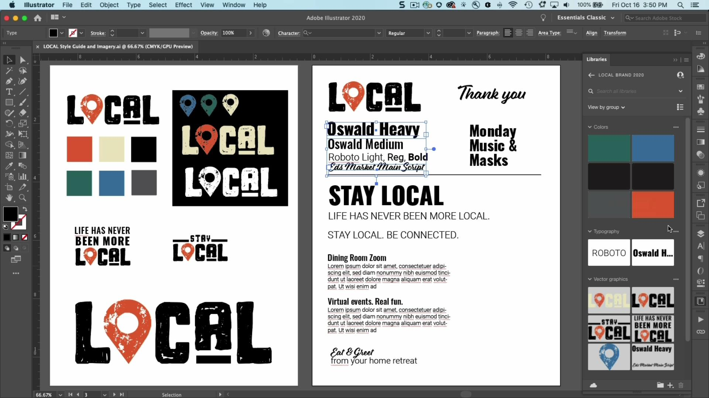

# Bibliothèques CC

Gardez vos ressources à portée de main et préservez la cohérence de marque dans vos projets.

## Parcourir les Tutorials de produits

<table style="table-layout:fixed">
<tr>
 <td>
   
    

   <a href="cclibraries.md#tutorial1"><strong>Création de bibliothèques CC</strong></a>
    

    <em>Les bibliothèques Adobe Creative Cloud vous permettent de gérer et d’organiser vos logos, couleurs et autres depuis vos applications de Creative Cloud préférées, et d’y accéder</em>
     
  </td>
   <td>
   
    

   <a href="cclibraries.md#tutorial2"><strong>Partage de bibliothèques CC</strong></a>
    

    <em>Gagnez en efficacité, garantissez une cohérence créative et restez en phase avec votre équipe</em>
     
  </td>
  <td>
    
    

     
  </td>
</tr>
</table>

## Création de bibliothèques CC (4:38) {#tutorial1}

>[!VIDEO](https://video.tv.adobe.com/v/326802?hidetitle=true)

**Description**
Les bibliothèques Adobe Creative Cloud vous permettent de gérer et d’organiser vos logos, couleurs et autres depuis vos applications de Creative Cloud préférées, et d’y accéder.

Dans ce tutoriel, vous apprendrez à :
* Gardez vos ressources à portée de main et préservez la cohérence de marque dans vos projets
* Nouveau ! Intégration complète avec Adobe XD

**Présenté par :**
Ashley Dvorin, consultante senior en solutions (médias numériques)

## Partage de bibliothèques CC (4:14) {#tutorial2}

>[!VIDEO](https://video.tv.adobe.com/v/326803?hidetitle=true)

**Description**
Gagnez en efficacité, garantissez une cohérence créative et restez en phase avec votre équipe.

Dans ce tutoriel, vous apprendrez à :
* Gardez vos ressources à portée de main et préservez la cohérence de marque dans vos projets
* Collaborez facilement sur des projets directement depuis vos applications préférées

**Présenté par :**
Ashley Dvorin, consultante senior en solutions (médias numériques)

**Ressources des bibliothèques CC**

[Formation et support](https://helpx.adobe.com/creative-cloud/help/libraries.html) est votre centre d’informations sur les nouveautés et les tutoriels supplémentaires, ainsi que des liens vers les forums de la communauté.

**Version d’octobre 2020**

Commencez à utiliser ces fonctionnalités (et bien plus encore !) en téléchargeant la dernière mise à jour depuis l’application pour postes de travail de votre Creative Cloud.
