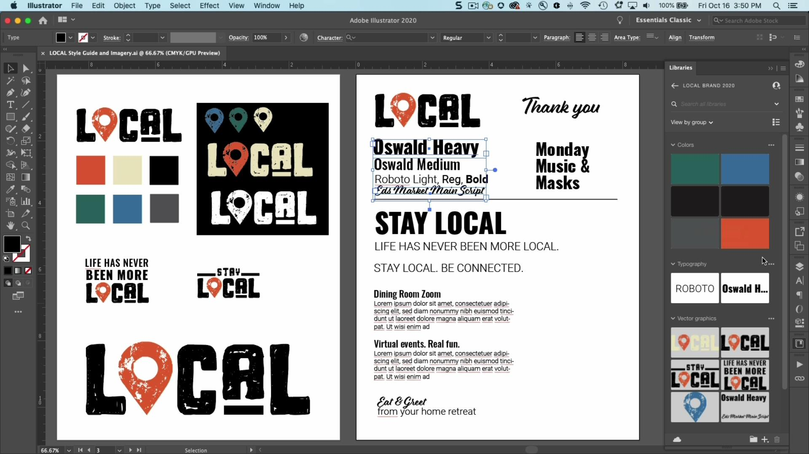

# Bibliothèques CC

Gardez vos ressources à portée de main et vos projets en accord avec la marque.

## Parcourir les Tutorials de produit

<table style="table-layout:fixed">
<tr>
 <td>
   
    

   <a href="cclibraries.md#tutorial1"><strong>Créer CC Libraries</strong></a>
    

    <em>Avec les bibliothèques Adobe Creative Cloud, vous pouvez gérer, organiser et accéder à vos logos, couleurs et autres éléments dans vos applications de Creative Cloud préférées</em>
     
  </td>
   <td>
   
    

   <a href="cclibraries.md#tutorial2"><strong>Partager CC Libraries</strong></a>
    

    <em>Travaillez plus efficacement, assurez la cohérence créative et restez facilement synchronisé avec votre équipe</em>
     
  </td>
  <td>
    
    

     
  </td>
</tr>
</table>

## Créer CC Libraries (4:38) {#tutorial1}

>[!VIDEO](https://video.tv.adobe.com/v/326802?hidetitle=true)

**Description**
Les bibliothèques Adobe Creative Cloud vous permettent de gérer, d’organiser et d’accéder à vos logos, couleurs et autres éléments dans vos applications de Creative Cloud préférées.

Dans ce tutoriel, vous apprendrez à :
* Gardez vos ressources à portée de main et vos projets en accord avec la marque
* Nouveau ! Intégration complète à Adobe XD

**Présenté par :**
Ashley Dvorin, conseillère principale en solutions (médias numériques)

## Partager CC Libraries (4:14) {#tutorial2}

>[!VIDEO](https://video.tv.adobe.com/v/326803?hidetitle=true)

**Description**
Travaillez plus efficacement, assurez une cohérence créative et restez facilement synchronisé avec votre équipe.

Dans ce tutoriel, vous apprendrez à :
* Gardez vos ressources à portée de main et vos projets en accord avec la marque
* Collaborez facilement sur des projets directement à partir de vos applications préférées

**Présenté par :**
Ashley Dvorin, conseillère principale en solutions (médias numériques)

Logo 

**Ressources CC Libraries**

[Formation et assistance](https://helpx.adobe.com/fr/creative-cloud/help/libraries.html) est votre point de contact pour accéder à des tutoriels supplémentaires, aux nouveautés et aux liens vers les forums de la communauté.

**Version D&#39;Octobre 2020**

Commencez à utiliser ces fonctionnalités (et bien plus encore !) en téléchargeant la dernière mise à jour depuis l’application de bureau Creative Cloud.
