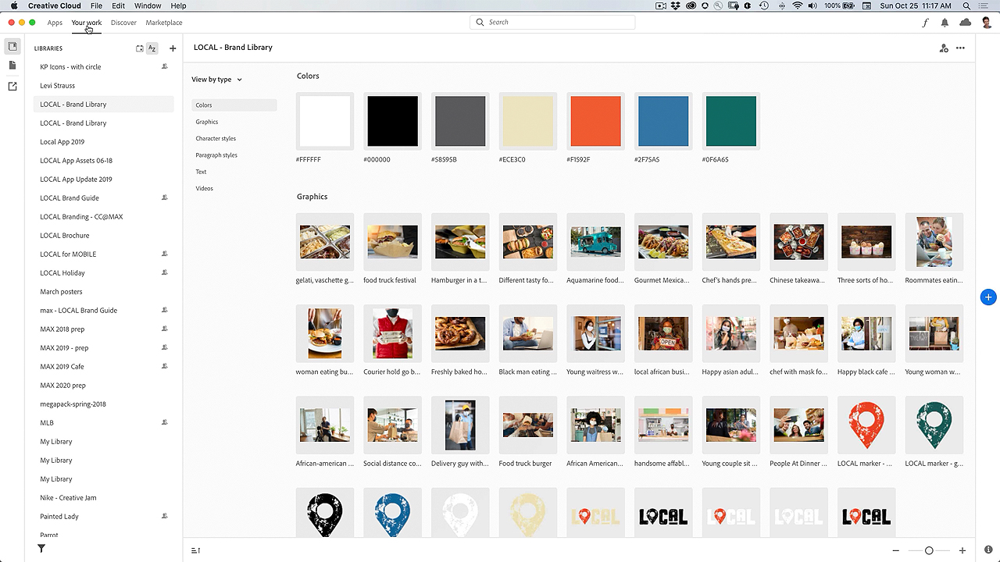

# Application de bureau Creative Cloud

L’application pour postes de travail Creative Cloud est le point central de la gestion des applications, services et collaborations CC, et plus encore !

## Parcourir les Tutorials de produit

<table style="table-layout:fixed">
<tr>
 <td>
   
    

   <a href="creativeclouddesktopapp.md#tutorial1"><strong>Explorez l’application de bureau CC : votre hub pour 
Creative Cloud</strong></a>
    

    <em>L’application de bureau Creative Cloud est votre point central pour gérer les applications, les services et la collaboration CC, et plus encore !</em>
     
  </td>
  <td>
    
    

     
  </td>
  <td>
    
    

     
  </td>
</tr>
</table>

## Explorez l’application de bureau CC : votre hub pour le Creative Cloud (2:50) {#tutorial1}

>[!VIDEO](https://video.tv.adobe.com/v/327095?hidetitle=true)

**Description**
L’application pour postes de travail Creative Cloud est le point central de la gestion des applications, services et collaborations CC, et plus encore !

Dans ce tutoriel, vous apprendrez à :
* Lancement et mise à jour de vos applications pour ordinateur
* Recherche d’applications mobiles et web
* Gestion et partage de ressources
* Accès à Adobe Fonts
* Découvrir les tutoriels
* Partage de votre travail sur Behance

**Présenté par :**
Patti Sokol, conseillère principale en solutions (médias numériques)
