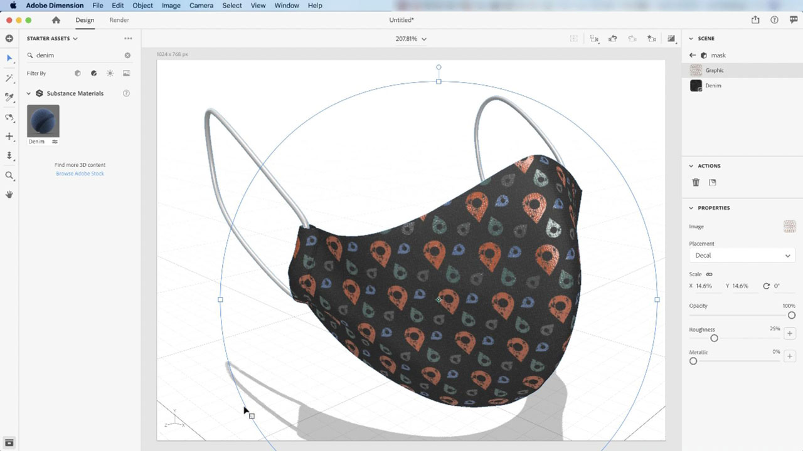

# [!DNL Dimension]

Créez plus rapidement du contenu attrayant en 3D avec des modèles, des matières et un éclairage de haute qualité. [!DNL Dimension] facilite la création de visualisations de marque, d&#39;illustrations, de maquettes de produits, de conceptions de packaging et d&#39;autres travaux créatifs.

## Parcourir les Tutorials de produit

<table style="table-layout:fixed">
<tr>
 <td>
   
    

   <a href="dimension.md#tutorial1"><strong>Appliquer des matériaux de Substance aux modèles 3D</strong></a>
    

    <em>Les matériaux de Substance prennent en charge des milliers de variations de motif et de conception dans un seul matériau</em>
     
  </td>
  <td>
    
    

     
  </td>
  <td>
    
    

     
  </td>
</tr>
</table>

## Appliquer des matériaux de Substance aux modèles 3D (11:42) {#tutorial1}

>[!VIDEO](https://video.tv.adobe.com/v/326944?hidetitle=true)

**Description**
Les matériaux de Substance prennent en charge des milliers de variations de motifs et de conceptions dans un seul matériau.

Dans ce tutoriel, vous apprendrez à :
* Créez plus rapidement du contenu attrayant en 3D avec des modèles, des matières et un éclairage de haute qualité

**Présenté par :**
Jim Babbage, conseiller principal en solutions (médias numériques)

**Ressources de Dimension**

[Formation et assistance](https://helpx.adobe.com/support/dimension.html) est votre point central pour consulter d&#39;autres tutoriels, les [Nouveautés](https://helpx.adobe.com/dimension/user-guide.html/dimension/using/whats-new.ug.html) et des liens vers les forums de la communauté.

**Version D&#39;Octobre 2020**

Commencez à utiliser ces fonctionnalités (et bien plus encore !) en téléchargeant la dernière mise à jour depuis l’application de bureau Creative Cloud.
