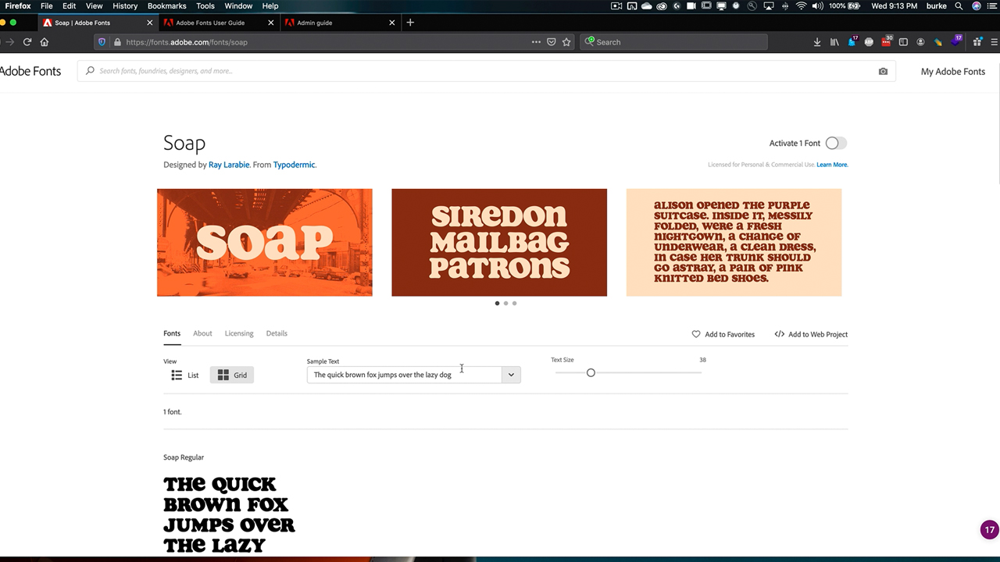

# Administration d’entreprise

Gérez les droits d’Adobe et les ressources dans l’ensemble de votre organisation.

## Parcourir les Tutorials d’administration d’entreprise

<table style="table-layout:fixed">
<tr>
 <td>
   
    

   <a href="enterprise.md#tutorial1"><strong>Adobe Fonts</strong></a>
    

    <em>Explorez près de 200 familles dans Adobe Fonts et la facilité d'utilisation du service Adobe Fonts</em>
     
  </td>
  <td>
    
    

     
  </td>
  <td>
    
    

     
  </td>
</tr>
</table>

## Adobe Fonts (5:20) {#tutorial1}

>[!VIDEO](https://video.tv.adobe.com/v/328226?hidetitle=true)

**Description :**

Découvrez près de 200 familles dans Adobe Fonts et la facilité d’utilisation du service Adobe Fonts.

Dans ce tutoriel, vous apprendrez à :
* Utilisez la puissante interface de navigation pour trouver rapidement et facilement la bonne police
* Gagnez du temps et de l’argent en utilisant des intégrations de Creative Cloud natif
* Gérez toutes vos polices au même endroit dans Adobe Admin Console

**Présenté par :**

Todd Burke, conseiller principal en solutions (médias numériques)

**Ressources d&#39;administration d&#39;entreprise :**

[Guide de l’utilisateur d’Adobe Fonts](https://helpx.adobe.com/fonts/user-guide.html)

[Guide de l’administrateur d’entreprise](https://helpx.adobe.com/fr/enterprise/admin-guide.html)
