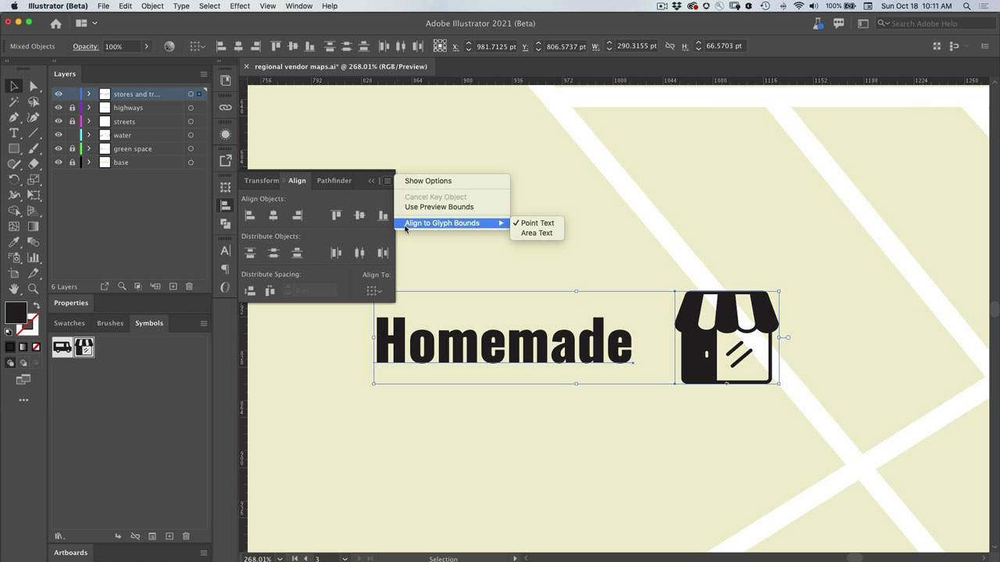

# Illustrator

L’application moderne pour les illustrations et les graphiques. Créez des logos, des icônes, des illustrations et tout autre design que vous pouvez imaginer pour le web, le mobile ou l’impression.

## Parcourir les Tutorials de produit

<table style="table-layout:fixed">
<tr>
 <td>
   
    

   <a href="illustrator.md#tutorial1"><strong>Utilisation de symboles pour mettre à jour plusieurs instances d’icônes</strong></a>
    

    <em>Réduction du travail manuel et cohérence avec les symboles</em>
     
  </td>
  <td>
    
    

    <a href="illustrator.md#tutorial2"><strong>Alignement du texte et des images avec l’accrochage aux glyphes</strong></a>
    

    <em>Accrocher rapidement les glyphes à des zones importantes du document</em>
     
  </td>
  <td>
    
    

     
  </td>
</tr>
</table>

## Utiliser des symboles pour mettre à jour plusieurs instances d’icônes (5:08) {#tutorial1}

>[!VIDEO](https://video.tv.adobe.com/v/326816?hidetitle=true)

**Description**
Réduisez le travail manuel et conservez la cohérence avec les symboles.

Dans ce tutoriel, vous apprendrez à :
* Réduction du travail manuel et cohérence avec les symboles

**Présenté par :**
Patti Sokol, conseillère principale en solutions (médias numériques)

## Alignement du texte et des images avec l’accrochage aux glyphes (6:48) {#tutorial2}

>[!VIDEO](https://video.tv.adobe.com/v/326817?hidetitle=true)

**Description**
Accrochez rapidement les glyphes aux zones importantes du document.

Dans ce tutoriel, vous apprendrez à :
* Accrocher rapidement les glyphes à des zones importantes du document

**Présenté par :**
Patti Sokol, conseillère principale en solutions (médias numériques)

**Ressources Illustrator**

[Formation et assistance](https://helpx.adobe.com/support/illustrator.html) est votre point de référence pour les tutoriels supplémentaires et les liens vers les forums de la communauté.

**Version d’octobre 2020**

Commencez à utiliser ces fonctionnalités (et bien plus encore !) en téléchargeant la dernière mise à jour depuis l’application de bureau Creative Cloud.
