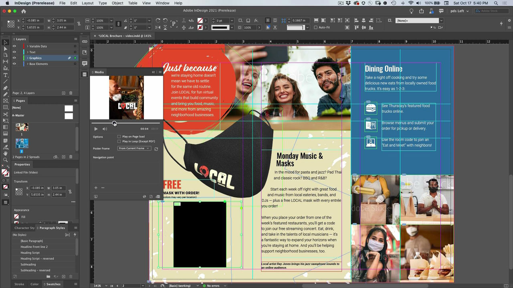

# InDesign

L’application de référence pour créer de superbes documents pour l’impression et la publication numérique. Créez des expériences numériques et imprimées riches, allant des livres électroniques aux magazines électroniques, en passant par les livres, les rapports et les livres blancs.

## Parcourir les Tutorials de produit

<table style="table-layout:fixed">
<tr>
 <td>
    
    

    <a href="indesign.md#tutorial1"><strong>Générer des codes QR</strong></a>
    

    <em>Générer un code QR qui renvoie à un site web</em>
     
  </td>
  <td>
   
    

   <a href="indesign.md#tutorial2"><strong>Partager pour révision à partir de l'InDesign</strong></a>
    

    <em>Expérience de révision créative transparente pour les designers et les membres de leur équipe</em>
     
  </td>
  <td>
    
    

    <a href="indesign.md#tutorial3"><strong>Importer des commentaires de PDF à partir d'un document 
Révision dans le cloud</strong></a>
    

    <em>Importez des commentaires d'un PDF directement dans l'InDesign et appliquez rapidement les modifications demandées</em>
     
  </td>
</tr>
<tr>
<td>
   
    

   <a href="indesign.md#tutorial4"><strong>Ajouter un fichier vidéo au document d'InDesign</strong></a>
    

    <em>Ajouter une vidéo à l’InDesign. Sortie dans le PDF et publication en ligne</em>
     
  </td>
 <td>
    
    

     
 </td>
 <td>
    
    

     
 </td>
</tr>
</table>

## Générer des codes QR (2:34) {#tutorial1}

>[!VIDEO](https://video.tv.adobe.com/v/326818?hidetitle=true)

**Description**
Générez un code QR renvoyant à un site web.

Dans ce tutoriel, vous apprendrez comment :
* Accès mains libres au contenu web via des appareils mobiles
* Rassurez vos clients
* Numérique signifie qu’il est facile de garder le contenu à jour

**Présenté par :**
Patti Sokol, conseillère principale en solutions (médias numériques)

## Partage pour révision à partir de l’InDesign (4:04) {#tutorial2}

>[!VIDEO](https://video.tv.adobe.com/v/326824?hidetitle=true)

**Description**
La fonctionnalité Partage d’InDesign pour révision offre une expérience de révision créative encore plus fluide aux designers et aux membres de leur équipe.

Dans ce tutoriel, vous apprendrez à :
* Lancer une révision directement depuis l’InDesign sans avoir à créer un PDF
* Réviser et commenter à partir d’un navigateur web
* Recueillez les commentaires de plusieurs parties prenantes au même endroit
* Gérez les commentaires dans l’application où les modifications peuvent être apportées immédiatement.

**PDF de comparaison des options de commentaire et de révision de l&#39;Adobe**

**Présenté par :**
Emily Palmer, conseillère en solutions (médias numériques)

## Importer des commentaires de PDF à partir d&#39;une révision de Document Cloud (4:52) {#tutorial3}

>[!VIDEO](https://video.tv.adobe.com/v/326959?hidetitle=true)

**Description**
Importez des commentaires d’un PDF directement dans InDesign et appliquez rapidement les modifications demandées.

Dans ce tutoriel, vous apprendrez à :
* Prend en charge les workflows de commentaire de PDF existants
* Fonctionne pour les PDF combinés à partir de plusieurs sources

**PDF de comparaison des options de commentaire et de révision de l&#39;Adobe**

**Présenté par :**
Michael Murphy, conseiller principal en solutions (médias numériques)

## Ajouter un fichier vidéo au document d&#39;InDesign (5:58) {#tutorial4}

>[!VIDEO](https://video.tv.adobe.com/v/326757?hidetitle=true)

**Description**
Ajoutez une vidéo à l’InDesign. Sortie dans le PDF et publication en ligne.

Dans ce tutoriel, vous apprendrez à :
* Ajouter une vidéo à l’InDesign
* Sortie dans le PDF et publication en ligne

**Présenté par :**
Patti Sokol, conseillère principale en solutions (médias numériques)

**Ressources d&#39;InDesign**

[Formation et assistance](https://helpx.adobe.com/fr/support/indesign.html) est votre point central pour consulter d&#39;autres tutoriels, les [Nouveautés](https://helpx.adobe.com/fr/indesign/user-guide.html/indesign/using/whats-new.ug.html) et des liens vers les forums de la communauté.

**Version D&#39;Octobre 2020**

Commencez à utiliser ces fonctionnalités (et bien plus encore !) en téléchargeant la dernière mise à jour depuis l’application de bureau Creative Cloud.
