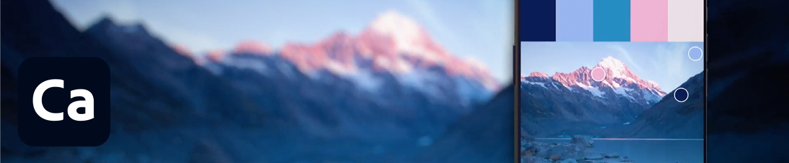

# Tutoriels

En tant que créatif d’entreprise, vous devez collaborer avec des équipes réparties dans le monde entier, mettre en place des processus évolutifs et respecter les directives et les systèmes de l’entreprise. Ces tutoriels vous aideront à découvrir les nouvelles fonctionnalités de la version 2021 de Creative Cloud, du point de vue de l’entreprise.

## Tutorials, par Produits pour ordinateurs

<table style="table-layout:fixed">
<tr>
 <td>
    
    

    <a href="acrobat-sign.md"><strong>Acrobat et Adobe Sign</strong></a>
    

    <em>Création, modification et signature de documents et formulaires PDF</em>
     
  </td>
  <td>
    
    

    <a href="dimension.md"><strong>Dimension</strong></a>
    

    <em>Créez des images 3D photoréalistes pour l'identité visuelle des marques, les photos de produits et le design de packaging</em>
     
  </td>
  <td>
    
    

    <a href="illustrator.md"><strong>Illustrator</strong></a>
    

    <em>Images vectorielles et illustrations</em>
     
  </td>
</tr>
<tr>
 <td>
    
    

    <a href="indesign.md"><strong>InDesign</strong></a>
    

    <em>Création de mises en page pour l'impression et la publication digitale</em>
     
  </td>
  <td>
    
    

    <a href="photoshop.md"><strong>Photoshop</strong></a>
    

    <em>Retouchez, composez et créez de superbes images, illustrations et oeuvres d’art sur ordinateur</em>
     
  </td>
  <td>
    
    

    <a href="rush.md"><strong>Premiere Rush</strong></a>
    

    <em>Filmez et partagez vos vidéos en ligne, depuis un mobile ou un ordinateur</em>
     
  </td>
</tr>
<tr>
 <td>
    
    

    <a href="xd.md"><strong>XD</strong></a>
    

    <em>Concevez, prototypez et partagez des projets d’UX design</em>
     
  </td>
  <td>
    
    

     
  </td>
  <td>
    
    

     
  </td>
</tr>
</table>

### Tutorials par application mobile

<table style="table-layout:fixed">
<tr>
 <td>
    
    

    <a href="capture.md"><strong>Capture</strong></a>
    

    <em>Transformez n’importe quelle image en thème de couleur, illustration vectorielle, pinceau, etc</em>
     
  </td>
  <td>
    
    

    <a href="fresco.md"><strong>Fresco</strong></a>
    

    <em>Redécouvrez le plaisir du dessin et de la peinture, où que vous soyez</em>
     
  </td>
  <td>
    
    

    <a href="illustratoripad.md"><strong>Illustrator sur iPad</strong></a>
    

    <em>Images vectorielles et illustrations</em>
     
  </td>
</tr>
<tr>
 <td>
    
    

    <a href="photoshopipad.md"><strong>Photoshop sur iPad</strong></a>
    

    <em>Retouchez vos photos sur ordinateur et iPad, et créez des images, des éléments graphiques et des illustrations uniques</em>
     
  </td>
  <td>
    
    

     
  </td>
  <td>
    
    

     
  </td>
</tr>
</table>

### Tutorials par intégration

<table style="table-layout:fixed">
<tr>
 <td>
    
    

    <a href="aem.md"><strong>AEM Assets et Asset Link</strong></a>
    

    <em>Gestion des assets digitaux de nouvelle génération</em>
     
  </td>
  <td>
    
    

    <a href="creativeclouddesktopapp.md"><strong>Application de bureau Creative Cloud</strong></a>
    

    <em>L’application pour postes de travail Creative Cloud est votre centre de gestion des applications, services et collaborations CC, et bien plus encore !</em>
     
  </td>
  <td>
    
    

    <a href="cclibraries.md"><strong>Bibliothèques CC</strong></a>
    

    <em>Gardez vos ressources à portée de main et préservez la cohérence de marque dans vos projets</em>
     
  </td>
</tr>
<tr>
<td>
    
    

    <a href="indesignserver.md"><strong>InDesign Server </strong></a>
    

    <em>Les outils sophistiqués de l'InDesign couplés à l'automatisation personnalisée</em>
     
  </td>
 <td>
    
    

    <a href="stock.md"><strong>Adobe [!DNL Stock]</strong></a>
    

    <em>Images, illustrations, vidéos, contenus audio et modèles digitaux de qualité, et bien plus encore</em>
     
  </td>
  <td>
    
    

     
  </td>
</tr>
</table>

### Projet pratique : Création de votre propre masque de visage

<table style="table-layout:fixed">
<tr>
 <td>
    
    

    <a href="handsonproject.md"><strong>Création de votre propre masque de visage</strong></a>
    

    <em>Avec le plug-in Adobe Design to Print, vous pouvez visualiser vos designs sur des centaines de produits Zazzle et les publier directement sur leur marketplace en ligne</em>
     
  </td>
  <td>
    
    

     
  </td>
  <td>
    
    

     
  </td>
</tr>
</table>
