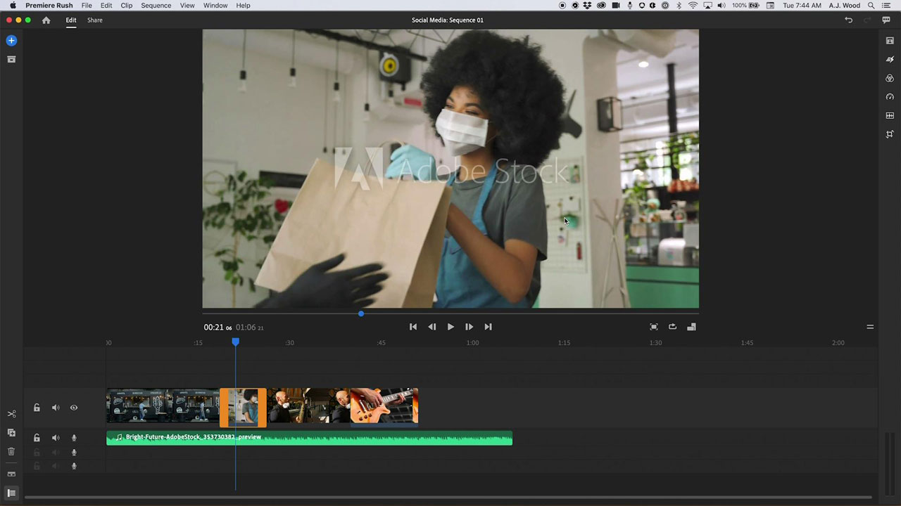

# [!DNL Rush]

Premiere [!DNL Rush] est la première application de montage vidéo multi-appareil tout-en-un qui facilite considérablement la création et le partage de contenu en ligne. Cette solution intégrée pour ordinateur et appareils mobiles synchronise automatiquement vos projets et vos modifications dans le cloud. Vous pouvez ainsi travailler où que vous soyez et sur n’importe quel appareil.

## Parcourir les Tutorials de produits

<table style="table-layout:fixed">
<tr>
 <td>
   
    

   <a href="rush.md#tutorial1"><strong>Création d'une vidéo pour les réseaux sociaux</strong></a>
    

    <em>Adobe [!DNL Rush] vous permet de travailler sur n’importe quel appareil et rend la sortie professionnelle suffisamment facile pour les débutants</em>
     
  </td>
  <td>
    
    

     
  </td>
  <td>
    
    

     
  </td>
</tr>
</table>

## Création d&#39;une vidéo pour les réseaux sociaux (18:11) {#tutorial1}

>[!VIDEO](https://video.tv.adobe.com/v/326900?hidetitle=true)

**Description**
Racontez votre histoire en utilisant des séquences vidéo et audio d’Adobe [!DNL Stock]. Adobe [!DNL Rush] vous permet de travailler sur n’importe quel appareil et rend la sortie professionnelle suffisamment facile pour les débutants.

Dans ce tutoriel, vous apprendrez à :
* Montez facilement des vidéos sur ordinateur, tablette et téléphone
* Conservez le centre de votre sujet entre les formats horizontal, carré et vertical grâce à la fonctionnalité de technologie IA de recadrage automatique
* Les modèles d’animations graphiques (MoGRTS) permettent d’obtenir des titres et des tiers inférieurs d’aspect professionnel et facilement personnalisables
* Exportez et publiez aisément vos créations directement sur les réseaux sociaux
* Ouvrir [!DNL Rush] projets dans Adobe Premiere Pro

**Présenté par :**
A.J. Wood, consultant en solutions (médias numériques)

**[!DNL Rush]Ressources**

[Formation et support](https://helpx.adobe.com/support/premiere-rush.html) est votre centre de tutoriels supplémentaires, [Nouveautés de la version](https://helpx.adobe.com/premiere-rush/user-guide.html/premiere-rush/help/whats-new.ug.html)et des liens vers des forums communautaires.

**Version d’octobre 2020**

Commencez à utiliser ces fonctionnalités (et bien plus encore !) en téléchargeant la dernière mise à jour depuis l’application pour postes de travail de votre Creative Cloud.
