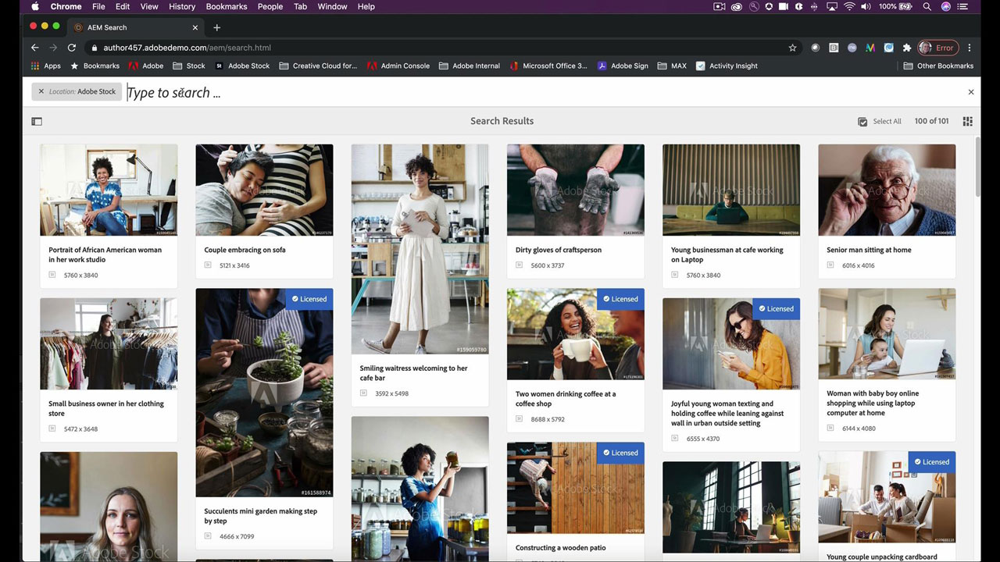

# [!DNL Stock]

Les créatifs sont sous pression pour diffuser rapidement du nouveau contenu visuellement attrayant qui captera et retiendra l’attention. Adobe [!DNL Stock] abonnement Entreprise permet aux équipes de création d’accéder à plus de 200 millions d’images, de vidéos, de modèles, d’illustrations, de fichiers audio et de ressources 3D, le tout à partir des applications de création Adobe qu’elles utilisent chaque jour.

## Parcourir les Tutorials de produit

<table style="table-layout:fixed">
<tr>
 <td>
   
    

   <a href="stock.md#tutorial1"><strong>Trouvez les meilleures ressources plus rapidement avec l’Adobe [!DNL Stock]</strong></a>
    

    <em>Trouvez l’image libre de droits parfaite pour améliorer votre projet créatif à l’aide de meilleurs résultats de recherche plus rapides optimisés par Adobe AI</em>
     
  </td>
  <td>
   
    

   <a href="stock.md#tutorial2"><strong>Rechercher et acheter la licence de [!DNL Stock] ressources dans 
Adobe Experience Manager</strong></a>
    

    <em>Simplifiez le processus de chargement de vos ressources d’Adobe sous licence [!DNL Stock] dans votre système Digital Asset Management</em>
     
  </td>
  <td>
    
    

     
  </td>
</tr>
</table>

## Trouvez les meilleures ressources plus rapidement avec l’Adobe [!DNL Stock] (10:49) {#tutorial1}

>[!VIDEO](https://video.tv.adobe.com/v/326951?hidetitle=true)

**Description**
Trouvez l’image libre de droits parfaite pour améliorer votre projet créatif à l’aide de meilleurs résultats de recherche, plus rapides et optimisés par Adobe AI.

Dans ce tutoriel, vous apprendrez à :

* Prenez le temps et le stress de votre recherche d’images et de vidéos de haute qualité
* Gérez et suivez facilement les licences et l’utilisation des actifs dans votre entreprise
* Recherchez, prévisualisez et achetez des licences directement depuis vos applications Adobe Creative Cloud

**Présenté par :**

Victoria Torres, consultante en solutions [!DNL Stock] (médias numériques)

## Rechercher et acheter des fichiers [!DNL Stock] dans AEM (6:46) {#tutorial2}

>[!VIDEO](https://video.tv.adobe.com/v/326952?hidetitle=true)

**Description**
Simplifiez le processus de chargement de vos ressources d’Adobe sous licence [!DNL Stock] dans votre système Digital Asset Management.

Dans ce tutoriel, vous apprendrez à :
* Effectuer une recherche de ressource [!DNL Stock] Adobe sans quitter l&#39;espace de travail AEM
* Enregistrer les fichiers sous licence directement dans un dossier AEM au moment de l’achat de la licence
* Affichez les fichiers achetés auprès d’AEM dans votre historique de licences [!DNL Stock] sur le site web [!DNL Stock].

**Présenté par :**
Emily Palmer, conseillère en solutions (médias numériques)

Logo ![[!DNL Stock]](../assets/st_appicon_96.png)

**Adobe des ressources [!DNL Stock]**

[Formation et assistance](https://helpx.adobe.com/support/stock.html) est votre point de contact pour les tutoriels supplémentaires et les liens vers les forums de la communauté.

**Version D&#39;Octobre 2020**

Commencez à utiliser ces fonctionnalités (et bien plus encore !) en téléchargeant la dernière mise à jour depuis l’application de bureau Creative Cloud.
